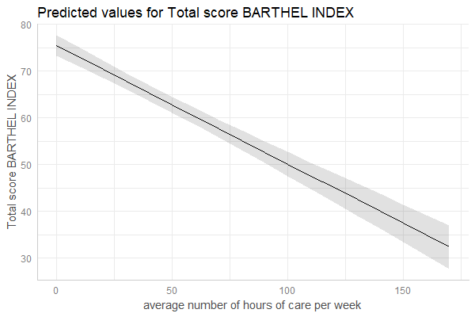
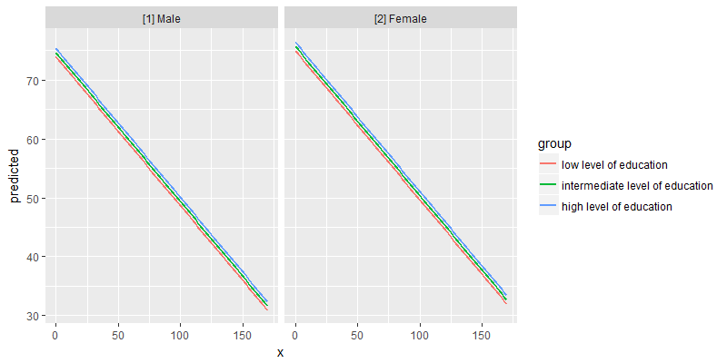

# ggeffects - Create Tidy Data Frames of Marginal Effects for 'ggplot' from Model Outputs 

[](https://doi.org/10.21105/joss.00772)

## Why marginal effects?

Results of regression models are typically presented as tables that are easy to understand. For more complex models that include interaction or quadratic / spline terms, tables with numbers are less helpful and difficult to interpret. In such cases, _marginal effects_ are far easier to understand. In particular, the visualization of marginal effects allows to intuitively get the idea of how predictors and outcome are associated, even for complex models. 

## Aim of this package

**ggeffects** computes marginal effects at the mean or average marginal effects from statistical models and returns the result as tidy data frames. These data frames are ready to use with the **ggplot2**-package.

## Documentation and Support

Please visit [https://strengejacke.github.io/ggeffects/](https://strengejacke.github.io/ggeffects/) for documentation and vignettes. In case you want to file an issue or contribute in another way to the package, please follow [this guide](CONTRIBUTING.md). For questions about the functionality, you may either contact me via email or also file an issue.

## ggeffects supports many different models and is easy to use

Marginal effects can be calculated for many different models. Currently supported model-objects are: `lm`, `glm`, `glm.nb`, `lme`, `lmer`, `glmer`, `glmer.nb`, `nlmer`, `glmmTMB`, `gam` (package **mgcv**), `vgam`, `gamm`, `gamm4`, `multinom`, `betareg`, `truncreg`, `coxph`, `gls`, `gee`, `plm`, `lrm`, `polr`, `clm`, `clm2`, `zeroinfl`, `hurdle`, `stanreg`, `brmsfit`, `lmRob`, `glmRob`, `brglm`, `rlm`, `svyglm` and `svyglm.nb`. Other models not listed here are passed to a generic predict-function and might work as well, or maybe with `ggeffect()`, which effectively does the same as `ggpredict()`.

Interaction terms, splines and polynomial terms are also supported. The two main functions are `ggpredict()` and `ggeffect()`. There is a generic `plot()`-method to plot the results using **ggplot2**.

## Examples

The returned data frames always have the same, consistent structure and column names, so it's easy to create ggplot-plots without the need to re-write the function call. `x` and `predicted` are the values for the x- and y-axis. `conf.low` and `conf.high` could be used as `ymin` and `ymax` aesthetics for ribbons to add confidence bands to the plot. `group` can be used as grouping-aesthetics, or for faceting.

`ggpredict()` requires at least one, but not more than three terms specified in the `terms`-argument. Predicted values of the response, along the values of the first term are calucalted, optionally grouped by the other terms specified in `terms`.

```
data(efc)
fit <- lm(barthtot ~ c12hour + neg_c_7 + c161sex + c172code, data = efc)

ggpredict(fit, terms = "c12hour")

#> # Predicted values for Total score BARTHEL INDEX 
#> # x = average number of hours of care per week 
#> 
#>   x predicted conf.low conf.high group
#>   0    75.444   73.257    77.630     1
#>   5    74.177   72.098    76.256     1
#>  10    72.911   70.931    74.890     1
#>  15    71.644   69.753    73.535     1
#>  20    70.378   68.564    72.191     1
#>  25    69.111   67.361    70.861     1
#>  30    67.845   66.144    69.545     1
#>  35    66.578   64.911    68.245     1
#>  40    65.312   63.661    66.962     1
#>  45    64.045   62.393    65.697     1
#>  ... and 25 more rows.
```

A possible call to ggplot could look like this:

```
library(ggplot2)
mydf <- ggpredict(fit, terms = "c12hour")
ggplot(mydf, aes(x, predicted)) +
  geom_line() +
  geom_ribbon(aes(ymin = conf.low, ymax = conf.high), alpha = .1)
```


However, there is also a `plot()`-method. This method uses convenient defaults, to easily create the most suitable plot for the marginal effects.

```
mydf <- ggpredict(fit, terms = "c12hour")
plot(mydf)
```


**ggeffects** has a `plot()`-method with some convenient defaults, which allows quickly creating ggplot-objects.

With three variables, predictions can be grouped and faceted.

```
ggpredict(fit, terms = c("c12hour", "c172code", "c161sex"))

#> # Predicted values for Total score BARTHEL INDEX 
#> # x = average number of hours of care per week 
#> 
#>  x predicted conf.low conf.high                           group      facet
#>  0    74.996   71.406    78.585          low level of education [2] Female
#>  0    73.954   69.354    78.554          low level of education   [1] Male
#>  0    75.714   73.313    78.115 intermediate level of education [2] Female
#>  0    74.673   71.055    78.290 intermediate level of education   [1] Male
#>  0    76.432   72.887    79.977         high level of education [2] Female
#>  0    75.391   71.040    79.741         high level of education   [1] Male
#>  5    73.729   70.219    77.239          low level of education [2] Female
#>  5    72.688   68.143    77.233          low level of education   [1] Male
#>  5    74.447   72.146    76.748 intermediate level of education [2] Female
#>  5    73.406   69.846    76.966 intermediate level of education   [1] Male
#>  ... and 200 more rows.

mydf <- ggpredict(fit, terms = c("c12hour", "c172code", "c161sex"))
ggplot(mydf, aes(x = x, y = predicted, colour = group)) +
  stat_smooth(method = "lm", se = FALSE) +
  facet_wrap(~facet)
```


`plot()` works for this case, as well:

```
plot(mydf)
```


There are some more features, which are explained in more detail in the package-vignette.

## Contributing to the package

Please follow [this guide](CONTRIBUTING.md) if you like to contribute to this package.

## Installation

### Latest development build

To install the latest development snapshot (see latest changes below), type following commands into the R console:

```r
library(devtools)
devtools::install_github("strengejacke/ggeffects")
```

Please note the package dependencies when installing from GitHub. The GitHub version of this package may depend on latest GitHub versions of my other packages, so you may need to install those first, if you encounter any problems. Here's the order for installing packages from GitHub:

[sjlabelled](https://github.com/strengejacke/sjlabelled) &rarr; [sjmisc](https://github.com/strengejacke/sjmisc) &rarr; [sjstats](https://github.com/strengejacke/sjstats) &rarr; [ggeffects](https://github.com/strengejacke/ggeffects) &rarr; [sjPlot](https://github.com/strengejacke/sjPlot)


### Officiale, stable release

[](https://cran.r-project.org/package=ggeffects)
&#160;&#160;
[](http://cranlogs.r-pkg.org/)
&#160;&#160;
[](http://cranlogs.r-pkg.org/)

To install the latest stable release from CRAN, type following command into the R console:

```r
install.packages("ggeffects")
```

## Citation

In case you want / have to cite my package, please use `citation('ggeffects')` for citation information.

[](https://doi.org/10.21105/joss.00772)
