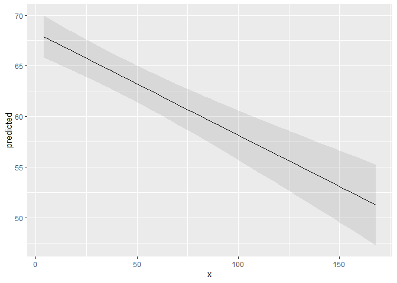
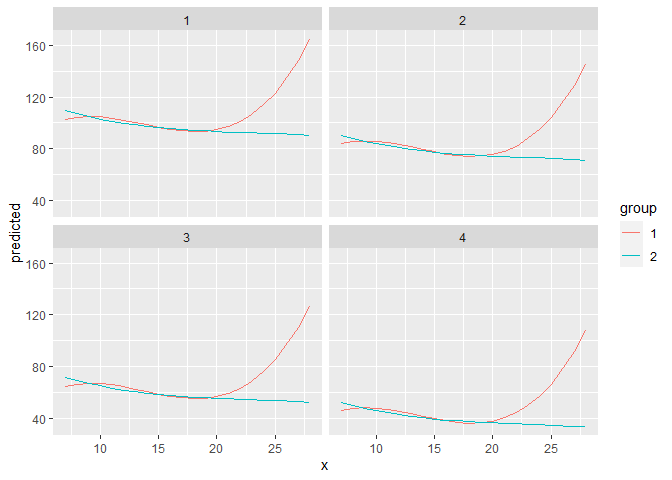
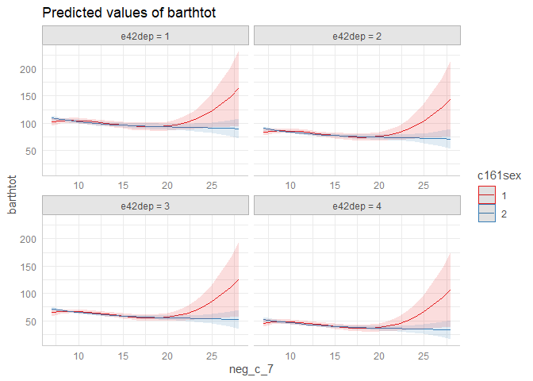
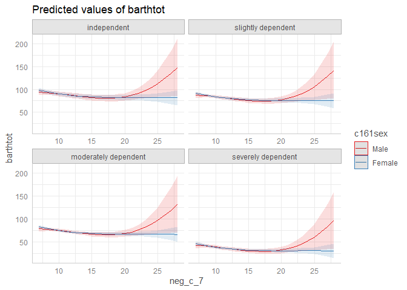

# ggeffects - Estimated Marginal Means and Adjusted Predictions from Regression Models

[](https://doi.org/10.21105/joss.00772)
[](https://strengejacke.github.io/ggeffects/)
[](https://cranlogs.r-pkg.org/)
[](https://cranlogs.r-pkg.org/)

Lüdecke D (2018). *ggeffects: Tidy Data Frames of Marginal Effects from
Regression Models.* Journal of Open Source Software, 3(26), 772. doi:
[10.21105/joss.00772](https://doi.org/10.21105/joss.00772)

## Why do we need (marginal/conditional) effects or (adjusted) predicted values?

Results of regression models are typically presented as tables that are
easy to understand. For more complex models that include interaction or
transformed terms (like quadratic or spline terms), tables with raw
regression coefficients are less helpful and difficult to interpret. In
such cases, *marginal effects* or *adjusted predictions* are far easier
to understand. In particular, the visualization of such effects or
predictions allows to intuitively get the idea of how predictors and
outcome are associated, even for complex models.

## Aims of this package

**ggeffects** is a light-weight package that aims at easily calculating
marginal effects and adjusted predictions (or: *estimated marginal
means*) at the mean or at representative values of covariates ([see
definitions
here](https://stats.stackexchange.com/tags/marginal-effect/info)) from
statistical models, i.e. **predictions generated by a model when one
holds the non-focal variables constant and varies the focal
variable(s)**. Furthermore, it is possible to compute contrasts or
pairwise comparisons, to test predictions and differences in predictions
for statistical significance. Finally, you can easily produce nice
figures to visualize the results.

What you basically would need for your workflow is: -
`predict_response()` (understand your results) - `test_predictions()`
(check for “significant” results) - `plot()` (communicate your results)

Three core ideas describe the philosophy of the function design and help
users to achieve the above mentioned goals:

1)  Functions are type-safe and always return a data frame with the
    same, consistent structure;

2)  there is a simple, unique approach to calculate marginal
    effects/adjusted predictions and estimated marginal means for many
    different models;

3)  the package supports “labelled data” (Lüdecke 2018), which allows
    human readable annotations for graphical outputs.

This means, users do not need to care about any expensive steps after
modeling to visualize the results. The returned as data frame is ready
to use with the **ggplot2**-package, however, there is also a
`plot()`-method to easily create publication-ready figures.

Adjusted predictions or estimated marginal means are always calculated
on the *response* scale, which is the easiest and most intuitive scale
to interpret the results.

It is easy to start, you just need one function: `predict_response()`,
and two arguments: the model and the “focal terms”, i.e. the predictors
that you are mainly interested in. Examples are shown below.

## So, when do I need the *ggeffects* package?

You should use *ggeffects*…

- … when you want to understand how predictors and outcome are related,
  no matter whether you have simple or complex models, interaction or
  transformed terms. See how to start [in this
  vignette](https://strengejacke.github.io/ggeffects/articles/ggeffects.html).
  The syntax for the *ggeffects* functions is super easy and consistent
  across the different type of models and complexity.

- … when you want to perform pairwise comparisons, in order to see
  whether there are statistically significant differences in the
  association of, for instance, different groups or categories of your
  predictors and your outcome. There are several vignettes describing
  this in detail, starting [with this
  vignette](https://strengejacke.github.io/ggeffects/articles/introduction_comparisons_1.html).

- … when you need impressive figures instead of long, confusing tables
  to describe your results. There are several examples in the
  [documentation](https://strengejacke.github.io/ggeffects/), for
  example [this
  vignette](https://strengejacke.github.io/ggeffects/articles/introduction_plotmethod.html).

- … and even when you want to check, whether your model appropriately
  describes your data. See [this
  vignette](https://strengejacke.github.io/ggeffects/articles/introduction_partial_residuals.html)
  to learn more about how to use *ggeffects* for model diagnostics.

A workflow in R would then include using following functions in this
order: `predict_response()`, `test_predictions()` and `plot()` - that’s
all you need!

## Installation

[](https://cran.r-project.org/package=ggeffects)
[](https://strengejacke.r-universe.dev)

| Type        | Source       | Command                                                                        |
|-------------|--------------|--------------------------------------------------------------------------------|
| Release     | CRAN         | `install.packages("ggeffects")`                                                |
| Development | r - universe | `install.packages("ggeffects", repos = "https://strengejacke.r-universe.dev")` |
| Development | GitHub       | `remotes::install_github("strengejacke/ggeffects")`                            |

Or you can run
[`ggeffects::install_latest()`](https://strengejacke.github.io/ggeffects/reference/install_latest.html)
to install the latest development version from r-universe.

## Definition of “marginal effects”

There is no common language across fields regarding a unique meaning of
“marginal effects”. Thus, the wording throughout this package may vary.
Maybe “adjusted predictions” comes closest to what **ggeffects**
actually does. To avoid confusion about what is actually calculated and
returned by the different marginalization options in
`predict_response()` (or the different package’s functions
`ggpredict()`, `ggemmeans()` and `ggeffect()`), it is recommended to
read [this
vignette](https://strengejacke.github.io/ggeffects/articles/introduction_marginal_effects.html)
about the different terminology and its meanings.

## marginal effects: marginalizing over non-focal predictors

`predict_response()` is a wrapper around `ggpredict()`, `ggeffect()`,
`ggemmeans()` and `ggaverage()`. Depending on the value of the
`marginalize` argument, `predict_response()` calls one of those
functions, sometimes with different arguments. It’s important to note
that:

1.  Predictions are always returned on the *response scale*, no matter
    which model is used. This is the most intuitive scale to interpret
    your results (the predicted values).

2.  The response is predicted for the values or levels of your *focal
    terms*, i.e. you specify the predictors you are mainly interested
    in, using the `terms` argument. The predicted values are calculated
    for these values, while all other predictors are marginalized over.

The `marginalize` argument in `predict_response()` indicates how to
marginalize over the *non-focal* predictors, i.e. those variables that
are *not* specified in `terms`. Possible values are:

- `"mean_reference"`: calls `ggpredict()`, i.e. non-focal predictors are
  set to their mean (numeric variables) or reference level (factors, or
  “lowest” value in case of character vectors).
- `"mean_mode"`: calls
  `ggpredict(typical = c(numeric = "mean", factor = "mode"))`,
  i.e. non-focal predictors are set to their mean (numeric variables) or
  mode (factors, or “most common” value in case of character vectors).
- `"marginalmeans"`: calls `ggemmeans()`, i.e. non-focal predictors are
  set to their mean (numeric variables) or marginalized over the levels
  or “values” for factors and character vectors. Marginalizing over the
  factor levels of non-focal terms computes a kind of “weighted average”
  for the values at which these terms are hold constant.
- `"empirical"` (or `"counterfactual"`): calls `ggaverage()`,
  i.e. non-focal predictors are marginalized over the observations in
  your sample. Technically, `ggaverage()` calculates predicted values
  for each observation in the data multiple times (the data is
  duplicated once for all unique values of the focal terms), each time
  fixing one unique value or level of the focal terms and then takes the
  average of these predicted values (aggregated/grouped by the focal
  terms). These kind of predictions are also called “counterfactual”
  predictions. There is a more detailed description in [this
  vignette](https://strengejacke.github.io/ggeffects/articles/technical_differencepredictemmeans.html).

For all the above options, the *differences* between predicted values
are identical - if your main interest is to investigate “group
differences” or “inequalities”, it doesn’t matter much, which way you
choose. However, if you are specificall interested in the predicted
values of your response, you should consider the differences between the
options. Predictions based on `"mean_reference"` and `"mean_mode"`
represent a rather “theoretical” view, which does not necessarily
exactly reflect your sample. `"marginalmeans"` comes closer to the
sample, because it takes all possible values and levels of your
non-focal predictors into account. `"empirical"` is the most “realistic”
approach, because it is based on the actual observations in your sample.

## Documentation and Support

Please visit <https://strengejacke.github.io/ggeffects/> for
documentation and vignettes. For questions about the functionality, you
may either contact me via email or also file an issue.

## ggeffects supports many different models and is easy to use

Marginal effects and adjusted predictions can be calculated for many
different models. Currently supported model-objects are: ‘averaging’,
‘bamlss’, ‘bayesx’, ‘betabin’, ‘betareg’, ‘bglmer’, ‘bigglm’, ‘biglm’,
‘blmer’, ‘bracl’, ‘brglm’, ‘brmsfit’, ‘brmultinom’, ‘cgam’, ‘cgamm’,
‘clm’, ‘clm2’, ‘clmm’, ‘coxph’, ‘feglm’, ‘fixest’, ‘flac’, ‘flic’,
‘gam’, ‘Gam’, ‘gamlss’, ‘gamm’, ‘gamm4’, ‘gee’, ‘geeglm’, ‘glimML’,
‘glm’, ‘glm.nb’, ‘glmer.nb’, ‘glmerMod’, ‘glmmPQL’, ‘glmmTMB’, ‘glmrob’,
‘glmRob’, ‘glmx’, ‘gls’, ‘hurdle’, ‘ivreg’, ‘lm’, ‘lm_robust’, ‘lme’,
‘lmerMod’, ‘lmrob’, ‘lmRob’, ‘logistf’, ‘logitr’, ‘lrm’, ‘mblogit’,
‘mclogit’, ‘MCMCglmm’, ‘merModLmerTest’, ‘MixMod’, ‘mixor’, ‘mlogit’,
‘multinom’, ‘negbin’, ‘nestedLogit’, ‘nlmerMod’, ‘ols’, ‘orm’,
‘phyloglm’, ‘phylolm’, ‘plm’, ‘polr’, ‘rlm’, ‘rlmerMod’, ‘rq’, ‘rqs’,
‘rqss’, ‘sdmTMB’, ‘speedglm’, ‘speedlm’, ‘stanreg’, ‘survreg’, ‘svyglm’,
‘svyglm.nb’, ‘tidymodels’, ‘tobit’, ‘truncreg’, ‘vgam’, ‘vglm’, ‘wblm’,
‘wbm’, ‘Zelig-relogit’, ‘zeroinfl’ and ‘zerotrunc’.

Support for models varies by function, i.e. although `ggpredict()`,
`ggemmeans()`, `ggeffect()` and `ggaverage()` support most models, some
models are only supported exclusively by one of the three functions.
Thus, not all `marginalize` options in `predict_response()` will support
all models. Other models not listed here might work as well, but are
currently not tested.

Interaction terms, splines and polynomial terms are also supported.
There is a generic `plot()`-method to plot the results using
**ggplot2**.

## Examples

The returned data frames always have the same, consistent structure and
column names, so it’s easy to create ggplot-plots without the need to
re-write the function call. `x` and `predicted` are the values for the
x- and y-axis. `conf.low` and `conf.high` could be used as `ymin` and
`ymax` aesthetics for ribbons to add confidence bands to the plot.
`group` can be used as grouping-aesthetics, or for faceting.

`ggpredict()` requires at least one, but not more than four terms
specified in the `terms`-argument. Predicted values of the response,
along the values of the first term are calculated, optionally grouped by
the other terms specified in `terms`.

### Adjusted predictions for one focal predictor

``` r
library(ggeffects)
library(splines)
library(datawizard)
data(efc, package = "ggeffects")
efc <- to_factor(efc, c("c161sex", "e42dep"))
fit <- lm(barthtot ~ c12hour + bs(neg_c_7) * c161sex + e42dep, data = efc)

predict_response(fit, terms = "c12hour")
#> # Predicted values of barthtot
#> 
#> c12hour | Predicted |       95% CI
#> ----------------------------------
#>       4 |     89.91 | 84.18, 95.63
#>      12 |     89.34 | 83.62, 95.06
#>      22 |     88.63 | 82.90, 94.36
#>      36 |     87.64 | 81.88, 93.40
#>      49 |     86.72 | 80.90, 92.53
#>      70 |     85.23 | 79.30, 91.16
#>     100 |     83.10 | 76.92, 89.29
#>     168 |     78.28 | 71.24, 85.33
#> 
#> Adjusted for:
#> * neg_c_7 =       11.83
#> * c161sex =        Male
#> *  e42dep = independent
```

A possible call to ggplot could look like this:

``` r
library(ggplot2)
mydf <- predict_response(fit, terms = "c12hour")
ggplot(mydf, aes(x, predicted)) +
  geom_line() +
  geom_ribbon(aes(ymin = conf.low, ymax = conf.high), alpha = 0.1)
```

<!-- -->

However, there is also a `plot()`-method. This method uses convenient
defaults, to easily create the most suitable plot for the marginal
effects.

``` r
mydf <- predict_response(fit, terms = "c12hour")
plot(mydf)
```

<!-- -->

### Adjusted predictions for several focal predictors

With three variables, predictions can be grouped and faceted.

``` r
result <- predict_response(fit, terms = c("neg_c_7", "c161sex", "e42dep"))
# we want a more compact table, thus we use `print()` explicitly
print(result, collapse_table = TRUE, collapse_ci = TRUE)
#> # Predicted values of barthtot
#> 
#> neg_c_7 | c161sex |               e42dep |     Predicted (95% CI)
#> -----------------------------------------------------------------
#>       7 |    Male |          independent |  93.73 (87.01, 100.44)
#>      12 |         |                      |  86.89 (81.09,  92.70)
#>      17 |         |                      |  80.62 (73.69,  87.54)
#>      28 |         |                      | 148.54 (85.66, 211.42)
#>       7 |         |   slightly dependent |  87.41 (81.27,  93.56)
#>      12 |         |                      |  80.58 (76.32,  84.84)
#>      17 |         |                      |  74.31 (68.46,  80.15)
#>      28 |         |                      | 142.23 (79.71, 204.75)
#>       7 |         | moderately dependent |  78.29 (72.08,  84.49)
#>      12 |         |                      |  71.46 (67.64,  75.27)
#>      17 |         |                      |  65.18 (59.75,  70.60)
#>      28 |         |                      | 133.10 (70.44, 195.76)
#>       7 |         |   severely dependent |  41.93 (35.66,  48.21)
#>      12 |         |                      |  35.10 (30.98,  39.22)
#>      17 |         |                      |  28.82 (23.41,  34.24)
#>      28 |         |                      |  96.75 (34.08, 159.41)
#>       7 |  Female |          independent |  98.04 (93.06, 103.02)
#>      12 |         |                      |  86.61 (81.85,  91.37)
#>      17 |         |                      |  82.58 (77.33,  87.82)
#>      28 |         |                      |  81.57 (64.41,  98.73)
#>       7 |         |   slightly dependent |  91.73 (87.89,  95.57)
#>      12 |         |                      |  80.30 (77.43,  83.17)
#>      17 |         |                      |  76.26 (72.57,  79.96)
#>      28 |         |                      |  75.26 (58.64,  91.87)
#>       7 |         | moderately dependent |  82.60 (78.62,  86.59)
#>      12 |         |                      |  71.17 (68.79,  73.56)
#>      17 |         |                      |  67.14 (63.95,  70.33)
#>      28 |         |                      |  66.13 (49.52,  82.74)
#>       7 |         |   severely dependent |  46.25 (41.93,  50.57)
#>      12 |         |                      |  34.82 (32.27,  37.37)
#>      17 |         |                      |  30.78 (27.67,  33.90)
#>      28 |         |                      |  29.78 (13.33,  46.23)
#> 
#> Adjusted for:
#> * c12hour = 42.10

ggplot(result, aes(x = x, y = predicted, colour = group)) +
  geom_line() +
  facet_wrap(~facet)
```

<!-- -->

`plot()` works for this case, as well:

``` r
plot(result)
```

<!-- -->

### Contrasts and pairwise comparisons

Next, an example of an interaction term. We want to know whether the two
slopes are significantly different from each other.

``` r
fit <- lm(neg_c_7 ~ c12hour + barthtot * c161sex + e42dep, data = efc)
result <- predict_response(fit, c("barthtot", "c161sex"))
plot(result)
```

<!-- -->

This can be achieved by `test_predictions()`.

``` r
test_predictions(result)
#> # Linear trend for barthtot
#> 
#> c161sex     | Contrast |      95% CI |     p
#> --------------------------------------------
#> Male-Female | 7.05e-03 | -0.01, 0.03 | 0.466
```

We can conclude that slopes (or “linear trends”) of `barthtot` for the
different groups of `c161sex` are not statistically significantly
different from each other.

More features are explained in detail in the
[package-vignettes](https://strengejacke.github.io/ggeffects/).

## Citation

In case you want / have to cite my package, please use
`citation('ggeffects')` for citation information:

Lüdecke D (2018). *ggeffects: Tidy Data Frames of Marginal Effects from
Regression Models.* Journal of Open Source Software, 3(26), 772. doi:
[10.21105/joss.00772](https://doi.org/10.21105/joss.00772)

## References

<div id="refs" class="references csl-bib-body hanging-indent"
entry-spacing="0">

<div id="ref-daniel_ludecke_2018_1249216" class="csl-entry">

Lüdecke, Daniel. 2018. “Sjlabelled: Labelled Data Utility Functions,”
May. <https://doi.org/10.5281/zenodo.1249215>.

</div>

</div>
