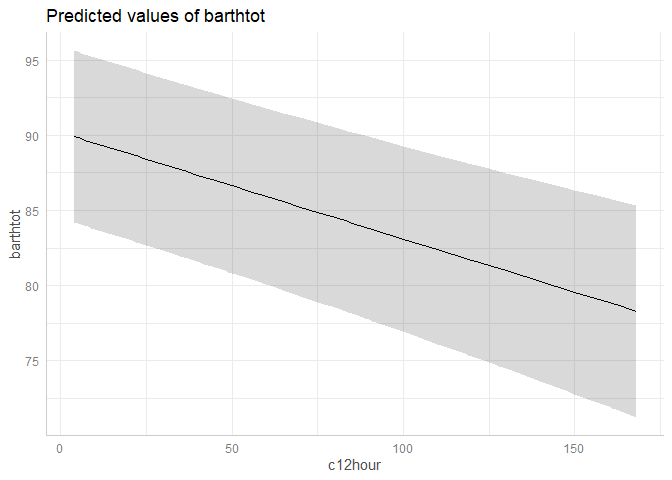

# ggeffects - Create Tidy Data Frames of Marginal Effects for ‘ggplot’ from Model Outputs 

[](https://cran.r-project.org/package=ggeffects)
  
[](https://doi.org/10.21105/joss.00772)
  
[](https://strengejacke.github.io/ggeffects/)
   [](https://travis-ci.org/strengejacke/ggeffects.svg)
  
[](http://cranlogs.r-pkg.org/)
  
[](http://cranlogs.r-pkg.org/)

Lüdecke D (2018). *ggeffects: Tidy Data Frames of Marginal Effects from
Regression Models.* Journal of Open Source Software, 3(26), 772. doi:
[10.21105/joss.00772](https://doi.org/10.21105/joss.00772)

## Why marginal effects?

Results of regression models are typically presented as tables that are
easy to understand. For more complex models that include interaction or
quadratic / spline terms, tables with numbers are less helpful and
difficult to interpret. In such cases, *marginal effects* are far easier
to understand. In particular, the visualization of marginal effects
allows to intuitively get the idea of how predictors and outcome are
associated, even for complex models.

## Aim of this package

**ggeffects** computes marginal effects at the mean or at representative
values ([see definitions
here](https://stats.stackexchange.com/tags/marginal-effect/info)) from
statistical models and returns the result as tidy data frames. These
data frames are ready to use with the **ggplot2**-package.

## Documentation and Support

Please visit <https://strengejacke.github.io/ggeffects/> for
documentation and vignettes. In case you want to file an issue or
contribute in another way to the package, please follow [this
guide](https://github.com/strengejacke/ggeffects/blob/master/.github/CONTRIBUTING.md).
For questions about the functionality, you may either contact me via
email or also file an issue.

## ggeffects supports many different models and is easy to use

Marginal effects can be calculated for many different models. Currently
supported model-objects are: `bamlss`, `bayesx`, `betabin`, `betareg`,
`bglmer`, `blmer`, `bracl`, `brglm`, `brmsfit`, `brmultinom`, `clm`,
`clm2`, `clmm`, `coxph`, `gam` (package **mgcv**), `Gam` (package
**gam**), `gamlss`, `gamm`, `gamm4`, `gee`, `geeglm`, `glm`, `glm.nb`,
`glmer`, `glmer.nb`, `glmmTMB`, `glmmPQL`, `glmrob`, `glmRob`, `gls`,
`hurdle`, `ivreg`, `lm`, `lm_robust`, `lme`, `lmer`, `lmrob`, `lmRob`,
`logistf`, `lrm`, `MixMod`, `MCMCglmm`, `multinom`, `negbin`, `nlmer`,
`ols`, `plm`, `polr`, `rlm`, `rlmer`, `rq`, `rqss`, `stanreg`,
`survreg`, `svyglm`, `svyglm.nb`, `tobit`, `truncreg`, `vgam`, `wbm`,
`zeroinfl` and `zerotrunc`. Other models not listed here are passed to a
generic predict-function and might work as well, or maybe with
`ggeffect()` or `ggemmeans()`, which effectively do the same as
`ggpredict()`.

Interaction terms, splines and polynomial terms are also supported. The
main functions are `ggpredict()`, `ggemmeans()` and `ggeffect()`. There
is a generic `plot()`-method to plot the results using **ggplot2**.

## Examples

The returned data frames always have the same, consistent structure and
column names, so it’s easy to create ggplot-plots without the need to
re-write the function call. `x` and `predicted` are the values for the
x- and y-axis. `conf.low` and `conf.high` could be used as `ymin` and
`ymax` aesthetics for ribbons to add confidence bands to the plot.
`group` can be used as grouping-aesthetics, or for faceting.

`ggpredict()` requires at least one, but not more than four terms
specified in the `terms`-argument. Predicted values of the response,
along the values of the first term are calculated, optionally grouped by
the other terms specified in `terms`.

``` r
library(ggeffects)
library(splines)
data(efc)
fit <- lm(barthtot ~ c12hour + bs(neg_c_7) * c161sex + e42dep, data = efc)

ggpredict(fit, terms = "c12hour")
#> 
#> # Predicted values of Total score BARTHEL INDEX
#> # x = average number of hours of care per week
#> 
#>    x predicted std.error conf.low conf.high
#>    4        68      1.06       66        70
#>   12        67      1.01       65        69
#>   22        66      0.96       64        68
#>   36        65      0.92       63        66
#>   49        63      0.93       62        65
#>   70        61      1.01       59        63
#>  100        58      1.25       56        61
#>  168        51      2.04       47        55
#> 
#> Adjusted for:
#> * neg_c_7 = 11.83
#> * c161sex =  1.76
#> *  e42dep =  2.93
```

A possible call to ggplot could look like this:

``` r
library(ggplot2)
mydf <- ggpredict(fit, terms = "c12hour")
ggplot(mydf, aes(x, predicted)) +
  geom_line() +
  geom_ribbon(aes(ymin = conf.low, ymax = conf.high), alpha = .1)
```

<!-- -->

However, there is also a `plot()`-method. This method uses convenient
defaults, to easily create the most suitable plot for the marginal
effects.

``` r
mydf <- ggpredict(fit, terms = "c12hour")
plot(mydf)
```

<!-- -->

With three variables, predictions can be grouped and faceted.

``` r
ggpredict(fit, terms = c("neg_c_7", "c161sex", "e42dep"))
#> 
#> # Predicted values of Total score BARTHEL INDEX
#> # x = Negative impact with 7 items
#> 
#> # c161sex = Male
#> #  e42dep = [1] independent
#>   x predicted std.error conf.low conf.high
#>   7       103       3.5       96       110
#>  12       102       2.6       97       107
#>  17        94       3.5       87       101
#>  28       165      35.0       96       233
#> 
#> # c161sex = Female
#> #  e42dep = [1] independent
#>   x predicted std.error conf.low conf.high
#>   7       110       2.2      105       114
#>  12       100       2.0       96       104
#>  17        95       2.4       90       100
#>  28        90       9.4       72       109
#> 
#> # c161sex = Male
#> #  e42dep = [2] slightly dependent
#>   x predicted std.error conf.low conf.high
#>   7        84       3.3       77        90
#>  12        83       2.2       79        88
#>  17        75       3.1       69        81
#>  28       146      35.0       77       214
#> 
#> # c161sex = Female
#> #  e42dep = [2] slightly dependent
#>   x predicted std.error conf.low conf.high
#>   7        91       1.9       87        94
#>  12        81       1.3       78        83
#>  17        76       1.8       72        80
#>  28        71       9.3       53        89
#> 
#> # c161sex = Male
#> #  e42dep = [3] moderately dependent
#>   x predicted std.error conf.low conf.high
#>   7        65       3.3       58        71
#>  12        64       2.0       60        68
#>  17        56       2.9       50        62
#>  28       127      35.0       58       195
#> 
#> # c161sex = Female
#> #  e42dep = [3] moderately dependent
#>   x predicted std.error conf.low conf.high
#>   7        72       2.0       68        75
#>  12        62       1.0       60        64
#>  17        57       1.5       54        60
#>  28        52       9.2       34        70
#> 
#> # c161sex = Male
#> #  e42dep = [4] severely dependent
#>   x predicted std.error conf.low conf.high
#>   7        46       3.5       39        53
#>  12        45       2.2       41        49
#>  17        37       3.0       31        43
#>  28       108      35.0       39       176
#> 
#> # c161sex = Female
#> #  e42dep = [4] severely dependent
#>   x predicted std.error conf.low conf.high
#>   7        53       2.4       48        57
#>  12        43       1.3       40        45
#>  17        38       1.6       35        41
#>  28        33       9.2       15        51
#> 
#> Adjusted for:
#> * c12hour = 42.10

mydf <- ggpredict(fit, terms = c("neg_c_7", "c161sex", "e42dep"))
ggplot(mydf, aes(x = x, y = predicted, colour = group)) +
  geom_line() +
  facet_wrap(~facet)
```

<!-- -->

`plot()` works for this case, as well:

``` r
plot(mydf)
```

<!-- -->

There are some more features, which are explained in more detail in the
package-vignette.

## Installation

### Latest development build

To install the latest development snapshot (see latest changes below),
type following commands into the R console:

``` r
library(devtools)
devtools::install_github("strengejacke/ggeffects")
```

### Officiale, stable release

To install the latest stable release from CRAN, type following command
into the R console:

``` r
install.packages("ggeffects")
```

## Citation

In case you want / have to cite my package, please use
`citation('ggeffects')` for citation information:

Lüdecke D (2018). *ggeffects: Tidy Data Frames of Marginal Effects from
Regression Models.* Journal of Open Source Software, 3(26), 772. doi:
[10.21105/joss.00772](https://doi.org/10.21105/joss.00772)
