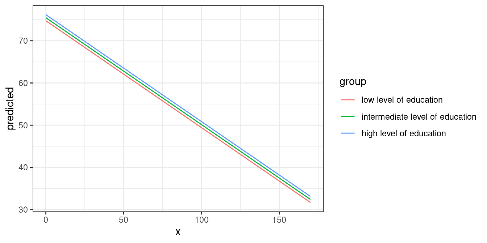
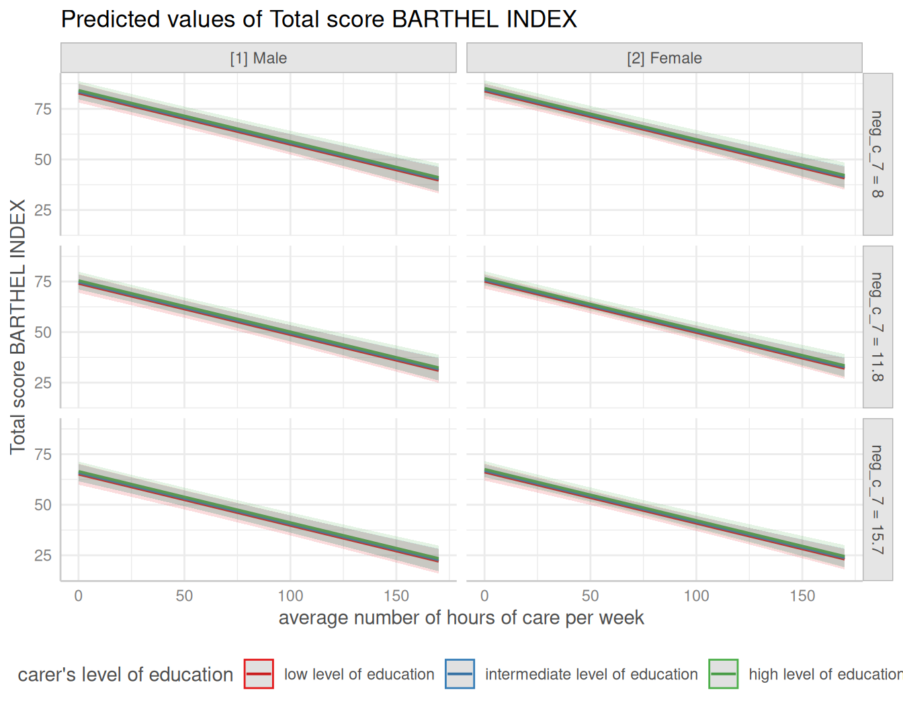
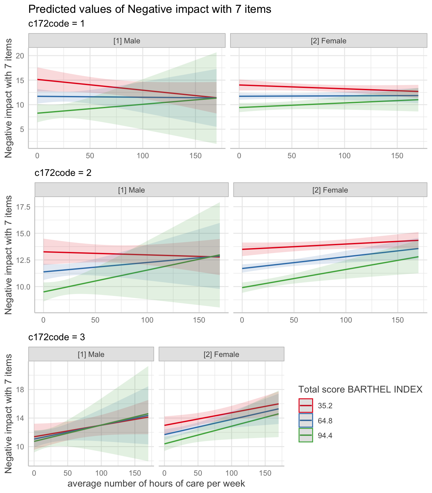
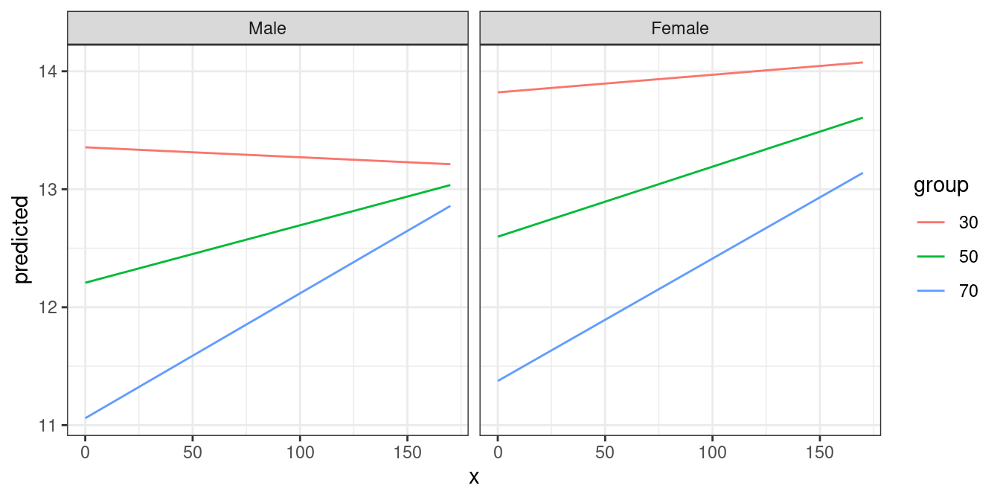
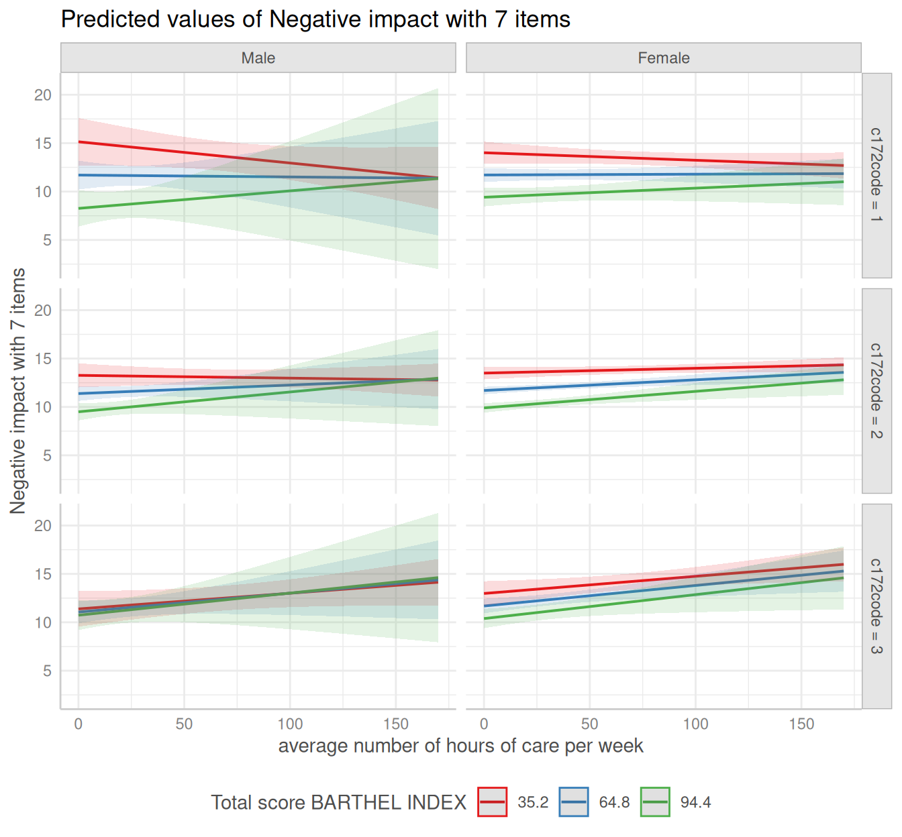
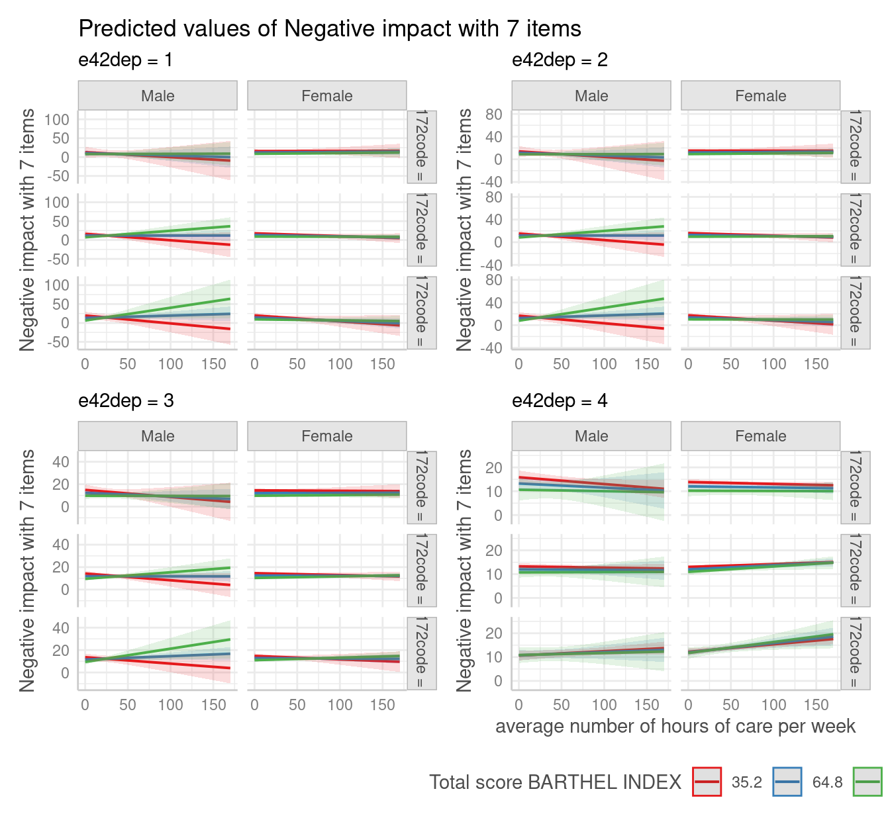
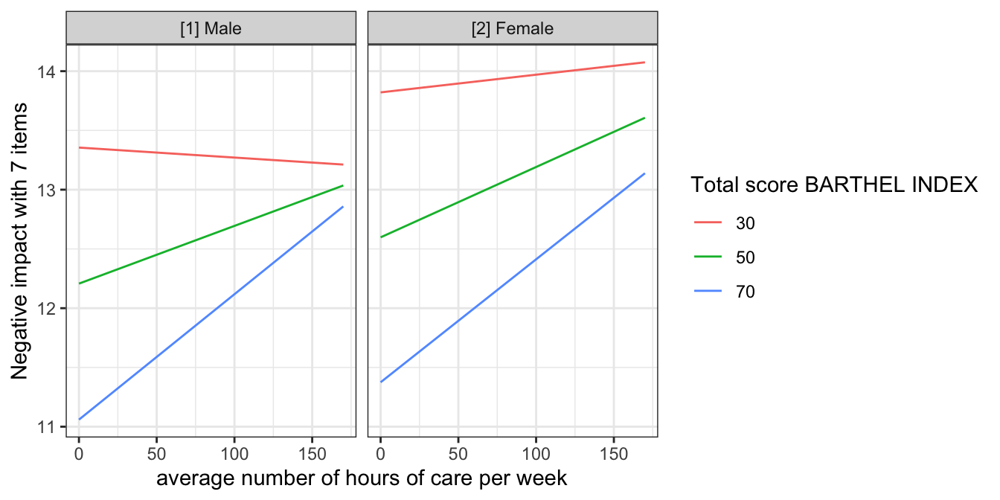
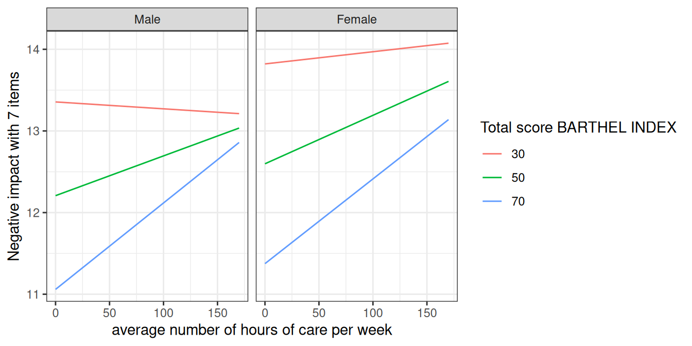

# ggeffects: Marginal Means And Adjusted Predictions Of Regression Models

## Aims of the ggeffects-package

After fitting a model, it is useful generate model-based estimates
(expected values, or *adjusted predictions*) of the response variable
for different combinations of predictor values. Such estimates can be
used to make inferences about relationships between variables - adjusted
predictions tell you: what is the expected ouctome for certain values or
levels of my predictors? Even for complex models, the visualization of
*marginal means* or *adjusted predictions* is far easier to understand
and allows to intuitively get the idea of how predictors and outcome are
associated.

There are three major goals that you can achieve with *ggeffects*:
computing marginal means and adjusted predictions, testing these
predictions for statistical significance, and creating figures (plots).
What you basically would need for your workflow is:
[`predict_response()`](https://strengejacke.github.io/ggeffects/reference/predict_response.md),
[`test_predictions()`](https://strengejacke.github.io/ggeffects/reference/test_predictions.md)
and
[`plot()`](https://strengejacke.github.io/ggeffects/reference/plot.md).

##  Summary of most important points:

- The aim of the *ggeffects-package* is to understand your model and
  look at how predictors are associated with the outcome. This is
  achieved by calculating adjusted predictions, using the
  [`predict_response()`](https://strengejacke.github.io/ggeffects/reference/predict_response.md)
  function.
- [`predict_response()`](https://strengejacke.github.io/ggeffects/reference/predict_response.md)
  estimates the outcome for meaningful values of predictors of interest
  (so-called *focal terms* ).
- The interpretation of the results, or the conclusion that can be
  drawn, also depend on how the non-focal terms are handled. This is
  controlled by the `margin` argument.
- The syntax is easy and intuitive: Just provide a model object, specify
  focal terms in the `terms` argument, and optionally specify the
  `margin` argument. This works for simple effects as well as more
  complex interaction effects.

### What ggeffects does

**ggeffects** computes marginal means and adjusted predictions at the
mean (MEM), at representative values (MER) or averaged across predictors
(so called *focal terms*) from statistical models. The result is
returned as data frame with consistent structure, especially for further
use with [ggplot](https://cran.r-project.org/package=ggplot2).

At least one focal term needs to be specified for which the effects are
computed. It is also possible to compute adjusted predictions for focal
terms, grouped by the levels of another model’s predictor. The package
also allows plotting adjusted predictions for two-, three- or
four-way-interactions, or for specific values of a focal term only.
Examples are shown below.

### How to use the ggeffects-package: The main function

[`predict_response()`](https://strengejacke.github.io/ggeffects/reference/predict_response.md)
is actually a wrapper around three “workhorse” functions,
[`ggpredict()`](https://strengejacke.github.io/ggeffects/reference/ggpredict.md),
[`ggemmeans()`](https://strengejacke.github.io/ggeffects/reference/ggpredict.md)
and
[`ggaverage()`](https://strengejacke.github.io/ggeffects/reference/ggpredict.md).
Depending on the value of the `margin` argument,
[`predict_response()`](https://strengejacke.github.io/ggeffects/reference/predict_response.md)
calls one of those functions, with different arguments. The `margin`
argument indicates how to marginalize over the *non-focal* predictors,
i.e. those variables that are *not* specified in `terms`.

It is important to know, which question you would like to answer. See
the following options for the `margin` argument and which question is
answered by each option:

- `"mean_reference"` and `"mean_mode"`: `"mean_reference"` calls
  [`ggpredict()`](https://strengejacke.github.io/ggeffects/reference/ggpredict.md),
  i.e. non-focal predictors are set to their mean (numeric variables),
  reference level (factors), or “most common” value (mode) in case of
  character vectors. `"mean_mode"` calls
  `ggpredict(typical = c(numeric = "mean", factor = "mode"))`,
  i.e. non-focal predictors are set to their mean (numeric variables) or
  mode (factors, or “most common” value in case of character vectors).

  Predictions based on `"mean_reference"` and `"mean_mode"` represent a
  rather “theoretical” view on your data, which does not necessarily
  exactly reflect the characteristics of your sample. It helps answer
  the question, “What is the predicted (or: expected) value of the
  response at meaningful values or levels of my focal terms for a
  ‘typical’ observation in my data?”, where ‘typical’ refers to certain
  characteristics of the remaining predictors.

- `"marginalmeans"`: calls
  [`ggemmeans()`](https://strengejacke.github.io/ggeffects/reference/ggpredict.md),
  i.e. non-focal predictors are set to their mean (numeric variables) or
  marginalized over the levels or “values” for factors and character
  vectors. Marginalizing over the factor levels of non-focal terms
  computes a kind of “weighted average” for the values at which these
  terms are hold constant. Thus, non-focal categorical terms are
  conditioned on “weighted averages” of their levels. There are
  different weighting options that can be chosen with the `weights`
  argument.

  `"marginalmeans"` comes closer to the sample, because it takes all
  possible values and levels of your non-focal predictors into account.
  It would answer thr question, “What is the predicted (or: expected)
  value of the response at meaningful values or levels of my focal terms
  for an ‘average’ observation in my data?”. It refers to randomly
  picking a subject of your sample and the result you get on average.

- `"empirical"` (or on of its aliases, `"counterfactual"` or
  `"average"`): calls
  [`ggaverage()`](https://strengejacke.github.io/ggeffects/reference/ggpredict.md),
  i.e. non-focal predictors are marginalized over the observations in
  your sample. The response is predicted for each subject in the data
  and predicted values are then averaged across all subjects,
  aggregated/grouped by the focal terms. In particular, averaging is
  applied to *counterfactual predictions* (Dickerman and Hernan 2020).
  There is a more detailed description in [this
  vignette](https://strengejacke.github.io/ggeffects/articles/technical_differencepredictemmeans.html).

  `"empirical"`is probably the most “realistic” approach, insofar as the
  results can also be transferred to other contexts. It answers the
  question, “What is the predicted (or: expected) value of the response
  at meaningful values or levels of my focal terms for the ‘average’
  observation in the population?”. It does not only refer to the actual
  data in your sample, but also “what would be if” we had more data, or
  if we had data from a different population. This is where
  “counterfactual” refers to.

You can set a default-option for the `margin` argument via
[`options()`](https://rdrr.io/r/base/options.html),
e.g. `options(ggeffects_margin = "empirical")`, so you don’t have to
specify your “default” marginalization method each time you call
[`predict_response()`](https://strengejacke.github.io/ggeffects/reference/predict_response.md).
Use `options(ggeffects_margin = NULL)` to remove that setting.

The `condition` argument can be used to fix non-focal terms to specific
values.

### Short technical note

#### Predicting the outcome

By default,
[`predict_response()`](https://strengejacke.github.io/ggeffects/reference/predict_response.md)
always returns predicted values for the *response* of a model (or
*response distribution* for Bayesian models).

#### Confidence intervals

Typically,
[`predict_response()`](https://strengejacke.github.io/ggeffects/reference/predict_response.md)
(or
[`ggpredict()`](https://strengejacke.github.io/ggeffects/reference/ggpredict.md))
returns confidence intervals based on the standard errors as returned by
the [`predict()`](https://rdrr.io/r/stats/predict.html)-function,
assuming normal distribution (`+/- 1.96 * SE`) resp. a Student’s
t-distribuion (if degrees of freedom are available). If
[`predict()`](https://rdrr.io/r/stats/predict.html) for a certain model
object does *not* return standard errors (for example,
*merMod*-objects), these are calculated manually, by following steps:
matrix-multiply `X` by the parameter vector `B` to get the predictions,
then extract the variance-covariance matrix `V` of the parameters and
compute `XVX'` to get the variance-covariance matrix of the predictions.
The square-root of the diagonal of this matrix represent the standard
errors of the predictions, which are then multiplied by the critical
test-statistic value (e.g., ~1.96 for normal distribuion) for the
confidence intervals.

### Consistent data frame structure

The returned data frames always have the same, consistent structure and
column names, so it’s easy to create ggplot-plots without the need to
re-write the arguments to be mapped in each ggplot-call. `x` and
`predicted` are the values for the x- and y-axis. `conf.low` and
`conf.high` could be used as `ymin` and `ymax` aesthetics for ribbons to
add confidence bands to the plot. `group` can be used as
grouping-aesthetics, or for faceting.

If the original variable names are desired as column names, there is an
[`as.data.frame()`](https://rdrr.io/r/base/as.data.frame.html) method
for objects of class `ggeffects`, which has an `terms_to_colnames`
argument, to use the variable names as column names instead of the
standardized names `"x"` etc.

The examples shown here mostly use **ggplot2**-code for the plots,
however, there is also a
[`plot()`](https://strengejacke.github.io/ggeffects/reference/plot.md)-method,
which is described in the vignette [Plotting Adjusted
Predictions](https://strengejacke.github.io/ggeffects/articles/introduction_plotmethod.md).

## Adjusted predictions at the mean

[`predict_response()`](https://strengejacke.github.io/ggeffects/reference/predict_response.md)
computes predicted values for all possible levels and values from
model’s predictors that are defined as *focal terms*. In the simplest
case, a fitted model is passed as first argument, and the focal term as
second argument. Use the raw name of the variable for the
`terms`-argument only - you don’t need to write things like
`poly(term, 3)` or `I(term^2)` for the `terms`-argument.

[`library`](https://rdrr.io/r/base/library.html)`(`[`ggeffects`](https://strengejacke.github.io/ggeffects/)`)`` `[`data`](https://rdrr.io/r/utils/data.html)`(``efc``, package ``=`` ``"ggeffects"``)`` ``fit`` ``<-`` `[`lm`](https://rdrr.io/r/stats/lm.html)`(``barthtot`` ``~`` ``c12hour`` ``+`` ``neg_c_7`` ``+`` ``c161sex`` ``+`` ``c172code``, data ``=`` ``efc``)`` `` `[`predict_response`](https://strengejacke.github.io/ggeffects/reference/predict_response.md)`(``fit``, terms ``=`` ``"c12hour"``)`` ``#> # Predicted values of Total score BARTHEL INDEX`` ``#> `` ``#> c12hour | Predicted | 95% CI`` ``#> ----------------------------------`` ``#> 0 | 75.44 | 73.25, 77.63`` ``#> 20 | 70.38 | 68.56, 72.19`` ``#> 45 | 64.05 | 62.39, 65.70`` ``#> 65 | 58.98 | 57.15, 60.80`` ``#> 85 | 53.91 | 51.71, 56.12`` ``#> 105 | 48.85 | 46.14, 51.55`` ``#> 125 | 43.78 | 40.51, 47.05`` ``#> 170 | 32.38 | 27.73, 37.04`` ``#> `` ``#> Adjusted for:`` ``#> * neg_c_7 = 11.84`` ``#> * c161sex = 1.76`` ``#> * c172code = 1.97`

As you can see,
[`predict_response()`](https://strengejacke.github.io/ggeffects/reference/predict_response.md)
(or their lower-level functions
[`ggpredict()`](https://strengejacke.github.io/ggeffects/reference/ggpredict.md),
[`ggeffect()`](https://strengejacke.github.io/ggeffects/reference/ggpredict.md),
[`ggaverage()`](https://strengejacke.github.io/ggeffects/reference/ggpredict.md)
or
[`ggemmeans()`](https://strengejacke.github.io/ggeffects/reference/ggpredict.md))
has a nice
[`print()`](https://strengejacke.github.io/ggeffects/reference/print.md)
method, which takes care of printing not too many rows (but always an
equally spaced range of values, including minimum and maximum value of
the term in question) and giving some extra information. This is
especially useful when predicted values are shown depending on the
levels of other terms (see below).

The output shows the predicted values for the response at each value
from the term *c12hour*. The data is already in shape for ggplot:

[`library`](https://rdrr.io/r/base/library.html)`(`[`ggplot2`](https://ggplot2.tidyverse.org)`)`` `[`theme_set`](https://ggplot2.tidyverse.org/reference/get_theme.html)`(`[`theme_bw`](https://ggplot2.tidyverse.org/reference/ggtheme.html)`(``)``)`` `` ``mydf`` ``<-`` `[`predict_response`](https://strengejacke.github.io/ggeffects/reference/predict_response.md)`(``fit``, terms ``=`` ``"c12hour"``)`` `[`ggplot`](https://ggplot2.tidyverse.org/reference/ggplot.html)`(``mydf``, `[`aes`](https://ggplot2.tidyverse.org/reference/aes.html)`(``x``, ``predicted``)``)`` ``+`` `[`geom_line`](https://ggplot2.tidyverse.org/reference/geom_path.html)`(``)`

## Adjusted predictions at the mean by other predictors’ levels

The `terms` argument accepts up to four model terms, where the second to
fourth terms indicate grouping levels. This allows predictions for the
term in question at different levels or values for other focal terms:

[`predict_response`](https://strengejacke.github.io/ggeffects/reference/predict_response.md)`(``fit``, terms ``=`` `[`c`](https://rdrr.io/r/base/c.html)`(``"c12hour"``, ``"c172code"``)``)`` ``#> # Predicted values of Total score BARTHEL INDEX`` ``#> `` ``#> c172code: low level of education`` ``#> `` ``#> c12hour | Predicted | 95% CI`` ``#> ----------------------------------`` ``#> 0 | 74.75 | 71.26, 78.23`` ``#> 30 | 67.15 | 64.03, 70.26`` ``#> 55 | 60.81 | 57.77, 63.86`` ``#> 85 | 53.22 | 49.95, 56.48`` ``#> 115 | 45.62 | 41.86, 49.37`` ``#> 170 | 31.69 | 26.59, 36.78`` ``#> `` ``#> c172code: intermediate level of education`` ``#> `` ``#> c12hour | Predicted | 95% CI`` ``#> ----------------------------------`` ``#> 0 | 75.46 | 73.28, 77.65`` ``#> 30 | 67.87 | 66.16, 69.57`` ``#> 55 | 61.53 | 59.82, 63.25`` ``#> 85 | 53.93 | 51.72, 56.14`` ``#> 115 | 46.34 | 43.35, 49.32`` ``#> 170 | 32.40 | 27.74, 37.07`` ``#> `` ``#> c172code: high level of education`` ``#> `` ``#> c12hour | Predicted | 95% CI`` ``#> ----------------------------------`` ``#> 0 | 76.18 | 72.81, 79.55`` ``#> 30 | 68.58 | 65.41, 71.76`` ``#> 55 | 62.25 | 59.00, 65.50`` ``#> 85 | 54.65 | 51.03, 58.27`` ``#> 115 | 47.05 | 42.85, 51.26`` ``#> 170 | 33.12 | 27.50, 38.74`` ``#> `` ``#> Adjusted for:`` ``#> * neg_c_7 = 11.84`` ``#> * c161sex = 1.76`

Creating a ggplot is pretty straightforward: the `colour` aesthetics is
mapped with the `group` column:

`mydf`` ``<-`` `[`predict_response`](https://strengejacke.github.io/ggeffects/reference/predict_response.md)`(``fit``, terms ``=`` `[`c`](https://rdrr.io/r/base/c.html)`(``"c12hour"``, ``"c172code"``)``)`` `[`ggplot`](https://ggplot2.tidyverse.org/reference/ggplot.html)`(``mydf``, `[`aes`](https://ggplot2.tidyverse.org/reference/aes.html)`(``x``, ``predicted``, colour ``=`` ``group``)``)`` ``+`` `[`geom_line`](https://ggplot2.tidyverse.org/reference/geom_path.html)`(``)`

Another focal term would stratify the result and will create another
column named `facet`, which - as the name implies - might be used to
create a facted plot:

`mydf`` ``<-`` `[`predict_response`](https://strengejacke.github.io/ggeffects/reference/predict_response.md)`(``fit``, terms ``=`` `[`c`](https://rdrr.io/r/base/c.html)`(``"c12hour"``, ``"c172code"``, ``"c161sex"``)``)`` ``# print a more compact table`` `[`print`](https://strengejacke.github.io/ggeffects/reference/print.md)`(``mydf``, collapse_tables ``=`` ``TRUE``)`` ``#> # Predicted values of Total score BARTHEL INDEX`` ``#> `` ``#> c12hour | c172code | c161sex | Predicted | 95% CI`` ``#> ---------------------------------------------------------------------------------`` ``#> 0 | low level of education | [1] Male | 73.95 | 69.35, 78.56`` ``#> 45 | | | 62.56 | 58.22, 66.89`` ``#> 85 | | | 52.42 | 47.89, 56.96`` ``#> 170 | | | 30.89 | 24.84, 36.95`` ``#> 0 | | [2] Female | 75.00 | 71.40, 78.59`` ``#> 45 | | | 63.60 | 60.45, 66.74`` ``#> 85 | | | 53.46 | 50.12, 56.80`` ``#> 170 | | | 31.93 | 26.82, 37.05`` ``#> 0 | intermediate level of education | [1] Male | 74.67 | 71.05, 78.29`` ``#> 45 | | | 63.27 | 59.88, 66.67`` ``#> 85 | | | 53.14 | 49.39, 56.89`` ``#> 170 | | | 31.61 | 25.97, 37.25`` ``#> 0 | | [2] Female | 75.71 | 73.31, 78.12`` ``#> 45 | | | 64.32 | 62.41, 66.22`` ``#> 85 | | | 54.18 | 51.81, 56.56`` ``#> 170 | | | 32.65 | 27.94, 37.37`` ``#> 0 | high level of education | [1] Male | 75.39 | 71.03, 79.75`` ``#> 45 | | | 63.99 | 59.72, 68.26`` ``#> 85 | | | 53.86 | 49.22, 58.50`` ``#> 170 | | | 32.33 | 25.94, 38.72`` ``#> 0 | | [2] Female | 76.43 | 72.88, 79.98`` ``#> 45 | | | 65.03 | 61.67, 68.39`` ``#> 85 | | | 54.90 | 51.15, 58.65`` ``#> 170 | | | 33.37 | 27.69, 39.05`` ``#> `` ``#> Adjusted for:`` ``#> * neg_c_7 = 11.84`` `[`ggplot`](https://ggplot2.tidyverse.org/reference/ggplot.html)`(``mydf``, `[`aes`](https://ggplot2.tidyverse.org/reference/aes.html)`(``x``, ``predicted``, colour ``=`` ``group``)``)`` ``+`` `` `[`geom_line`](https://ggplot2.tidyverse.org/reference/geom_path.html)`(``)`` ``+`` `` `[`facet_wrap`](https://ggplot2.tidyverse.org/reference/facet_wrap.html)`(``~``facet``)`

Finally, a third differentation can be defined, creating another column
named `panel`. In such cases, you may create multiple plots (for each
value in `panel`). **ggeffects** takes care of this when you use
[`plot()`](https://strengejacke.github.io/ggeffects/reference/plot.md)
and automatically creates an integrated plot with all panels in one
figure.

`mydf`` ``<-`` `[`predict_response`](https://strengejacke.github.io/ggeffects/reference/predict_response.md)`(``fit``, terms ``=`` `[`c`](https://rdrr.io/r/base/c.html)`(``"c12hour"``, ``"c172code"``, ``"c161sex"``, ``"neg_c_7"``)``)`` `[`plot`](https://strengejacke.github.io/ggeffects/reference/plot.md)`(``mydf``)`` ``+`` `[`theme`](https://ggplot2.tidyverse.org/reference/theme.html)`(``legend.position ``=`` ``"bottom"``)`

## Adjusted predictions for each model term

If the `term` argument is either missing or `NULL`, adjusted predictions
for each model term are calculated. The result is returned as a list,
which can be plotted manually (or using the
[`plot()`](https://strengejacke.github.io/ggeffects/reference/plot.md)
function).

`mydf`` ``<-`` `[`predict_response`](https://strengejacke.github.io/ggeffects/reference/predict_response.md)`(``fit``)`` ``mydf`` ``#> $c12hour`` ``#> # Predicted values of Total score BARTHEL INDEX`` ``#> `` ``#> c12hour | Predicted | 95% CI`` ``#> ----------------------------------`` ``#> 0 | 75.44 | 73.25, 77.63`` ``#> 20 | 70.38 | 68.56, 72.19`` ``#> 45 | 64.05 | 62.39, 65.70`` ``#> 65 | 58.98 | 57.15, 60.80`` ``#> 85 | 53.91 | 51.71, 56.12`` ``#> 105 | 48.85 | 46.14, 51.55`` ``#> 125 | 43.78 | 40.51, 47.05`` ``#> 170 | 32.38 | 27.73, 37.04`` ``#> `` ``#> Adjusted for:`` ``#> * neg_c_7 = 11.84`` ``#> * c161sex = 1.76`` ``#> * c172code = 1.97`` ``#> `` ``#> $neg_c_7`` ``#> # Predicted values of Total score BARTHEL INDEX`` ``#> `` ``#> neg_c_7 | Predicted | 95% CI`` ``#> ----------------------------------`` ``#> 6 | 78.17 | 75.10, 81.23`` ``#> 8 | 73.57 | 71.20, 75.94`` ``#> 12 | 64.38 | 62.73, 66.04`` ``#> 14 | 59.79 | 57.88, 61.70`` ``#> 16 | 55.19 | 52.72, 57.67`` ``#> 20 | 46.00 | 42.04, 49.97`` ``#> 22 | 41.41 | 36.63, 46.20`` ``#> 28 | 27.63 | 20.30, 34.96`` ``#> `` ``#> Adjusted for:`` ``#> * c12hour = 42.20`` ``#> * c161sex = 1.76`` ``#> * c172code = 1.97`` ``#> `` ``#> $c161sex`` ``#> # Predicted values of Total score BARTHEL INDEX`` ``#> `` ``#> c161sex | Predicted | 95% CI`` ``#> ----------------------------------`` ``#> 1 | 63.96 | 60.57, 67.35`` ``#> 2 | 65.00 | 63.11, 66.90`` ``#> `` ``#> Adjusted for:`` ``#> * c12hour = 42.20`` ``#> * neg_c_7 = 11.84`` ``#> * c172code = 1.97`` ``#> `` ``#> $c172code`` ``#> # Predicted values of Total score BARTHEL INDEX`` ``#> `` ``#> c172code | Predicted | 95% CI`` ``#> -----------------------------------`` ``#> 1 | 64.06 | 61.01, 67.11`` ``#> 2 | 64.78 | 63.12, 66.43`` ``#> 3 | 65.49 | 62.31, 68.68`` ``#> `` ``#> Adjusted for:`` ``#> * c12hour = 42.20`` ``#> * neg_c_7 = 11.84`` ``#> * c161sex = 1.76`` ``#> `` ``#> attr(,"class")`` ``#> [1] "ggalleffects" "list" `` ``#> attr(,"model.name")`` ``#> [1] "fit"`

## Many focal terms: Two-Way, Three-Way-, Four-Way- and Five-Way-Interactions

Here we show examples of interaction terms, however, this section
applies in general to using many focal terms. You can plot up to five
focal terms. For all of these examples, you can easily use the
[`plot()`-method](https://strengejacke.github.io/ggeffects/articles/introduction_plotmethod.html).
**ggplot2** is just used to show how to create plots from scratch.

### Two focal terms

To plot the adjusted predictions of interaction terms, simply specify
these terms in the `terms` argument.

[`data`](https://rdrr.io/r/utils/data.html)`(``efc``, package ``=`` ``"ggeffects"``)`` `` ``# make categorical`` ``efc``$``c161sex`` ``<-`` ``datawizard``::`[`to_factor`](https://easystats.github.io/datawizard/reference/to_factor.html)`(``efc``$``c161sex``)`` `` ``# fit model with interaction`` ``fit`` ``<-`` `[`lm`](https://rdrr.io/r/stats/lm.html)`(``neg_c_7`` ``~`` ``c12hour`` ``+`` ``barthtot`` ``*`` ``c161sex``, data ``=`` ``efc``)`` `` ``# select only levels 30, 50 and 70 from continuous variable Barthel-Index`` ``mydf`` ``<-`` `[`predict_response`](https://strengejacke.github.io/ggeffects/reference/predict_response.md)`(``fit``, terms ``=`` `[`c`](https://rdrr.io/r/base/c.html)`(``"barthtot [30,50,70]"``, ``"c161sex"``)``)`` `[`ggplot`](https://ggplot2.tidyverse.org/reference/ggplot.html)`(``mydf``, `[`aes`](https://ggplot2.tidyverse.org/reference/aes.html)`(``x``, ``predicted``, colour ``=`` ``group``)``)`` ``+`` `[`geom_line`](https://ggplot2.tidyverse.org/reference/geom_path.html)`(``)`

### Three focal terms

Since the `terms` argument accepts up to five focal terms, you can also
compute adjusted predictions for a 3-way-, 4-way- or 5-way-interaction.
To plot the adjusted predictions of three interaction terms, just like
before, specify all three terms in the `terms` argument.

`# fit model with 3-way-interaction`` ``fit`` ``<-`` `[`lm`](https://rdrr.io/r/stats/lm.html)`(``neg_c_7`` ``~`` ``c12hour`` ``*`` ``barthtot`` ``*`` ``c161sex``, data ``=`` ``efc``)`` `` ``# select only levels 30, 50 and 70 from continuous variable Barthel-Index`` ``mydf`` ``<-`` `[`predict_response`](https://strengejacke.github.io/ggeffects/reference/predict_response.md)`(``fit``, terms ``=`` `[`c`](https://rdrr.io/r/base/c.html)`(``"c12hour"``, ``"barthtot [30,50,70]"``, ``"c161sex"``)``)`` `` `[`ggplot`](https://ggplot2.tidyverse.org/reference/ggplot.html)`(``mydf``, `[`aes`](https://ggplot2.tidyverse.org/reference/aes.html)`(``x``, ``predicted``, colour ``=`` ``group``)``)`` ``+`` `` `[`geom_line`](https://ggplot2.tidyverse.org/reference/geom_path.html)`(``)`` ``+`` `` `[`facet_wrap`](https://ggplot2.tidyverse.org/reference/facet_wrap.html)`(``~``facet``)`

### Four focal terms

4-way-interactions, or more generally: four focal terms, will be plotted
in a grid layout. The *first* focal term is plotted on the x-axis. The
*second* focal term is mapped to different colors (groups) and appears
in the legend. The *third* focal term is mapped to columns, and the
*fourth* focal term is mapped to rows.

`# fit model with 4-way-interaction`` ``fit`` ``<-`` `[`lm`](https://rdrr.io/r/stats/lm.html)`(``neg_c_7`` ``~`` ``c12hour`` ``*`` ``barthtot`` ``*`` ``c161sex`` ``*`` ``c172code``, data ``=`` ``efc``)`` `` ``# adjusted predictions for all 4 interaction terms`` ``pr`` ``<-`` `[`predict_response`](https://strengejacke.github.io/ggeffects/reference/predict_response.md)`(``fit``, `[`c`](https://rdrr.io/r/base/c.html)`(``"c12hour"``, ``"barthtot"``, ``"c161sex"``, ``"c172code"``)``)`` `` ``# use plot() method, easier than own ggplot-code from scratch`` `[`plot`](https://strengejacke.github.io/ggeffects/reference/plot.md)`(``pr``)`` ``+`` `[`theme`](https://ggplot2.tidyverse.org/reference/theme.html)`(``legend.position ``=`` ``"bottom"``)`

### Five focal terms

5-way-interactions are rather confusing to print and plot. When
plotting, multiple plots (for each level of the fifth interaction term)
are plotted for the remaining four focal terms. Note that for five focal
terms, `n_rows` can be used to arrange the “sub-plots”.

`# fit model with 5-way-interaction`` ``fit`` ``<-`` `[`lm`](https://rdrr.io/r/stats/lm.html)`(``neg_c_7`` ``~`` ``c12hour`` ``*`` ``barthtot`` ``*`` ``c161sex`` ``*`` ``c172code`` ``*`` ``e42dep``, data ``=`` ``efc``)`` `` ``# adjusted predictions for all 5 interaction terms`` ``pr`` ``<-`` `[`predict_response`](https://strengejacke.github.io/ggeffects/reference/predict_response.md)`(``fit``, `[`c`](https://rdrr.io/r/base/c.html)`(``"c12hour"``, ``"barthtot"``, ``"c161sex"``, ``"c172code"``, ``"e42dep"``)``)`` `` ``# use plot() method, easier than own ggplot-code from scratch`` `[`plot`](https://strengejacke.github.io/ggeffects/reference/plot.md)`(``pr``, n_rows ``=`` ``2``)`` ``+`` `[`theme`](https://ggplot2.tidyverse.org/reference/theme.html)`(``legend.position ``=`` ``"bottom"``)`

## Polynomial terms and splines

[`predict_response()`](https://strengejacke.github.io/ggeffects/reference/predict_response.md)
also works for models with polynomial terms or splines. Following code
reproduces the plot from
[`?splines::bs`](https://rdrr.io/r/splines/bs.html):

[`library`](https://rdrr.io/r/base/library.html)`(``splines``)`` `[`data`](https://rdrr.io/r/utils/data.html)`(``women``)`` `` ``fm1`` ``<-`` `[`lm`](https://rdrr.io/r/stats/lm.html)`(``weight`` ``~`` `[`bs`](https://rdrr.io/r/splines/bs.html)`(``height``, df ``=`` ``5``)``, data ``=`` ``women``)`` ``dat`` ``<-`` `[`predict_response`](https://strengejacke.github.io/ggeffects/reference/predict_response.md)`(``fm1``, ``"height"``)`` `` `[`ggplot`](https://ggplot2.tidyverse.org/reference/ggplot.html)`(``dat``, `[`aes`](https://ggplot2.tidyverse.org/reference/aes.html)`(``x``, ``predicted``)``)`` ``+`` `` `[`geom_line`](https://ggplot2.tidyverse.org/reference/geom_path.html)`(``)`` ``+`` `` `[`geom_point`](https://ggplot2.tidyverse.org/reference/geom_point.html)`(``)`

## Survival models

[`predict_response()`](https://strengejacke.github.io/ggeffects/reference/predict_response.md)
also supports `coxph`-models from the **survival**-package and is able
to either plot risk-scores (the default), probabilities of survival
(`type = "survival"`) or cumulative hazards
(`type = "cumulative_hazard"`).

Since probabilities of survival and cumulative hazards are changing
across time, the time-variable is automatically used as x-axis in such
cases, so the `terms` argument only needs up to **two** variables for
`type = "survival"` or `type = "cumulative_hazard"`.

[`library`](https://rdrr.io/r/base/library.html)`(`[`survival`](https://github.com/therneau/survival)`)`` `[`data`](https://rdrr.io/r/utils/data.html)`(``"lung2"``)`` ``m`` ``<-`` `[`coxph`](https://rdrr.io/pkg/survival/man/coxph.html)`(`[`Surv`](https://rdrr.io/pkg/survival/man/Surv.html)`(``time``, ``status``)`` ``~`` ``sex`` ``+`` ``age`` ``+`` ``ph.ecog``, data ``=`` ``lung2``)`` `` ``# predicted risk-scores`` `[`predict_response`](https://strengejacke.github.io/ggeffects/reference/predict_response.md)`(``m``, `[`c`](https://rdrr.io/r/base/c.html)`(``"sex"``, ``"ph.ecog"``)``)`` ``#> # Predicted risk scores`` ``#> `` ``#> ph.ecog: good`` ``#> `` ``#> sex | Predicted | 95% CI`` ``#> -------------------------------`` ``#> male | 1.00 | 1.00, 1.00`` ``#> female | 0.58 | 0.42, 0.81`` ``#> `` ``#> ph.ecog: ok`` ``#> `` ``#> sex | Predicted | 95% CI`` ``#> -------------------------------`` ``#> male | 1.51 | 1.02, 2.23`` ``#> female | 0.87 | 0.53, 1.43`` ``#> `` ``#> ph.ecog: limited`` ``#> `` ``#> sex | Predicted | 95% CI`` ``#> -------------------------------`` ``#> male | 2.47 | 1.58, 3.86`` ``#> female | 1.43 | 0.83, 2.45`` ``#> `` ``#> Adjusted for:`` ``#> * age = 62.42`

`# probability of survival`` `[`predict_response`](https://strengejacke.github.io/ggeffects/reference/predict_response.md)`(``m``, `[`c`](https://rdrr.io/r/base/c.html)`(``"sex"``, ``"ph.ecog"``)``, type ``=`` ``"survival"``)`` ``#> # Probability of Survival`` ``#> `` ``#> sex: male`` ``#> ph.ecog: good`` ``#> `` ``#> time | Predicted | 95% CI`` ``#> -----------------------------`` ``#> 1 | 1.00 | 1.00, 1.00`` ``#> 180 | 0.78 | 0.69, 0.87`` ``#> 276 | 0.65 | 0.54, 0.78`` ``#> 1022 | 0.09 | 0.03, 0.26`` ``#> `` ``#> sex: male`` ``#> ph.ecog: ok`` ``#> `` ``#> time | Predicted | 95% CI`` ``#> -----------------------------`` ``#> 1 | 1.00 | 1.00, 1.00`` ``#> 180 | 0.69 | 0.60, 0.79`` ``#> 276 | 0.52 | 0.42, 0.64`` ``#> 1022 | 0.02 | 0.01, 0.11`` ``#> `` ``#> sex: male`` ``#> ph.ecog: limited`` ``#> `` ``#> time | Predicted | 95% CI`` ``#> -----------------------------`` ``#> 1 | 1.00 | 1.00, 1.00`` ``#> 180 | 0.54 | 0.42, 0.70`` ``#> 276 | 0.34 | 0.22, 0.52`` ``#> 1022 | 0.00 | 0.00, 0.04`` ``#> `` ``#> sex: female`` ``#> ph.ecog: good`` ``#> `` ``#> time | Predicted | 95% CI`` ``#> -----------------------------`` ``#> 1 | 1.00 | 1.00, 1.00`` ``#> 180 | 0.87 | 0.80, 0.93`` ``#> 276 | 0.78 | 0.68, 0.88`` ``#> 1022 | 0.24 | 0.11, 0.51`` ``#> `` ``#> sex: female`` ``#> ph.ecog: ok`` ``#> `` ``#> time | Predicted | 95% CI`` ``#> -----------------------------`` ``#> 1 | 1.00 | 1.00, 1.00`` ``#> 180 | 0.80 | 0.73, 0.88`` ``#> 276 | 0.68 | 0.59, 0.79`` ``#> 1022 | 0.12 | 0.04, 0.31`` ``#> `` ``#> sex: female`` ``#> ph.ecog: limited`` ``#> `` ``#> time | Predicted | 95% CI`` ``#> -----------------------------`` ``#> 1 | 1.00 | 1.00, 1.00`` ``#> 180 | 0.70 | 0.59, 0.83`` ``#> 276 | 0.53 | 0.40, 0.71`` ``#> 1022 | 0.03 | 0.00, 0.19`` ``#> `` ``#> Adjusted for:`` ``#> * age = 62.42`

## Labelling the data

**ggeffects** makes use of the
[sjlabelled-package](https://cran.r-project.org/package=sjlabelled) and
supports [labelled
data](https://cran.r-project.org/package=sjlabelled/vignettes/intro_sjlabelled.html).
If the data from the fitted models is labelled, the value and variable
label attributes are usually copied to the model frame stored in the
model object. **ggeffects** provides various *getter*-functions to
access these labels, which are returned as character vector and can be
used in ggplot’s `lab()`- or `scale_*()`-functions.

- [`get_title()`](https://strengejacke.github.io/ggeffects/reference/get_title.md) -
  a generic title for the plot, based on the model family, like
  “predicted values” or “predicted probabilities”
- [`get_x_title()`](https://strengejacke.github.io/ggeffects/reference/get_title.md) -
  the variable label of the first model term in `terms`.
- [`get_y_title()`](https://strengejacke.github.io/ggeffects/reference/get_title.md) -
  the variable label of the response.
- [`get_legend_title()`](https://strengejacke.github.io/ggeffects/reference/get_title.md) -
  the variable label of the second model term in `terms`.
- [`get_x_labels()`](https://strengejacke.github.io/ggeffects/reference/get_title.md) -
  value labels of the first model term in `terms`.
- [`get_legend_labels()`](https://strengejacke.github.io/ggeffects/reference/get_title.md) -
  value labels of the second model term in `terms`.

The data frame returned by
[`predict_response()`](https://strengejacke.github.io/ggeffects/reference/predict_response.md)
must be used as argument to one of the above function calls.

[`get_x_title`](https://strengejacke.github.io/ggeffects/reference/get_title.md)`(``mydf``)`` ``#> [1] "average number of hours of care per week"`` `[`get_y_title`](https://strengejacke.github.io/ggeffects/reference/get_title.md)`(``mydf``)`` ``#> [1] "Negative impact with 7 items"`` `` `[`ggplot`](https://ggplot2.tidyverse.org/reference/ggplot.html)`(``mydf``, `[`aes`](https://ggplot2.tidyverse.org/reference/aes.html)`(``x``, ``predicted``, colour ``=`` ``group``)``)`` ``+`` `` `[`geom_line`](https://ggplot2.tidyverse.org/reference/geom_path.html)`(``)`` ``+`` `` `[`facet_wrap`](https://ggplot2.tidyverse.org/reference/facet_wrap.html)`(``~``facet``)`` ``+`` `` `[`labs`](https://ggplot2.tidyverse.org/reference/labs.html)`(`` `` x ``=`` `[`get_x_title`](https://strengejacke.github.io/ggeffects/reference/get_title.md)`(``mydf``)``,`` `` y ``=`` `[`get_y_title`](https://strengejacke.github.io/ggeffects/reference/get_title.md)`(``mydf``)``,`` `` colour ``=`` `[`get_legend_title`](https://strengejacke.github.io/ggeffects/reference/get_title.md)`(``mydf``)`` `` ``)`

## References

Dickerman BA, Hernan, MA. Counterfactual prediction is not only for
causal inference. Eur J Epidemiol 35, 615–617 (2020).
