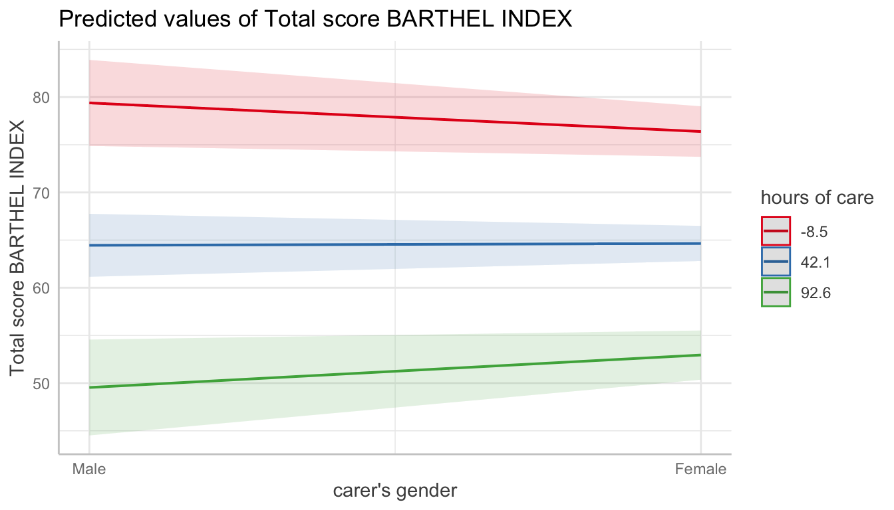
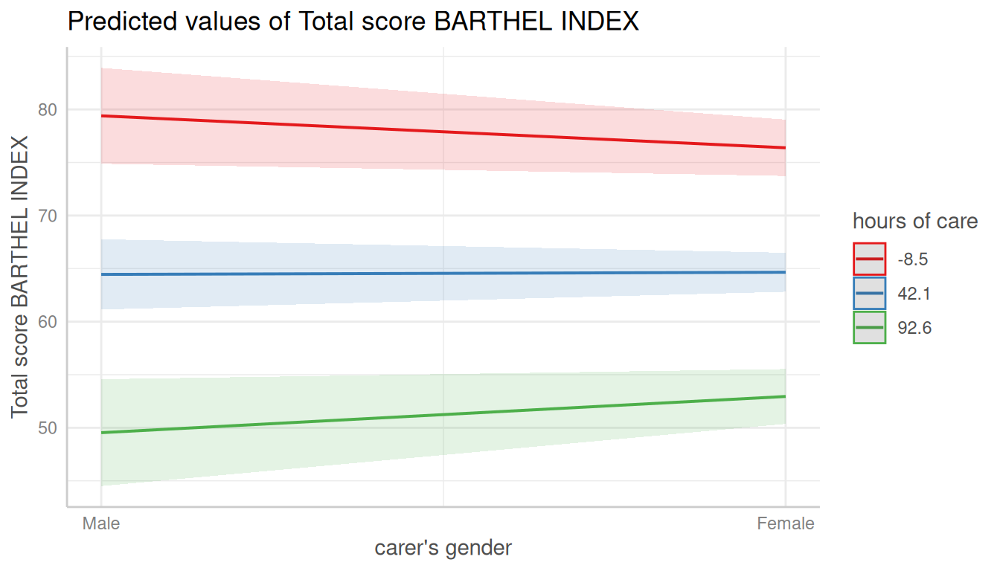
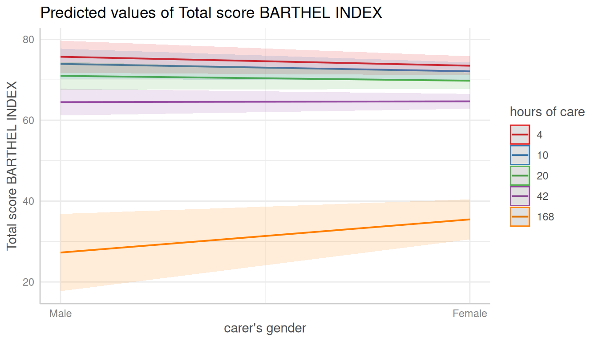
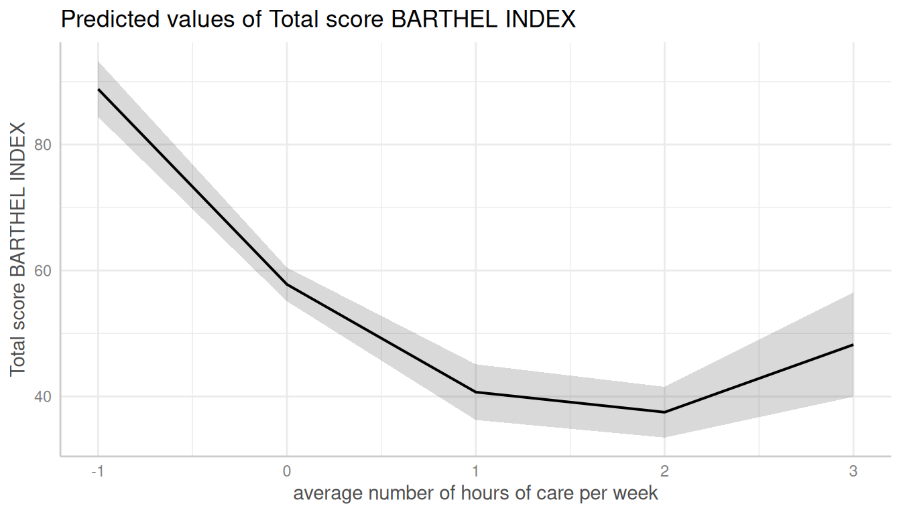
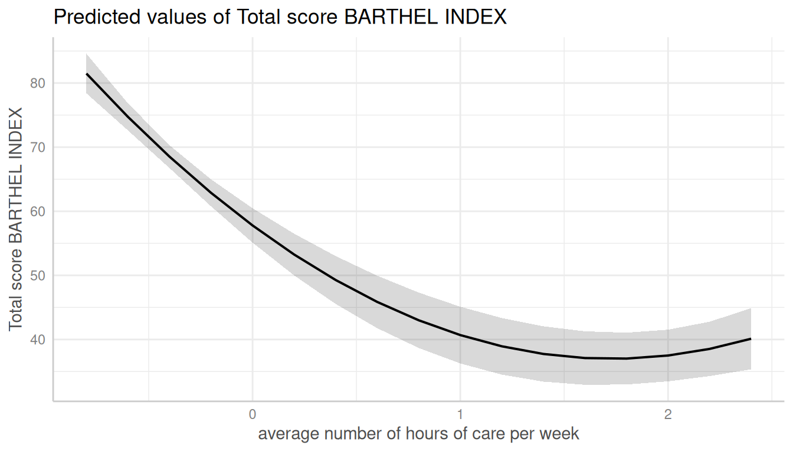
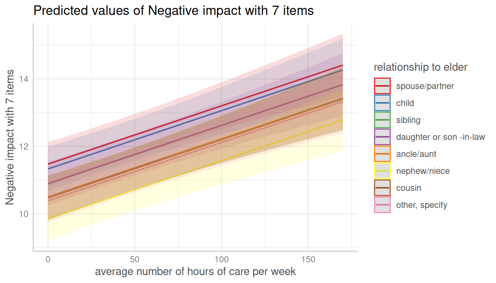
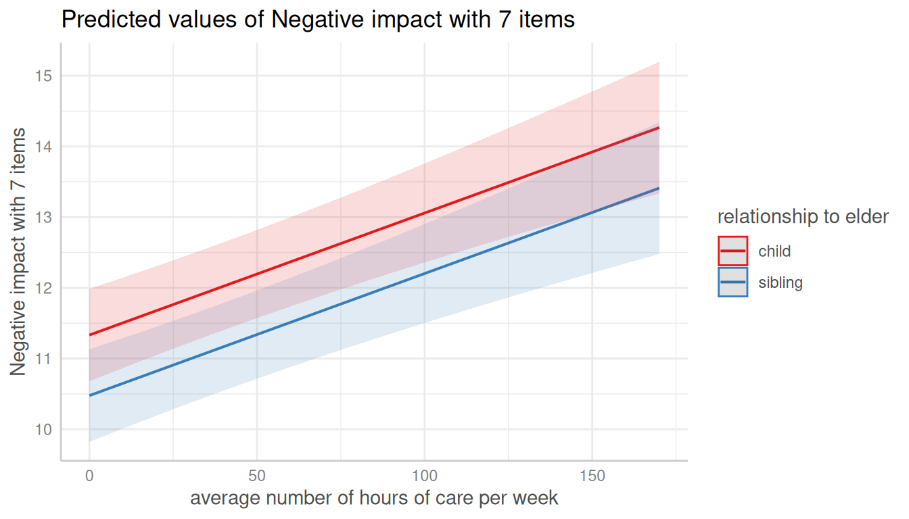
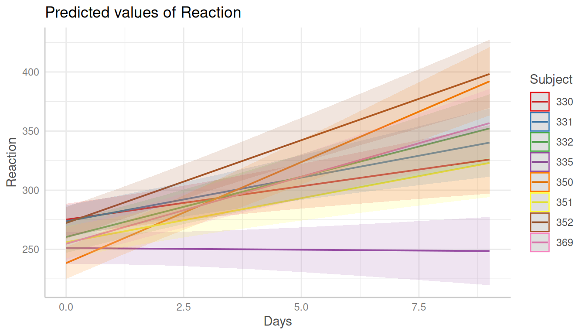

# Introduction: Adjusted Predictions And Marginal Means At Specific Values

## Adjusted predictions and marginal means at specific values or levels

This vignettes shows how to calculate adjusted predictions at specific
values or levels for the terms of interest. It is recommended to read
the [general
introduction](https://strengejacke.github.io/ggeffects/articles/ggeffects.md)
first, if you haven’t done this yet.

The `terms`-argument not only defines the model terms (i.e. focal
variables) of interest, but each model term can be limited to certain
“meaningful” (or “representative”) values. This allows to compute and
plot adjusted predictions for (grouping) terms at specific values only,
or to define values for the main effect of interest.

##  Summary of most important points:

- The `terms` argument is not only used to define the focal terms, but
  also allows to specify meaningful values, at which predictions are
  calculated.
- `terms` can be a character vector, a list, a formula, or a data frame.
  If a character vector, the values for the focal terms are placed in
  square brackets directly after the term name.
- Although providing a list is probably the most R-native way to define
  the focal terms and meaningful values, providing a character vector
  additionally allows to use pre-defined "shortcuts". That's why this is
  the preferred way demonstrated throughout the package-documentation.
- Non-focal terms can be fixed at specific values using the `condition`
  argument.

There are several options to define these meaningful values:

- A character vector, specifying the names of the focal terms. This is
  the preferred and probably most flexible way to specify focal terms.

- A list, where each element is a named vector, specifying the focal
  terms and their values. This is the “classical” R way to specify focal
  terms.

- A formula, e.g. `terms = ~ x + z`, which is internally converted to a
  character vector. This is probably the least flexible way, as you
  cannot specify representative values for the focal terms.

- A data frame representig a “data grid” or “reference grid”.
  Predictions are then made for all combinations of the variables in the
  data frame.

When `terms` is specified as character vector, values always should be
placed in square brackets directly after the term name and can vary for
each model term. The following examples show how to specify values for
the `terms`-argument.

1.  Concrete values are separated by a comma:
    `terms = "c172code [1,3]"`. For factors, you could also use factor
    levels, e.g. `terms = "Species [setosa,versicolor]"`. If `terms` is
    a named list, it would be specified like this:
    `terms = list(c172code = c(1, 3))` or
    `terms = list(c172code = c(1, 3), Species = c("setosa", "versicolor"))`.
    As a data frame, this would be:

``` r

terms <- data.frame(
  c172code = c(1, 3, 1, 3),
  Species = c("setosa", "setosa", "versicolor", "versicolor"),
  stringsAsFactors = FALSE
)
terms
#>   c172code    Species
#> 1        1     setosa
#> 2        3     setosa
#> 3        1 versicolor
#> 4        3 versicolor
```

2.  Ranges are specified with a colon:
    `terms = c("c12hour [30:80]", "c172code [1,3]")`. This would plot
    all values from 30 to 80 for the variable *c12hour*. By default, the
    step size is 1, i.e. `[1:4]` would create the range `1, 2, 3, 4`.
    You can choose different step sizes with `by`, e.g. `[1:4 by=.5]`.
    As named list, this would be `terms = list(c12hour = 30:80)` or
    `terms = list(c12hour = seq(1, 4, 0.5))`.

3.  Convenient shortcuts to calculate common values like mean +/- 1 SD
    (`terms = "c12hour [meansd]"`), quartiles
    (`terms = "c12hour [quartiles]"`) or minumum and maximum values
    (`terms = "c12hour [minmax]"`). See
    [`values_at()`](https://strengejacke.github.io/ggeffects/reference/values_at.md)
    for the different options.

4.  A function name. The function is then applied to all unique values
    of the indicated variable, e.g. `terms = "hp [exp]"`. You can also
    define own functions, and pass the name of it to the `terms`-values,
    e.g. `terms = "hp [own_function]"`.

5.  A variable name. The values of the variable are then used to define
    the `terms`-values, e.g. first, a vector is defined:
    `v = c(1000, 2000, 3000)` and then, `terms = "income [v]"`.

6.  If the *first* variable specified in `terms` is a *numeric* vector,
    for which no specific values are given, a “pretty range” is
    calculated (see
    [`pretty_range()`](https://strengejacke.github.io/ggeffects/reference/pretty_range.md)),
    to avoid memory allocation problems for vectors with many unique
    values. To select all values, use the `[all]`-tag,
    e.g. `terms = "mpg [all]"`. If a *numeric* vector is specified as
    *second* or *third* variable in `term` (i.e. if this vector
    represents a grouping structure), representative values (see
    [`values_at()`](https://strengejacke.github.io/ggeffects/reference/values_at.md))
    are chosen, which is typically mean +/- SD.

7.  To create a pretty range that should be smaller or larger than the
    default range (i.e. if no specific values would be given), use the
    `n`-tag, e.g. `terms = "age [n=5]"` or `terms = "age [n = 12]"`.
    Larger values for `n` return a larger range of predicted values.

8.  Especially useful for plotting group levels of random effects with
    many levels, is the `sample`-option,
    e.g. `terms = "Subject [sample=9]"`, which will sample nine values
    from all possible values of the variable `Subject`.

### Specific values and value range

``` r

library(ggeffects)
library(ggplot2)
data(efc, package = "ggeffects")
fit <- lm(barthtot ~ c12hour + neg_c_7 + c161sex + c172code, data = efc)

mydf <- predict_response(fit, terms = c("c12hour [30:80]", "c172code [1,3]"))
mydf
#> # Predicted values of Total score BARTHEL INDEX
#> 
#> c172code: low level of education
#> 
#> c12hour | Predicted |       95% CI
#> ----------------------------------
#>      30 |     67.15 | 64.03, 70.26
#>      38 |     65.12 | 62.05, 68.19
#>      47 |     62.84 | 59.80, 65.88
#>      55 |     60.81 | 57.77, 63.86
#>      63 |     58.79 | 55.72, 61.86
#>      80 |     54.48 | 51.28, 57.69
#> 
#> c172code: high level of education
#> 
#> c12hour | Predicted |       95% CI
#> ----------------------------------
#>      30 |     68.58 | 65.41, 71.76
#>      38 |     66.56 | 63.39, 69.73
#>      47 |     64.28 | 61.08, 67.48
#>      55 |     62.25 | 59.00, 65.50
#>      63 |     60.23 | 56.90, 63.55
#>      80 |     55.92 | 52.38, 59.46
#> 
#> Adjusted for:
#> * neg_c_7 = 11.84
#> * c161sex =  1.76
ggplot(mydf, aes(x, predicted, colour = group)) + geom_line()
```



When variables are, for instance, log-transformed, *ggeffects*
automatically back-transforms predictions to the original scale of the
response and predictors, making the predictions directly interpretable.
However, sometimes it might be useful to define own value ranges. In
such situation, specify the range in the `terms`-argument.

``` r

data(mtcars)
mpg_model <- lm(mpg ~ log(hp), data = mtcars)

# x-values and predictions based on the full range of the original "hp"-values
predict_response(mpg_model, "hp")
#> # Predicted values of mpg
#> 
#>  hp | Predicted |       95% CI
#> ------------------------------
#>  50 |     30.53 | 27.84, 33.22
#>  85 |     24.82 | 23.21, 26.42
#> 120 |     21.11 | 19.91, 22.30
#> 155 |     18.35 | 17.11, 19.59
#> 195 |     15.88 | 14.36, 17.41
#> 230 |     14.10 | 12.29, 15.92
#> 265 |     12.58 | 10.48, 14.68
#> 335 |     10.06 |  7.45, 12.66

# x-values and predictions based on "hp"-values ranging from 50 to 150
predict_response(mpg_model, "hp [50:150]")
#> # Predicted values of mpg
#> 
#>  hp | Predicted |       95% CI
#> ------------------------------
#>  50 |     30.53 | 27.84, 33.22
#>  63 |     28.04 | 25.86, 30.23
#>  75 |     26.17 | 24.33, 28.00
#>  87 |     24.57 | 23.00, 26.13
#> 100 |     23.07 | 21.71, 24.43
#> 113 |     21.75 | 20.52, 22.99
#> 125 |     20.67 | 19.49, 21.84
#> 150 |     18.71 | 17.49, 19.92
```

By default, the step size for a range is 1, like `50, 51, 52, ...`. If
you need a different step size, use `by=<stepsize>` inside the brackets,
e.g. `"hp [50:60 by=.5]"`. This would create a range from 50 to 60, with
.5er steps.

``` r

# range for x-values with .5-steps
predict_response(mpg_model, "hp [50:60 by=.5]")
#> # Predicted values of mpg
#> 
#>    hp | Predicted |       95% CI
#> --------------------------------
#> 50.00 |     30.53 | 27.84, 33.22
#> 51.50 |     30.21 | 27.59, 32.84
#> 52.50 |     30.01 | 27.42, 32.59
#> 53.50 |     29.80 | 27.26, 32.34
#> 55.00 |     29.50 | 27.02, 31.98
#> 56.50 |     29.22 | 26.79, 31.64
#> 57.50 |     29.03 | 26.64, 31.41
#> 60.00 |     28.57 | 26.28, 30.86
```

### Choosing representative values

Especially in situations where we have two continuous variables in
interaction terms, or where the “grouping” variable is continuous, it is
helpful to select representative values of the grouping variable - else,
predictions would be made for too many groups, which is no longer
helpful when interpreting adjusted predictions.

You can use

- `"minmax"`: minimum and maximum values (lower and upper bounds) of the
  variable are used.
- `"meansd"`: uses the mean value as well as one standard deviation
  below and above mean value.
- `"zeromax"`: is similar to the `"minmax"` option, however, 0 is always
  used as minimum value. This may be useful for predictors that don’t
  have an empirical zero-value.
- `"terciles"` calculates and uses the terciles (lower, middle and
  upper), *including* minimum and maximum value.
- `"terciles2"` calculates and uses the terciles (lower, middle and
  upper), *excluding* minimum and maximum value.
- `"threenum"` calculates a three-number-summary (lower-hinge, median,
  and upper-hinge).
- `"fivenum"` calculates Tukey’s five-number-summary (minimum,
  lower-hinge, median, upper-hinge, maximum).
- `"percentile"` (including the percentile-value) calculates a range of
  values from the given percentile, e.g. `"percentile80"`.
- `"all"` takes all values of the vector.

``` r

data(efc, package = "ggeffects")
# short variable label, for plot
attr(efc$c12hour, "label") <- "hours of care"
fit <- lm(barthtot ~ c12hour * c161sex + neg_c_7, data = efc)

mydf <- predict_response(fit, terms = c("c161sex", "c12hour [meansd]"))
plot(mydf)
```



``` r


mydf <- predict_response(fit, terms = c("c161sex", "c12hour [quartiles]"))
plot(mydf)
```



### Transforming values with functions

The brackets in the `terms`-argument also accept the name of a valid
function, to (back-)transform predicted values. In this example, we
define a custom function to get the original values of the focal
predictor, multiplied by 2.

``` r

# x-values and predictions based on "hp"-values, multiplied by 2
hp_double <- function(x) 2 * x
predict_response(mpg_model, "hp [hp_double]")
#> # Predicted values of mpg
#> 
#>     hp | Predicted |       95% CI
#> ---------------------------------
#> 104.00 |     22.65 | 21.34, 23.96
#> 132.00 |     20.08 | 18.91, 21.25
#> 186.00 |     16.39 | 14.94, 17.84
#> 210.00 |     15.08 | 13.43, 16.73
#> 226.00 |     14.29 | 12.51, 16.08
#> 300.00 |     11.24 |  8.88, 13.61
#> 410.00 |      7.88 |  4.81, 10.95
#> 670.00 |      2.59 | -1.63,  6.82
```

Using a list, the `terms` argument in the above example would look like
this: `terms = list(hp = hp_double(seq(100, 700, 7)))`.

### Using values from a variable (vector)

``` r

val <- c(100, 200, 300)
predict_response(mpg_model, "hp [val]")
#> # Predicted values of mpg
#> 
#>  hp | Predicted |       95% CI
#> ------------------------------
#> 100 |     23.07 | 21.71, 24.43
#> 200 |     15.61 | 14.04, 17.17
#> 300 |     11.24 |  8.88, 13.61
```

Using a list, the `terms` argument in the above example would look like
this: `terms = list(hp = val)`.

### Pretty value ranges

This section is intended to show some examples how the plotted output
differs, depending on which value range is used. Some transformations,
like polynomial or spline terms, but also quadratic or cubic terms,
result in many predicted values. In such situation, predictions for some
models lead to memory allocation problems. That is why
[`predict_response()`](https://strengejacke.github.io/ggeffects/reference/predict_response.md)
“prettifies” certain value ranges by default, at least for some model
types (like mixed models).

To see the difference in the “curvilinear” trend, we use a quadratic
term on a standardized variable.

``` r

library(datawizard)
library(lme4)
data(efc, package = "ggeffects")

efc$c12hour <- standardize(efc$c12hour)
efc$e15relat <- to_factor(efc$e15relat)

m <- lmer(
  barthtot ~ c12hour + I(c12hour^2) + neg_c_7 + c160age + c172code + (1 | e15relat),
  data = efc
)

me <- predict_response(m, terms = "c12hour")
plot(me)
```


#### Turn off “prettifying”

As said above,
[`predict_response()`](https://strengejacke.github.io/ggeffects/reference/predict_response.md)
“prettifies” the vector, resulting in a smaller set of unique values.
This is less memory consuming and may be needed especially for more
complex models.

You can turn off automatic “prettifying” by adding the `"all"`-shortcut
to the `terms`-argument.

``` r

me <- predict_response(m, terms = "c12hour [all]")
plot(me)
```


This results in a smooth plot, as all values from the term of interest
are taken into account.

#### Using different ranges for prettifying

To modify the “prettifying”, add the `"n"`-shortcut to the
`terms`-argument. This allows you to select a feasible range of values
that is smaller (and hence less memory consuming) them
`"terms = ... [all]"`, but still produces smoother plots than the
default prettyfing.

``` r

me <- predict_response(m, terms = "c12hour [n=2]")
plot(me)
```



``` r

me <- predict_response(m, terms = "c12hour [n=10]")
plot(me)
```



### Adjusted predictions conditioned on specific values of the covariates

By default, the `typical`-argument determines the function that will be
applied to the covariates to hold these terms at constant values. By
default, this is the mean-value, but other options (like median or mode)
are possible as well.

Use the `condition`-argument to define other values at which covariates
should be held constant. `condition` requires a named vector, with the
name indicating the covariate.

``` r

data(mtcars)
mpg_model <- lm(mpg ~ log(hp) + disp, data = mtcars)

# "disp" is hold constant at its mean
predict_response(mpg_model, "hp")
#> # Predicted values of mpg
#> 
#>  hp | Predicted |       95% CI
#> ------------------------------
#>  50 |     25.84 | 21.86, 29.82
#>  85 |     22.70 | 20.67, 24.72
#> 120 |     20.65 | 19.55, 21.76
#> 155 |     19.13 | 17.91, 20.35
#> 195 |     17.77 | 15.91, 19.64
#> 230 |     16.79 | 14.36, 19.23
#> 265 |     15.95 | 13.00, 18.91
#> 335 |     14.56 | 10.73, 18.40
#> 
#> Adjusted for:
#> * disp = 230.72

# "disp" is hold constant at value 200
predict_response(mpg_model, "hp", condition = c(disp = 200))
#> # Predicted values of mpg
#> 
#>  hp | Predicted |       95% CI
#> ------------------------------
#>  50 |     26.53 | 22.91, 30.15
#>  85 |     23.38 | 21.66, 25.11
#> 120 |     21.34 | 20.27, 22.41
#> 155 |     19.82 | 18.34, 21.30
#> 195 |     18.46 | 16.25, 20.67
#> 230 |     17.48 | 14.68, 20.28
#> 265 |     16.64 | 13.31, 19.97
#> 335 |     15.25 | 11.03, 19.47
```

### Adjusted predictions for each level of random effects (unit-level predictions)

Adjusted predictions can also be calculated for each group level in
mixed models. Simply add the name of the related random effects term to
the `terms`-argument, and set `type = "random"`.

In the following example, we fit a linear mixed model and first plot the
*population-level* predictions. Please see also the [dedicated vignette
for mixed
models](https://strengejacke.github.io/ggeffects/articles/introduction_randomeffects.html)
for further details and examples.

``` r

library(lme4)
data(efc, package = "ggeffects")
efc$e15relat <- to_factor(efc$e15relat)
m <- lmer(neg_c_7 ~ c12hour + c160age + c161sex + (1 | e15relat), data = efc)
me <- predict_response(m, terms = "c12hour")
plot(me)
```


To compute adjusted predictions for each grouping level (*unit-level*
predictions), add the related random term to the `terms`-argument.

``` r

me <- predict_response(m, terms = c("c12hour", "e15relat"), type = "random")
plot(me)
```



Unit-level predictions can also be calculated for specific levels only.
Add the related values into brackets after the variable name in the
`terms`-argument.

``` r

me <- predict_response(m, terms = c("c12hour", "e15relat [child,sibling]"), type = "random")
plot(me)
```



If the group factor has too many levels, you can also take a random
sample of all possible levels and plot the adjusted predictions for this
subsample of group levels. To do this, use
`term = "<groupfactor> [sample=n]"`.

``` r

data("sleepstudy")
m <- lmer(Reaction ~ Days + (1 + Days | Subject), data = sleepstudy)
me <- predict_response(m, terms = c("Days", "Subject [sample=8]"), type = "random")
plot(me)
```


