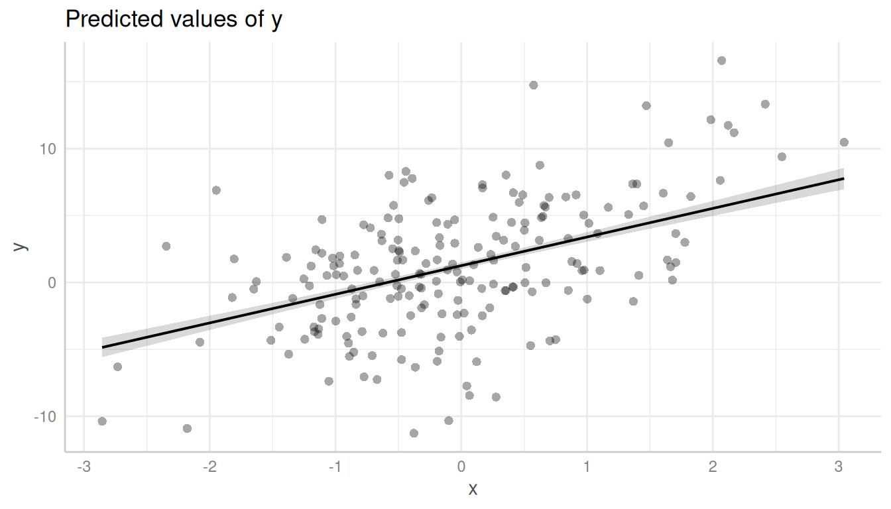
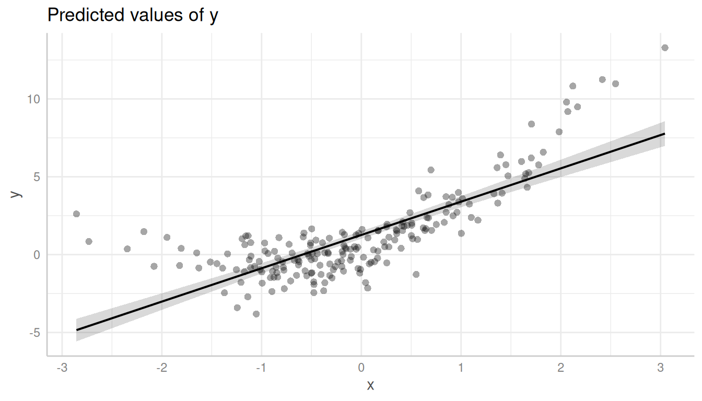
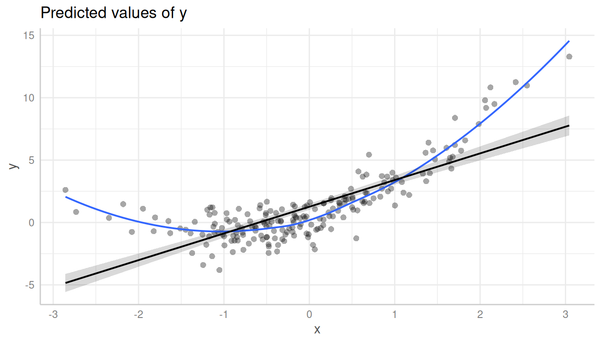
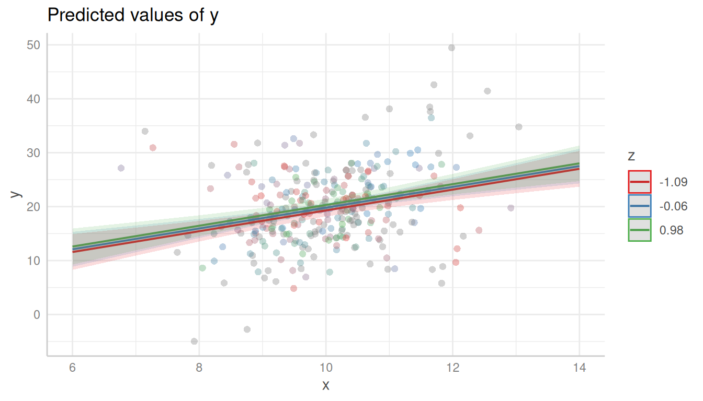
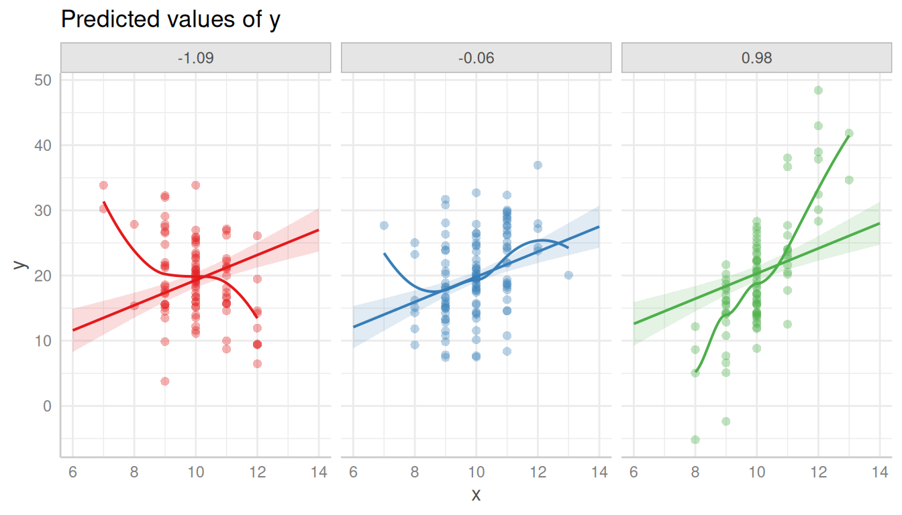
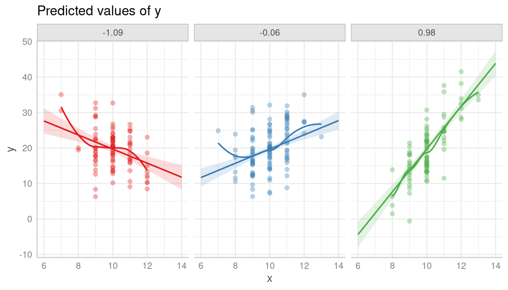
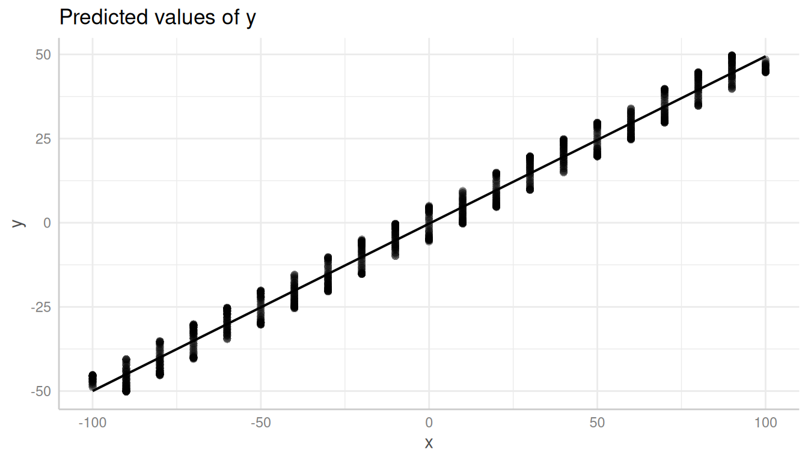
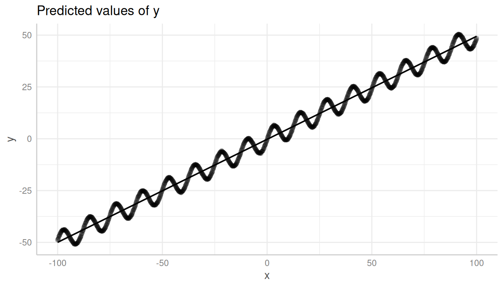

# Introduction: Adding Partial Residuals to Adjusted Predictions Plots

Plotting partial residuals on top of the estimated marginal means allows
detecting missed modeling, like unmodeled non-linear relationships or
unmodeled interactions. In a nutshell, it allows *Visualizing Fit and
Lack of Fit in Complex Regression Models with Predictor Effect Plots and
Partial Residuals* (Fox & Weisberg 2018).

To add partial residuals to a plot, add `show_residuals = TRUE` to the
[`plot()`](https://strengejacke.github.io/ggeffects/reference/plot.md)
function call. Unlike plotting raw data, partial residuals are much
better in detecting spurious patterns of relationships between
predictors and outcome.

### Detecting non-linear relationship

Let’s look at an example with a non-linear relationship. The missed
pattern is not obvious when looking at the raw data:

``` r

library(ggeffects)
set.seed(1234)
x <- rnorm(200)
z <- rnorm(200)
# quadratic relationship
y <- 2 * x + x^2 + 4 * z + rnorm(200)

d <- data.frame(x, y, z)
m <- lm(y ~ x + z, data = d)

pr <- predict_response(m, "x [all]")
plot(pr, show_data = TRUE)
```



However, it becomes more obvious with partial residuals:

``` r

plot(pr, show_residuals = TRUE)
```



It is even more obvious, when a local polynomial regression line (loess)
is added to the plot. This can be achieved using
`show_residuals_line = TRUE`.

``` r

plot(pr, show_residuals = TRUE, show_residuals_line = TRUE)
```



### Detecting missed interactions

Here is another example, which shows that the partial residuals plot
suggests modeling an interaction:

``` r

set.seed(1234)
x <- rnorm(300, mean = 10)
z <- rnorm(300)
v <- rnorm(300)
y <- (4 * z + 2) * x - 40 * z + 5 * v + rnorm(300, sd = 3)

d <- data.frame(x, y, z)
m <- lm(y ~ x + z, data = d)

pr <- predict_response(m, c("x", "z"))

# raw data, no interaction
plot(pr, show_data = TRUE)
```



Again, it is recommended to add a loess-fit line to the residuals:

``` r

plot(pr, show_residuals = TRUE, grid = TRUE, show_residuals_line = TRUE)
```



Modeling the interaction clearly catches the pattern in the data better.

``` r

m <- lm(y ~ x * z, data = d)
pr <- predict_response(m, c("x", "z"))
plot(pr, show_residuals = TRUE, grid = TRUE, show_residuals_line = TRUE)
```



### Using the complete range of values

*ggeffects* usually “prettyfies” the data and tries to find a pretty
sequence over a range of a focal predictor, to avoid too lengthy output,
particularly for continuous variables (see section *pretty value ranges*
in [this
vignette](https://strengejacke.github.io/ggeffects/articles/introduction_effectsatvalues.md)).

This, however, might be misleading in some cases when creating residual
plots. In the next example, we have a sinus-curve pattern for the
residuals, which is hidden by default:

``` r

set.seed(1234)
x <- seq(-100, 100, length.out = 1e3)
z <- rnorm(1e3)
y <- 5 * sin(x / 2) + x / 2 + 10 * z

m <- lm(y ~ x + z)
pr <- predict_response(m, "x")

plot(pr, show_residuals = TRUE)
```



In such cases, it is recommended to use the `all`-tag in the
`terms`-argument.

``` r

pr <- predict_response(m, "x [all]")
plot(pr, show_residuals = TRUE)
```



## References

Fox J, Weisberg S. *Visualizing Fit and Lack of Fit in Complex
Regression Models with Predictor Effect Plots and Partial Residuals*.
Journal of Statistical Software 2018;87.
<https://www.jstatsoft.org/article/view/v087i09>
