# Introduction: Customize Plot Appearance

This vignettes demonstrates how to customize plots created with the
[`plot()`](https://strengejacke.github.io/ggeffects/reference/plot.md)-method
of the **ggeffects**-package.

[`plot()`](https://strengejacke.github.io/ggeffects/reference/plot.md)
returns an object of class **ggplot**, so it is easy to apply further
modifications to the resulting plot. You may want to load the
ggplot2-package to do this:
[`library(ggplot2)`](https://ggplot2.tidyverse.org).

Let’s start with a default-plot:

[`library`](https://rdrr.io/r/base/library.html)`(`[`ggeffects`](https://strengejacke.github.io/ggeffects/)`)`` `[`library`](https://rdrr.io/r/base/library.html)`(`[`ggplot2`](https://ggplot2.tidyverse.org)`)`` `` `[`data`](https://rdrr.io/r/utils/data.html)`(``mtcars``)`` ``m`` ``<-`` `[`lm`](https://rdrr.io/r/stats/lm.html)`(``mpg`` ``~`` ``gear`` ``+`` `[`as.factor`](https://rdrr.io/r/base/factor.html)`(``cyl``)`` ``+`` ``wt``, data ``=`` ``mtcars``)`` `` ``# continuous x-axis`` ``dat`` ``<-`` `[`predict_response`](https://strengejacke.github.io/ggeffects/reference/predict_response.md)`(``m``, terms ``=`` `[`c`](https://rdrr.io/r/base/c.html)`(``"gear"``, ``"wt"``)``)`` `` ``# discrete x-axis`` ``dat_categorical`` ``<-`` `[`predict_response`](https://strengejacke.github.io/ggeffects/reference/predict_response.md)`(``m``, terms ``=`` `[`c`](https://rdrr.io/r/base/c.html)`(``"cyl"``, ``"wt"``)``)`` `` ``# default plot`` `[`plot`](https://strengejacke.github.io/ggeffects/reference/plot.md)`(``dat``)`

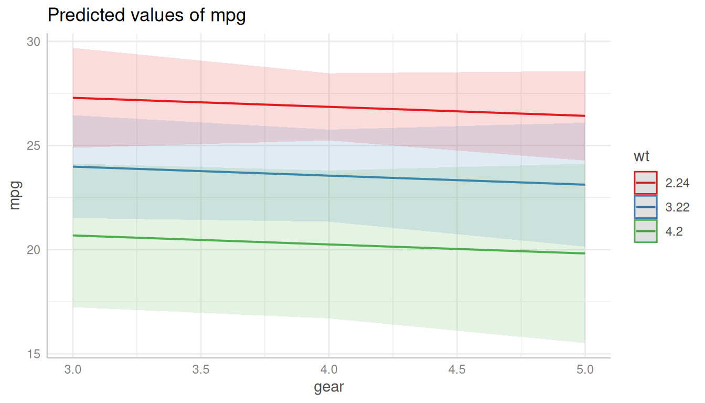

## Changing Plot and Axis Titles

The simplest thing is to change the titles from the plot, x- and y-axis.
This can be done with
[`ggplot2::labs()`](https://ggplot2.tidyverse.org/reference/labs.html):

[`plot`](https://strengejacke.github.io/ggeffects/reference/plot.md)`(``dat``)`` ``+`` `` `[`labs`](https://ggplot2.tidyverse.org/reference/labs.html)`(`` `` x ``=`` ``"Number of forward gears"``,`` `` y ``=`` ``"Miles/(US) gallon"``,`` `` title ``=`` ``"Predicted mean miles per gallon"`` `` ``)`

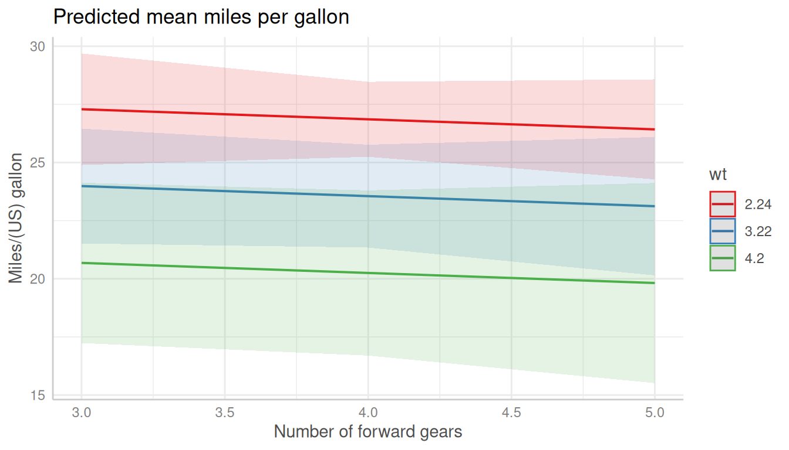

## Changing the Legend Title

The legend-title can also be changed using the
[`labs()`](https://ggplot2.tidyverse.org/reference/labs.html)-function.
The legend in ggplot-objects refers to the aesthetic used for the
grouping variable, which is by default the `colour`, i.e. the plot is
constructed in the following way:

[`ggplot`](https://ggplot2.tidyverse.org/reference/ggplot.html)`(``data``, `[`aes`](https://ggplot2.tidyverse.org/reference/aes.html)`(``x ``=`` ``x``, y ``=`` ``predicted``, colour ``=`` ``group``)``)`

### Plots with Default Colors

Hence, using `colour` in
[`labs()`](https://ggplot2.tidyverse.org/reference/labs.html) changes
the legend-title:

[`plot`](https://strengejacke.github.io/ggeffects/reference/plot.md)`(``dat``)`` ``+`` `[`labs`](https://ggplot2.tidyverse.org/reference/labs.html)`(``colour ``=`` ``"Weight (1000 lbs)"``)`

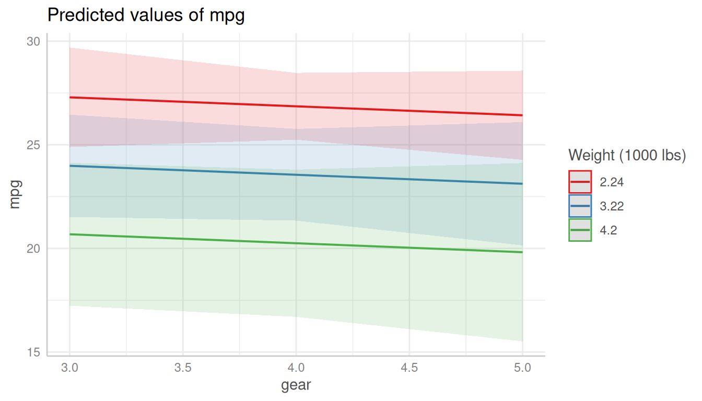

### Black-and-White Plots

For black-and-white plots, the group-aesthetic is mapped to different
*linetypes*, not to different colours. Thus, the legend-title for
black-and-white plots can be changed using `linetype` in
[`labs()`](https://ggplot2.tidyverse.org/reference/labs.html):

[`plot`](https://strengejacke.github.io/ggeffects/reference/plot.md)`(``dat``, colors ``=`` ``"bw"``)`` ``+`` `[`labs`](https://ggplot2.tidyverse.org/reference/labs.html)`(``linetype ``=`` ``"Weight (1000 lbs)"``)`

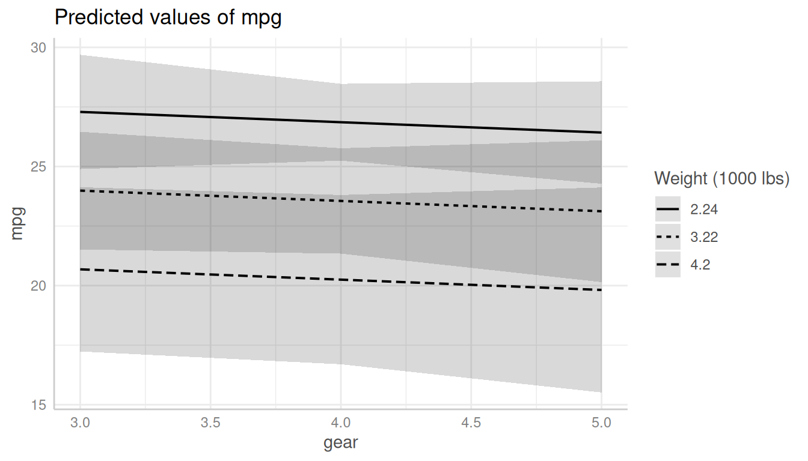

### Black-and-White Plots with Categorical Predictor

If the variable on the x-axis is discrete for a black-and-white plot,
the group-aesthetic is mapped to different *shapes*, so following code
must be used to change the legend title:

[`plot`](https://strengejacke.github.io/ggeffects/reference/plot.md)`(``dat_categorical``, colors ``=`` ``"bw"``)`` ``+`` `[`labs`](https://ggplot2.tidyverse.org/reference/labs.html)`(``shape ``=`` ``"Weight (1000 lbs)"``)`

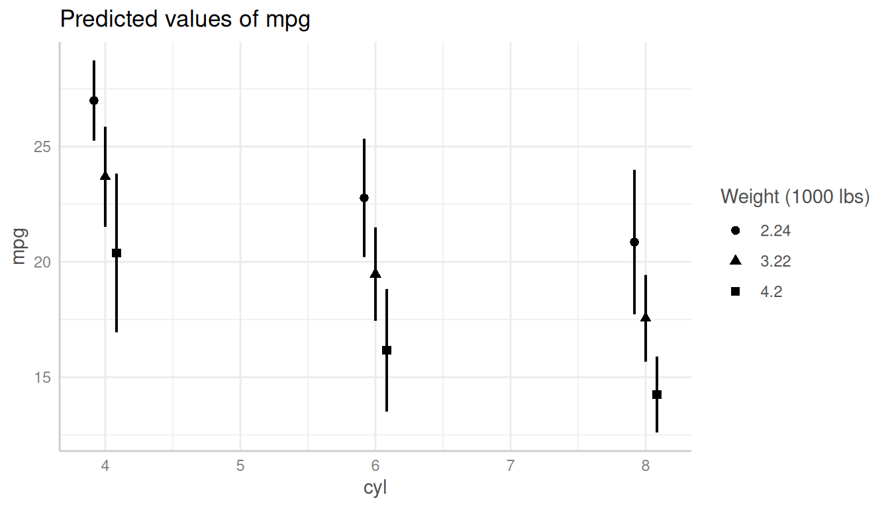

## Changing the x-Axis Appearance

The x-axis for plots returned from
[`plot()`](https://strengejacke.github.io/ggeffects/reference/plot.md)
is always *continuous*, even for discrete x-axis-variables. The reason
for this is that many users are used to plots that connect the data
points with lines, which is only possible for continuous x-axes. You can
do this using the `connect_lines`-argument:

[`plot`](https://strengejacke.github.io/ggeffects/reference/plot.md)`(``dat_categorical``, connect_lines ``=`` ``TRUE``)`

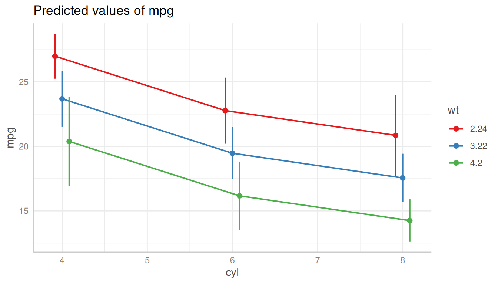

### Categorical Predictors

Since the x-axis is continuous
(i.e. [`ggplot2::scale_x_continuous()`](https://ggplot2.tidyverse.org/reference/scale_continuous.html)),
you can use
[`scale_x_continuous()`](https://ggplot2.tidyverse.org/reference/scale_continuous.html)
to modify the x-axis, and change breaks, limits or labels.

[`plot`](https://strengejacke.github.io/ggeffects/reference/plot.md)`(``dat_categorical``)`` ``+`` `` `[`scale_x_continuous`](https://ggplot2.tidyverse.org/reference/scale_continuous.html)`(``labels ``=`` `[`c`](https://rdrr.io/r/base/c.html)`(``"four"``, ``"six"``, ``"eight"``)``, breaks ``=`` `[`c`](https://rdrr.io/r/base/c.html)`(``4``, ``6``, ``8``)``)`

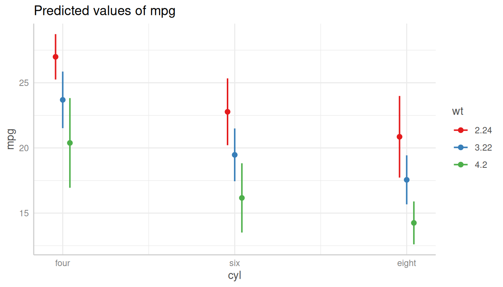

### Continuous Predictors

Or for continuous variables:

[`plot`](https://strengejacke.github.io/ggeffects/reference/plot.md)`(``dat``)`` ``+`` `[`scale_x_continuous`](https://ggplot2.tidyverse.org/reference/scale_continuous.html)`(``breaks ``=`` ``3``:``5``, limits ``=`` `[`c`](https://rdrr.io/r/base/c.html)`(``2``, ``6``)``)`

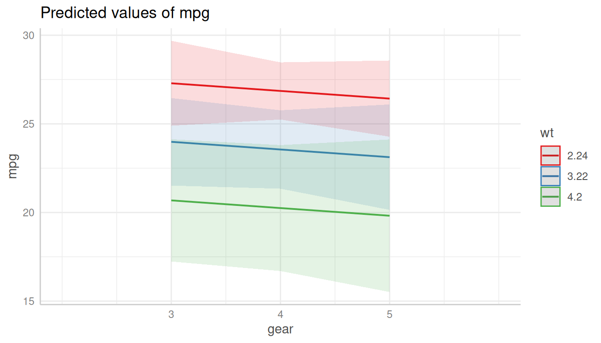

## Changing the y-Axis Appearance

Arguments in `...` are passed down to `ggplot::scale_y_continuous()`
(resp. `ggplot::scale_y_log10()`, if `log.y = TRUE`), so you can control
the appearance of the y-axis by putting the arguments directly into the
call to
[`plot()`](https://strengejacke.github.io/ggeffects/reference/plot.md):

[`plot`](https://strengejacke.github.io/ggeffects/reference/plot.md)`(``dat_categorical``, breaks ``=`` `[`seq`](https://rdrr.io/r/base/seq.html)`(``12``, ``30``, ``2``)``, limits ``=`` `[`c`](https://rdrr.io/r/base/c.html)`(``12``, ``30``)``)`

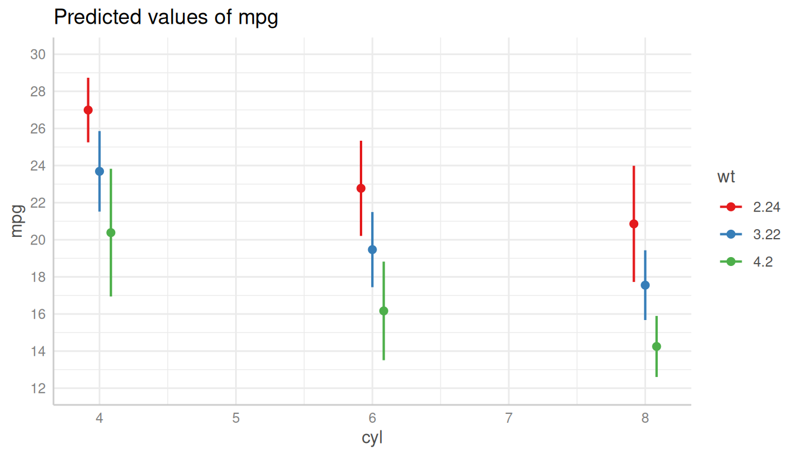

## Changing the Legend Labels

The legend labels can also be changed using a `scale_*()`-function from
**ggplot**. Depending on the color-setting (see section **Changing the
Legend Title**), following functions can be used to change the legend
labels:

- [`scale_colour_manual()`](https://ggplot2.tidyverse.org/reference/scale_manual.html)
  resp.
  [`scale_colour_brewer()`](https://ggplot2.tidyverse.org/reference/scale_brewer.html)
- [`scale_linetype_manual()`](https://ggplot2.tidyverse.org/reference/scale_manual.html)
- [`scale_shape_manual()`](https://ggplot2.tidyverse.org/reference/scale_manual.html)

Since you overwrite an exising “color” scale, you typically need to
provide the `values` or `palette`-argument, to manuall set the colors,
linetypes or shapes.

### Plots with Default Colors

For plots using default colors:

[`plot`](https://strengejacke.github.io/ggeffects/reference/plot.md)`(``dat``)`` ``+`` `` `[`scale_colour_brewer`](https://ggplot2.tidyverse.org/reference/scale_brewer.html)`(``palette ``=`` ``"Set1"``, labels ``=`` `[`c`](https://rdrr.io/r/base/c.html)`(``"-1 SD"``, ``"Mean"``, ``"+1 SD"``)``)`` ``+`` `` `[`scale_fill_brewer`](https://ggplot2.tidyverse.org/reference/scale_brewer.html)`(``palette ``=`` ``"Set1"``)`

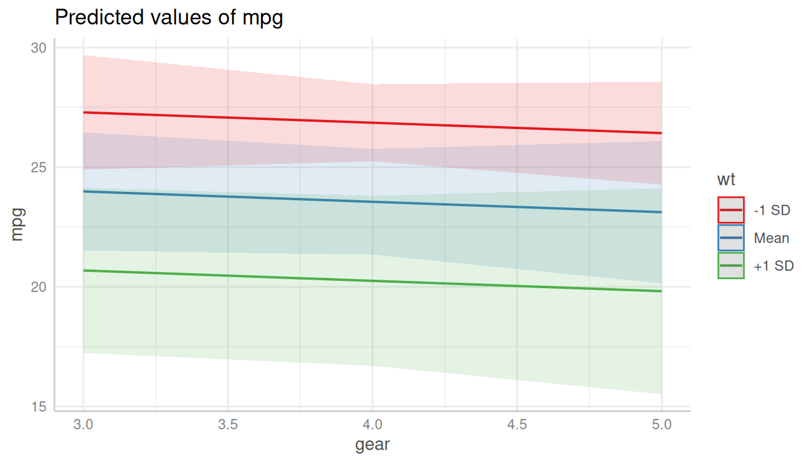

### Black-and-White Plots

For black-and-white plots:

[`plot`](https://strengejacke.github.io/ggeffects/reference/plot.md)`(``dat``, colors ``=`` ``"bw"``)`` ``+`` `` `[`scale_linetype_manual`](https://ggplot2.tidyverse.org/reference/scale_manual.html)`(``values ``=`` ``15``:``17``, labels ``=`` `[`c`](https://rdrr.io/r/base/c.html)`(``"-1 SD"``, ``"Mean"``, ``"+1 SD"``)``)`

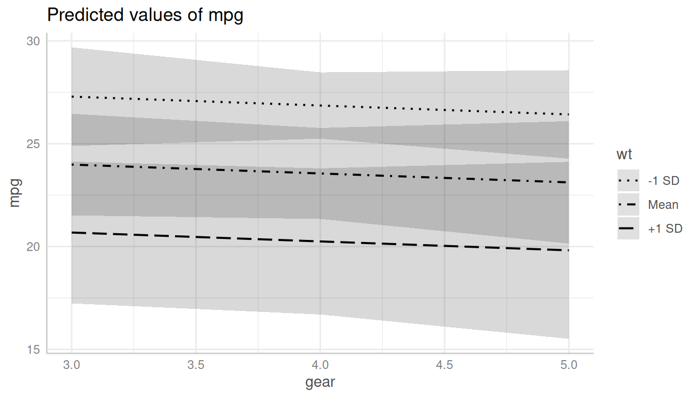

### Black-and-White Plots with Categorical Predictor

For black-and-white plots with categorical x-axis:

[`plot`](https://strengejacke.github.io/ggeffects/reference/plot.md)`(``dat_categorical``, colors ``=`` ``"bw"``)`` ``+`` `` `[`scale_shape_manual`](https://ggplot2.tidyverse.org/reference/scale_manual.html)`(``values ``=`` ``1``:``3``, labels ``=`` `[`c`](https://rdrr.io/r/base/c.html)`(``"-1 SD"``, ``"Mean"``, ``"+1 SD"``)``)`

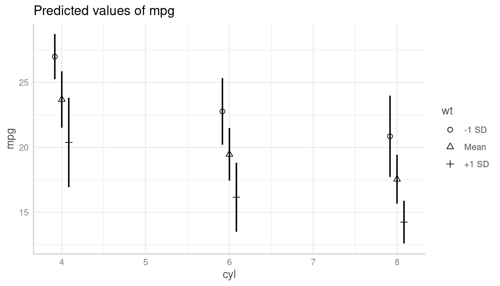
