# Introduction: Plotting Adjusted Predictions and Marginal Means

## plot()-method

This vignettes demonstrates the
[`plot()`](https://strengejacke.github.io/ggeffects/reference/plot.md)-method
of the **ggeffects**-package. It is recommended to read the [general
introduction](https://strengejacke.github.io/ggeffects/articles/ggeffects.md)
first, if you haven’t done this yet.

If you don’t want to write your own ggplot-code, **ggeffects** has a
[`plot()`](https://strengejacke.github.io/ggeffects/reference/plot.md)-method
with some convenient defaults, which allows quickly creating
ggplot-objects.
[`plot()`](https://strengejacke.github.io/ggeffects/reference/plot.md)
has some arguments to tweak the plot-appearance. For instance, `show_ci`
allows you to show or hide confidence bands (or error bars, for discrete
variables), `facets` allows you to create facets even for just one
grouping variable, or `colors` allows you to quickly choose from some
color-palettes, including black & white colored plots. Use `show_data`
to add the raw data points to the plot.

**ggeffects** supports [labelled
data](https://strengejacke.github.io/sjlabelled/) and the
[`plot()`](https://strengejacke.github.io/ggeffects/reference/plot.md)-method
automatically sets titles, axis - and legend-labels depending on the
value and variable labels of the data.

``` r

library(ggplot2)
library(ggeffects)
data(efc, package = "ggeffects")
efc <- datawizard::to_factor(efc, c("c172code", "e42dep"))
fit <- lm(barthtot ~ c12hour + neg_c_7 + c161sex + c172code + e42dep, data = efc)
```

### Facet by Group

``` r

dat <- predict_response(fit, terms = c("c12hour", "c172code"))
plot(dat, facets = TRUE)
```

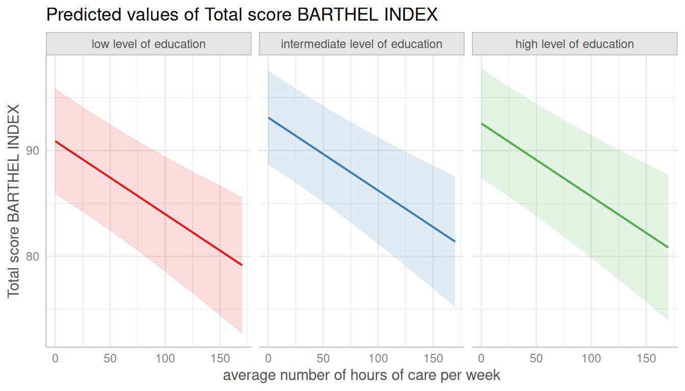

### No Facets, in Black & White

``` r

# don't use facets, b/w figure, w/o confidence bands
plot(dat, colors = "bw", show_ci = FALSE)
```

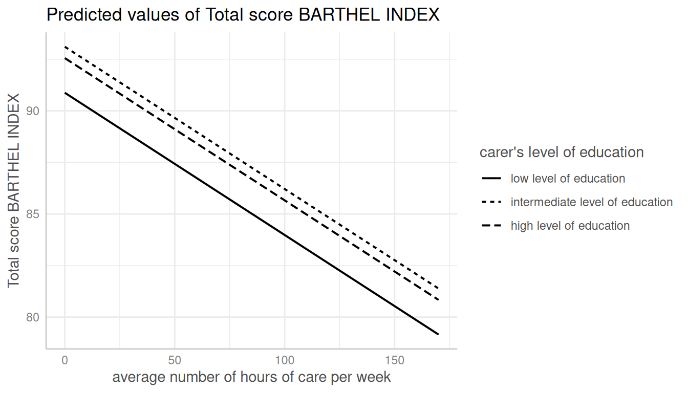

### Add Data Points to Plot

``` r

dat <- predict_response(fit, terms = c("c12hour", "c172code"))
plot(dat, show_data = TRUE)
```

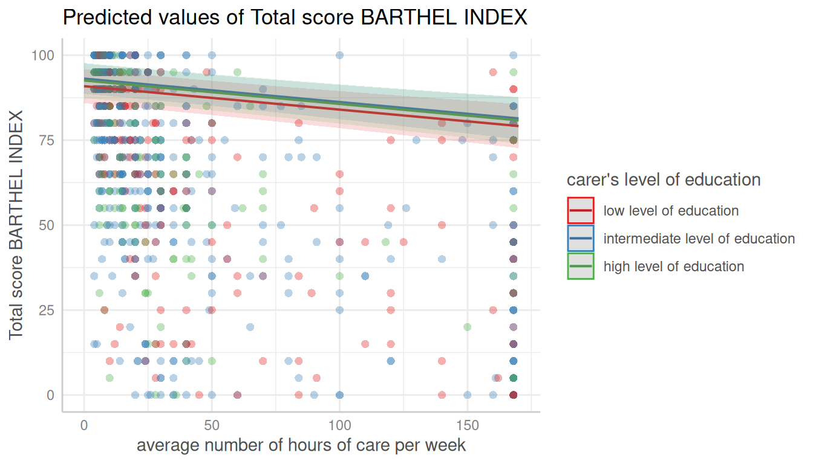

### Automatic Facetting

``` r

# for three variables, automatic facetting
dat <- predict_response(fit, terms = c("c12hour", "c172code", "c161sex"))
plot(dat)
```

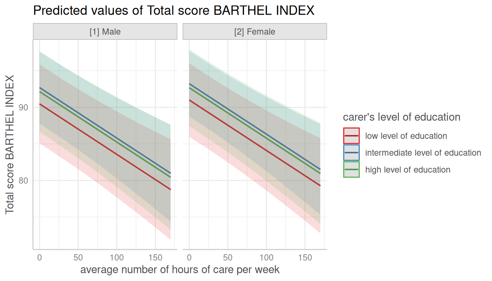

### Automatic Selection of Error Bars or Confidence Bands

``` r

# categorical variables have errorbars
dat <- predict_response(fit, terms = c("c172code", "c161sex"))
plot(dat)
```

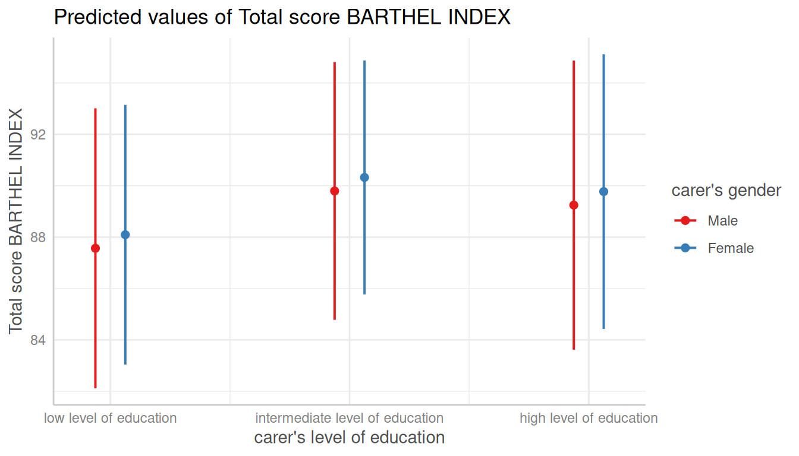

### Connect Discrete Data Points with Lines

``` r

# point-geoms for discrete x-axis can be connected with lines
plot(dat, connect_lines = TRUE)
```

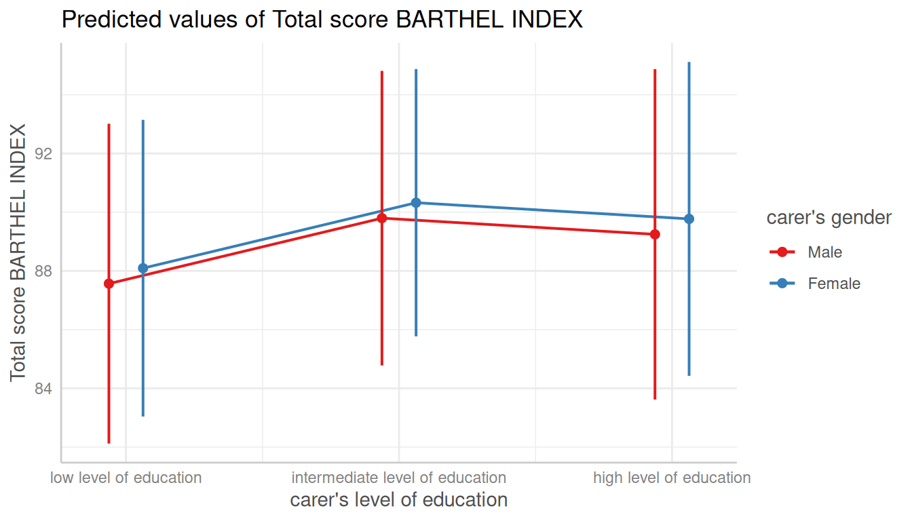

### Create Panel Plots for five Terms

For four grouping variable (i.e. if `terms` is of length five), one plot
per value/level of the fifth variable in `terms` is created, and a
single, integrated plot is produced by default. Use `one_plot = FALSE`
to return one plot per panel.

``` r

# for five variables, automatic facetting and integrated panel
dat <- predict_response(
  fit,
  terms = c("c12hour", "c172code", "c161sex", "neg_c_7", "e42dep")
)
# use 'one_plot = FALSE' for returning multiple single plots
plot(dat, one_plot = TRUE)
```

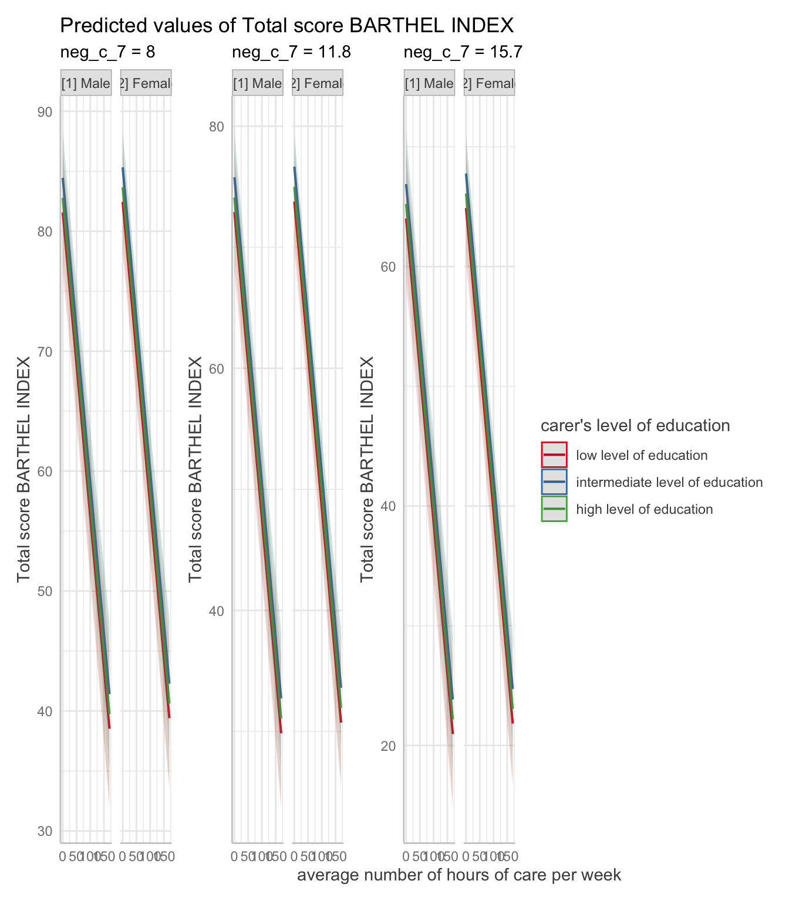

If facets become too small, you can align the panels in multiple rows,
using the `n_rows` argument. Furthermore, use functions from *ggplot2*
to align the legend.

``` r

plot(dat, one_plot = TRUE, n_rows = 4) + theme(legend.position = "bottom")
```

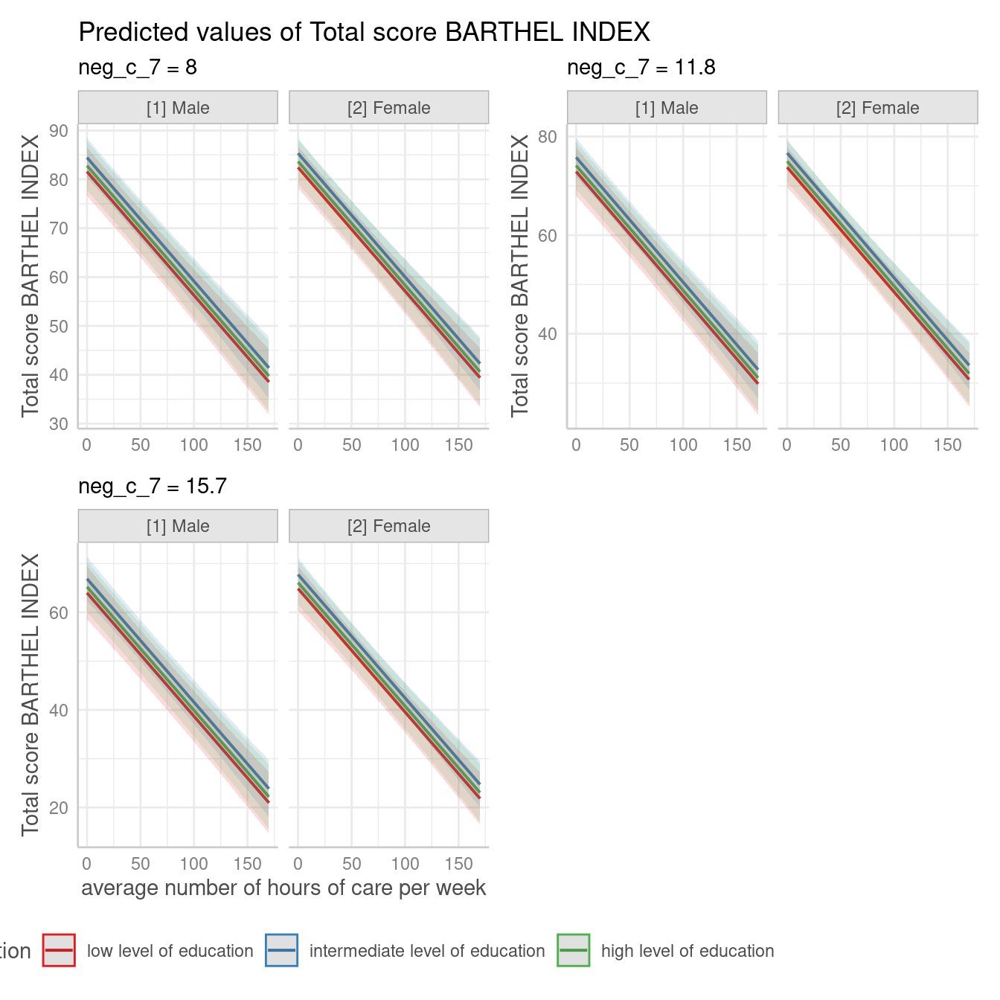

## Change appearance of confidence bands

In some plots, the the confidence bands are not represented by a shaded
area (ribbons), but rather by error bars (with line), dashed or dotted
lines. Use `ci_style = "errorbar"`, `ci_style = "dash"` or
`ci_style = "dot"` to change the style of confidence bands.

### Dashed Lines for Confidence Intervals

``` r

# dashed lines for CI
dat <- predict_response(fit, terms = "c12hour")
plot(dat, ci_style = "dash")
```

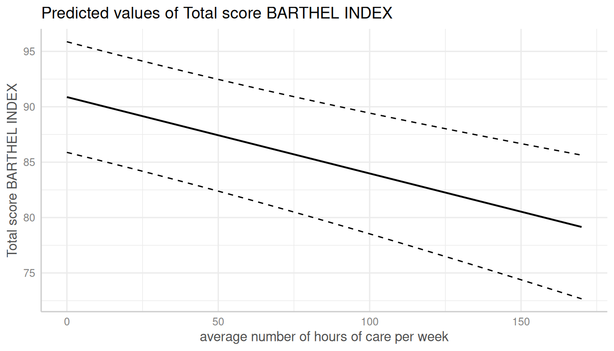

### Error Bars for Continuous Variables

``` r

# facet by group
dat <- predict_response(fit, terms = c("c12hour", "c172code"))
plot(dat, facets = TRUE, ci_style = "errorbar", dot_size = 1.5)
```

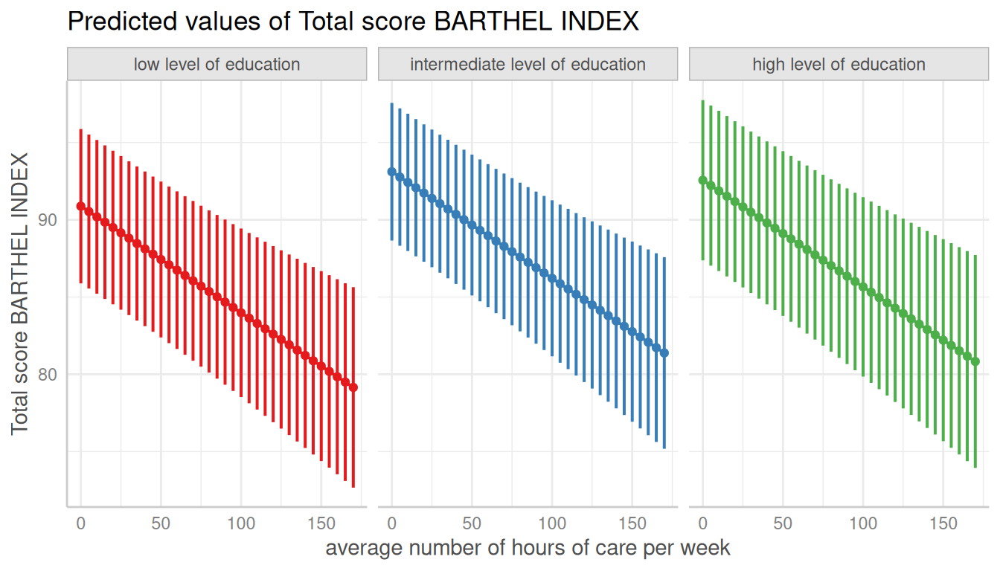

### Dotted Error Bars

The style of error bars for plots with categorical x-axis can also be
changed. By default, these are “error bars”, but `ci_style = "dot"` or
`ci_style = "dashed"` works as well

``` r

dat <- predict_response(fit, terms = "c172code")
plot(dat, ci_style = "dot")
```

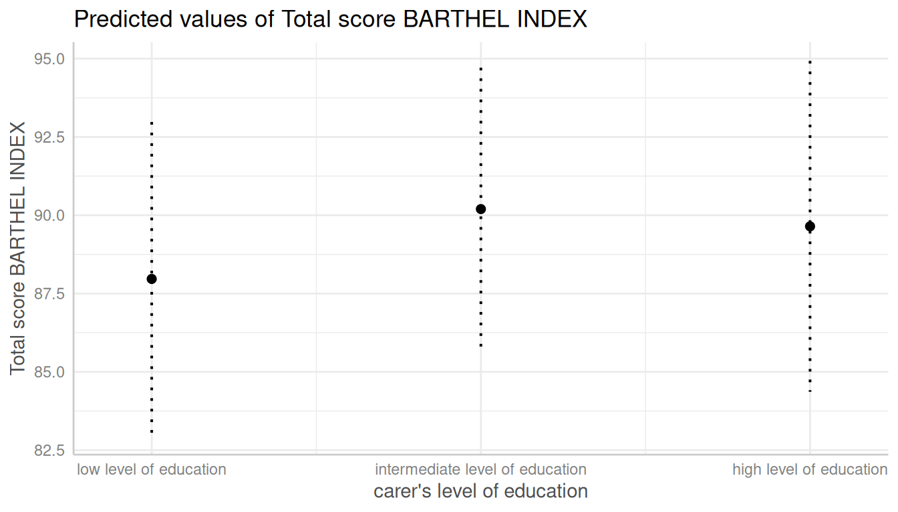

## Log-transform y-axis for binomial models

For binomial models, the y-axis indicates the predicted probabilities of
an event. In this case, error bars are not symmetrical.

``` r

library("lme4")
m <- glm(
  cbind(incidence, size - incidence) ~ period,
  family = binomial,
  data = lme4::cbpp
)

dat <- predict_response(m, "period")

# normal plot, asymmetrical error bars
plot(dat)
```

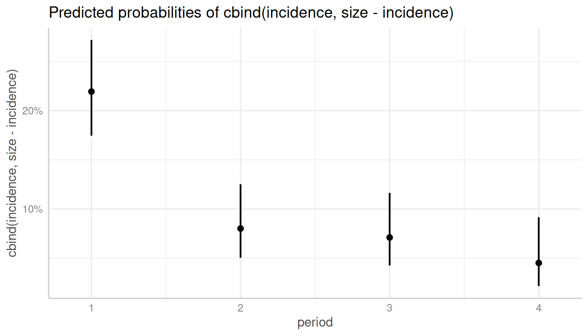

Here you can use `log_y` to log-transform the y-axis. The
[`plot()`](https://strengejacke.github.io/ggeffects/reference/plot.md)-method
will automatically choose axis breaks and limits that fit well to the
value range and log-scale.

``` r

# plot with log-transformed y-axis
plot(dat, log_y = TRUE)
```

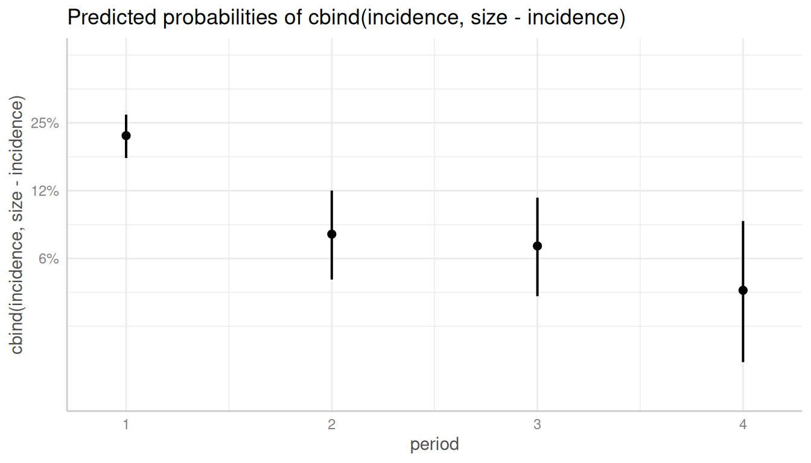

## Control y-axis appearance

Furthermore, arguments in `...` are passed down to
`ggplot::scale_y_continuous()` (resp. `ggplot::scale_y_log10()`, if
`log_y = TRUE`), so you can control the appearance of the y-axis.

``` r

# plot with log-transformed y-axis, modify breaks
plot(
  dat, log_y = TRUE,
  breaks = c(0.05, 0.1, 0.15, 0.2, 0.25, 0.3),
  limits = c(0.01, 0.3)
)
```

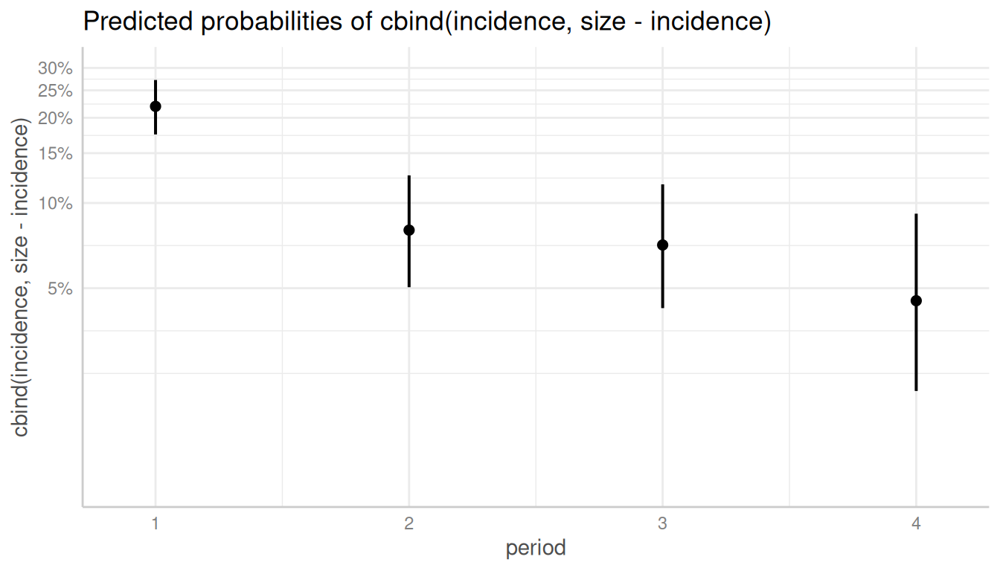

## Survival models

[`predict_response()`](https://strengejacke.github.io/ggeffects/reference/predict_response.md)
also supports `coxph`-models from the **survival**-package and is able
to either plot risk-scores (the default), probabilities of survival
(`type = "survival"`) or cumulative hazards
(`type = "cumulative_hazard"`).

Since probabilities of survival and cumulative hazards are changing
across time, the time-variable is automatically used as x-axis in such
cases, so the `terms`-argument only needs up to two variables.

``` r

library(survival)
data("lung2")
m <- coxph(Surv(time, status) ~ sex + age + ph.ecog, data = lung2)

# predicted risk-scores
pr <- predict_response(m, c("sex", "ph.ecog"))
plot(pr)
```

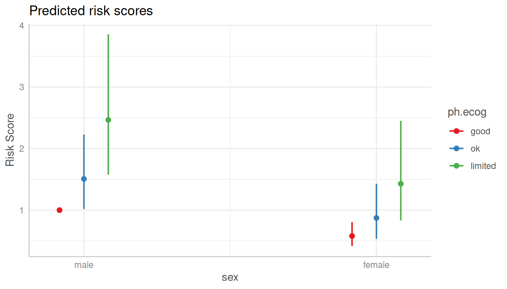

``` r

# probability of survival
pr <- predict_response(m, c("sex", "ph.ecog"), type = "survival")
plot(pr)
```

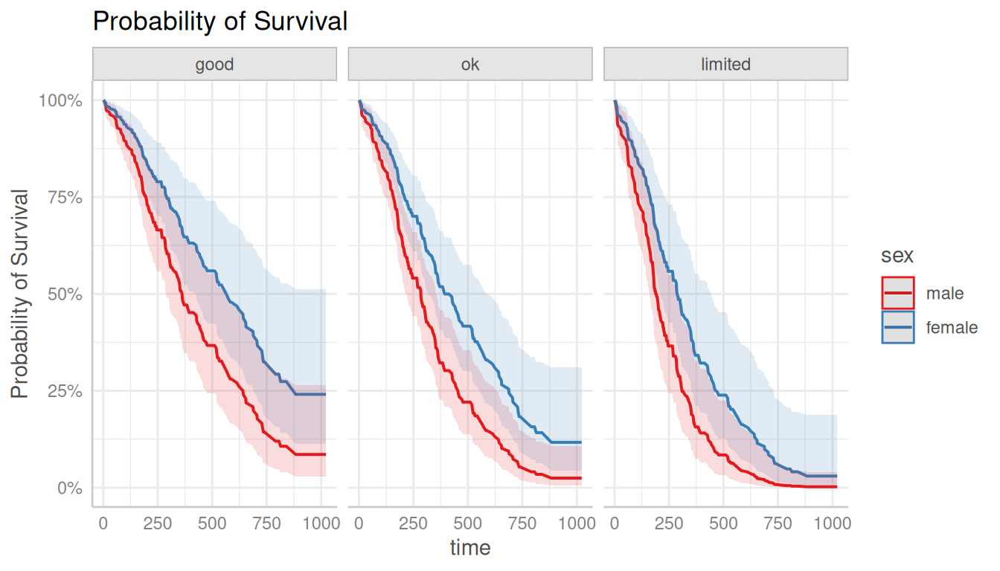

``` r

# cumulative hazards
pr <- predict_response(m, c("sex", "ph.ecog"), type = "cumulative_hazard")
plot(pr)
```

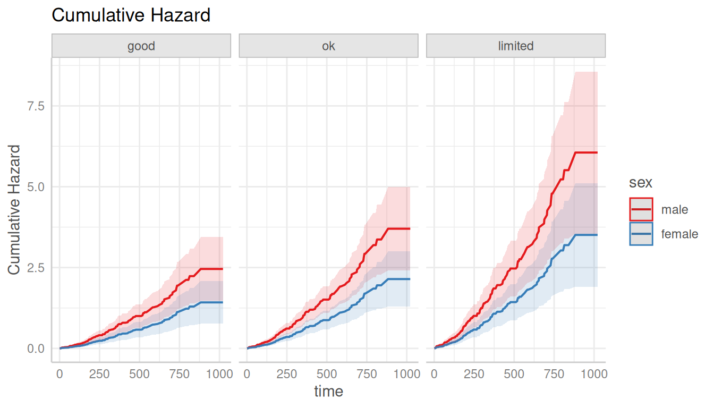

## Custom color palettes

The **ggeffects**-package has a few pre-defined color-palettes that can
be used with the `colors`-argument. Use
[`show_palettes()`](https://strengejacke.github.io/ggeffects/reference/plot.md)
to see all available palettes.

``` r

show_palettes()
```

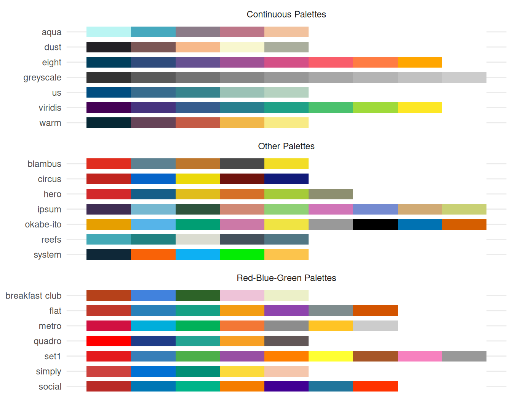

Here are two examples showing how to use pre-defined colors:

``` r

dat <- predict_response(fit, terms = c("c12hour", "c172code"))
plot(dat, facets = TRUE, colors = "circus")
```

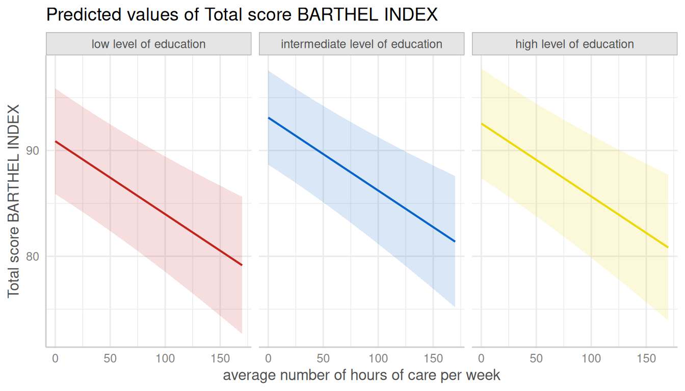

``` r

dat <- predict_response(fit, terms = c("c172code", "c12hour [quart]"))
plot(dat, colors = "hero", dodge = 0.4) # increase space between error bars
```

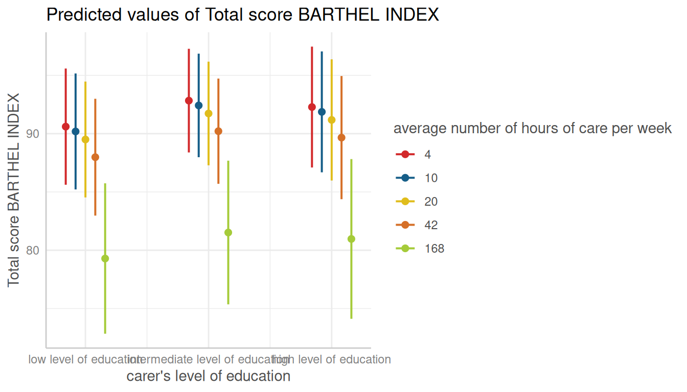
