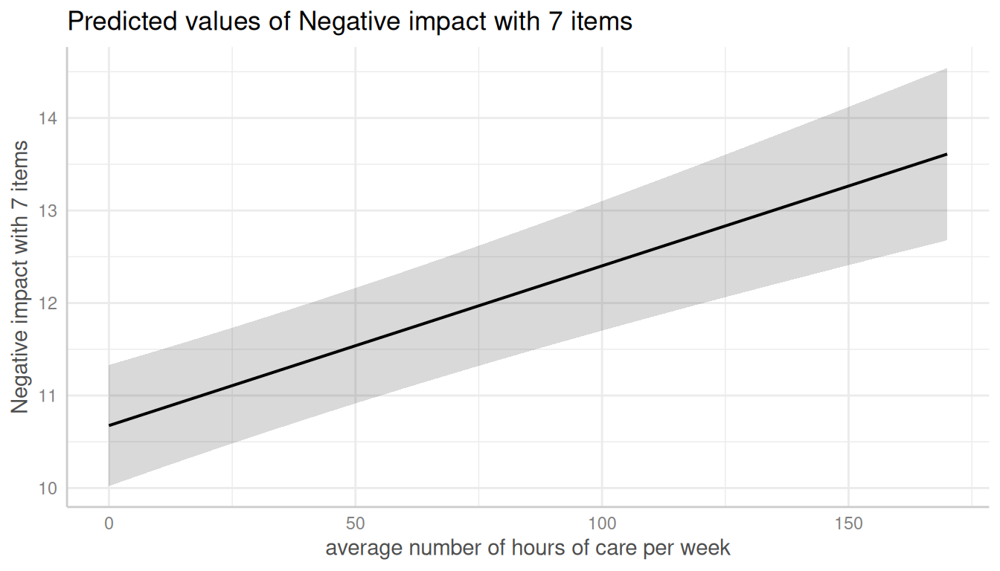
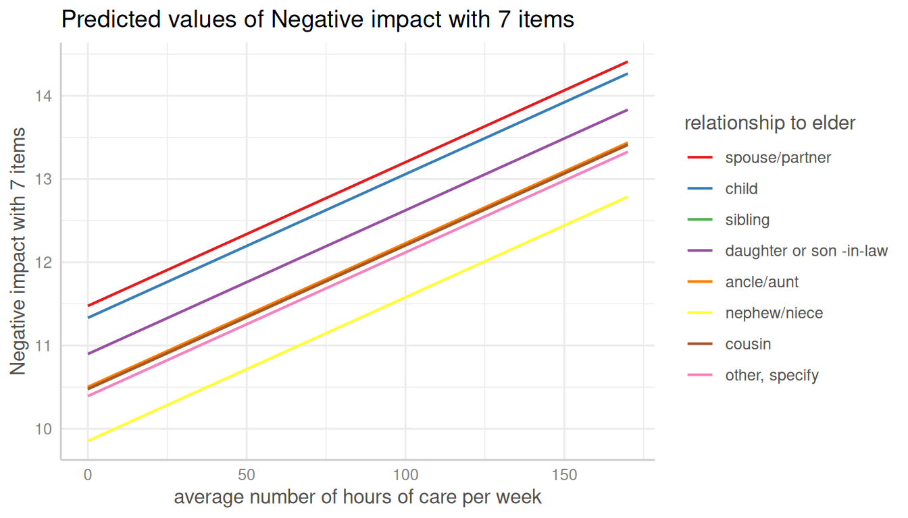
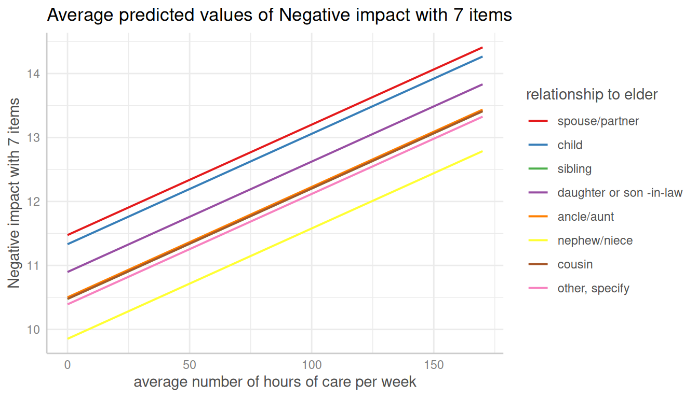
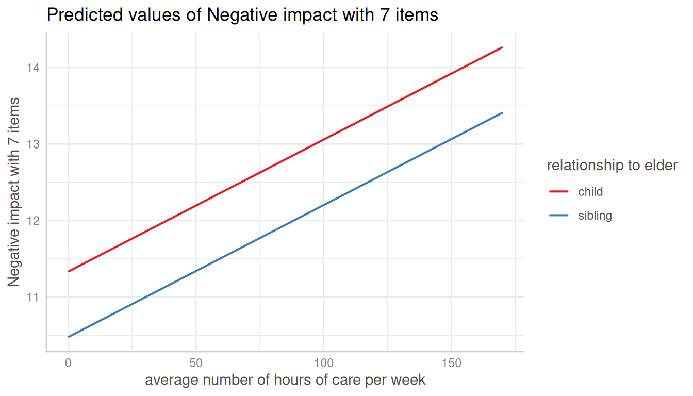
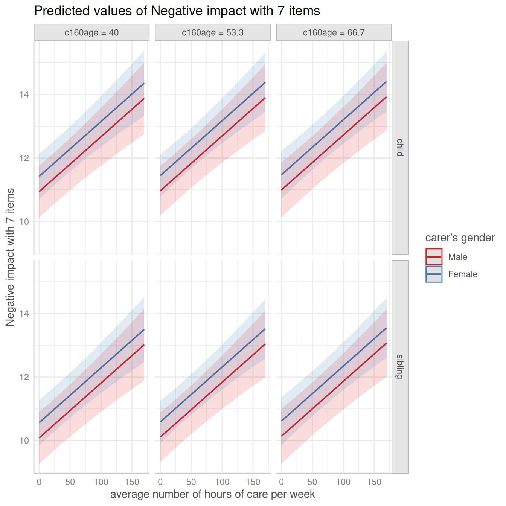
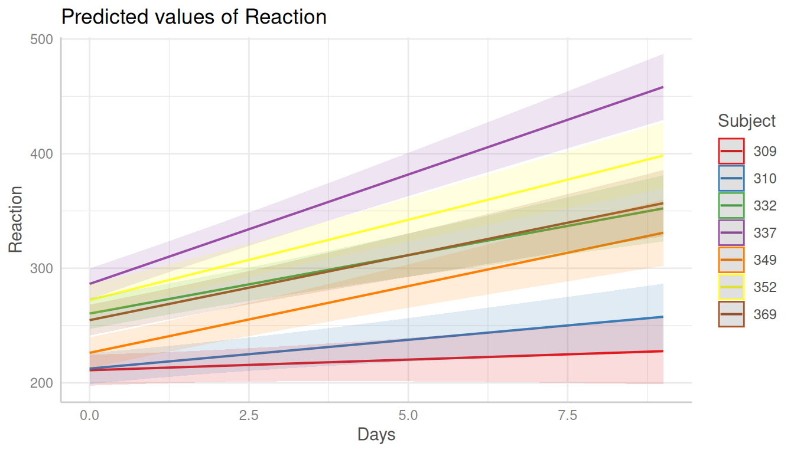
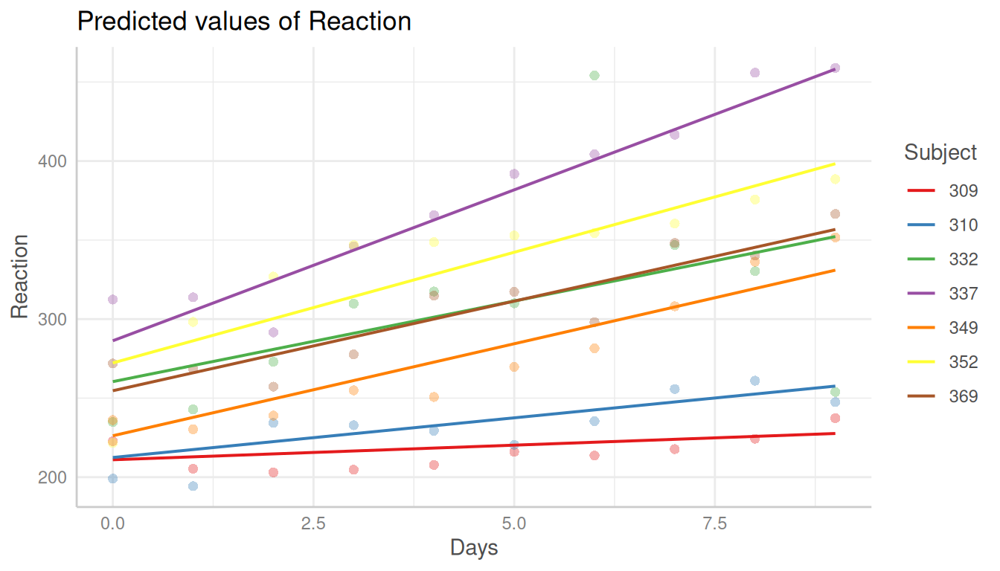

# Introduction: Adjusted Predictions and Marginal Effects for Random Effects Models

This vignette shows how to calculate adjusted predictions for mixed
models. However, for mixed models, since random effects are involved, we
can calculate *conditional predictions* and *marginal predictions*. We
also have to distinguish between *population-level* and *unit-level*
predictions.

But one thing at a time…

#  Summary of most important points:

- Predictions can be made on the population-level or for each level of
  the grouping variable (unit-level). If unit-level predictions are
  requested, you need to set `type="random"` and specify the grouping
  variable(s) in the `terms` argument.
- Population-level predictions can be either conditional (predictions
  for a "typical" group) or marginal (average predictions across all
  groups). Set `margin="empirical"` for marginal predictions. You'll
  notice differences in predictions especially for unequal group sizes
  at the random effects level.
- Prediction intervals, i.e. when `interval="prediction"` also account
  for the uncertainty in the random effects.

### Population-level predictions for mixed effects models

Mixed models are used to account for the dependency of observations
within groups, e.g. repeated measurements within subjects, or students
within schools. The dependency is modeled by random effects, i.e. mixed
model at least have one grouping variable (or factor) as higher level
unit.

At the lowest level, you have your *fixed effects*, i.e. your
“independent variables” or “predictors”.

Adjusted predictions can now be calculated for specified values or
levels of the focal terms, however, either for the full sample
(population-level) or for each level of the grouping variable
(unit-level). The latter is particularly useful when the grouping
variable is of interest, e.g. when you want to compare the effect of a
predictor between different groups.

To get population-level predictions, we set `type = "fixed"` or
`type = "zero_inflation"` (for models with zero-inflation component).

#### Conditional and marginal effects/predictions

We start with the population-level predictions. Here you can either
calculate the *conditional* or the *marginal* effect (see in detail also
*Heiss 2022*). The conditional effect is the effect of a predictor in an
average or typical group, while the marginal effect is the average
effect of a predictor across all groups. E.g. let’s say we have
`countries` as grouping variable and `gdp` (gross domestic product per
capita) as predictor, then the conditional and marginal effect would be:

- conditional effect: effect of `gdp` in an *average* or *typical*
  country. To get conditional predictions, we use
  [`predict_response()`](https://strengejacke.github.io/ggeffects/reference/predict_response.md)
  or `predict_response(margin = "mean_mode")`.

- marginal effect: average effect of `gdp` *across all* countries. To
  get marginal (or average) predictions, we use
  `predict_response(margin = "empirical")`.

While the term “effect” referes to the strength of the relationship
between a predictor and the response, “predictions” refer to the actual
predicted values of the response. Thus, in the following, we will talk
about conditional and marginal (or average) *predictions* (instead of
*effects*).

In a balanced data set, where all groups have the same number of
observations, the conditional and marginal predictions are often similar
(maybe slightly different, depending on the non-focal predictors).
However, in unbalanced data, the conditional and marginal predicted
values can largely differ.

[`library`](https://rdrr.io/r/base/library.html)`(`[`ggeffects`](https://strengejacke.github.io/ggeffects/)`)`` `[`library`](https://rdrr.io/r/base/library.html)`(`[`lme4`](https://github.com/lme4/lme4/)`)`` `[`data`](https://rdrr.io/r/utils/data.html)`(``sleepstudy``)`` `` ``# balanced data set`` ``m`` ``<-`` `[`lmer`](https://rdrr.io/pkg/lme4/man/lmer.html)`(``Reaction`` ``~`` ``Days`` ``+`` ``(``1`` ``+`` ``Days`` ``|`` ``Subject``)``, data ``=`` ``sleepstudy``)`` `` ``# conditional predictions`` `[`predict_response`](https://strengejacke.github.io/ggeffects/reference/predict_response.md)`(``m``, ``"Days [1,5,9]"``)`` ``#> # Predicted values of Reaction`` ``#> `` ``#> Days | Predicted | 95% CI`` ``#> ---------------------------------`` ``#> 1 | 261.87 | 248.48, 275.27`` ``#> 5 | 303.74 | 284.83, 322.65`` ``#> 9 | 345.61 | 316.74, 374.48`` ``#> `` ``#> Adjusted for:`` ``#> * Subject = 0 (population-level)`` `` ``# average marginal predictions`` `[`predict_response`](https://strengejacke.github.io/ggeffects/reference/predict_response.md)`(``m``, ``"Days [1,5,9]"``, margin ``=`` ``"empirical"``)`` ``#> # Average predicted values of Reaction`` ``#> `` ``#> Days | Predicted | 95% CI`` ``#> ---------------------------------`` ``#> 1 | 261.87 | 248.48, 275.27`` ``#> 5 | 303.74 | 284.83, 322.65`` ``#> 9 | 345.61 | 316.74, 374.48`` `` ``# create imbalanced data set`` `[`set.seed`](https://rdrr.io/r/base/Random.html)`(``123``)`` ``strapped`` ``<-`` ``sleepstudy``[`[`sample.int`](https://rdrr.io/r/base/sample.html)`(`[`nrow`](https://rdrr.io/r/base/nrow.html)`(``sleepstudy``)``, `[`nrow`](https://rdrr.io/r/base/nrow.html)`(``sleepstudy``)``, replace ``=`` ``TRUE``)``, ``]`` ``m`` ``<-`` `[`lmer`](https://rdrr.io/pkg/lme4/man/lmer.html)`(``Reaction`` ``~`` ``Days`` ``+`` ``(``1`` ``+`` ``Days`` ``|`` ``Subject``)``, data ``=`` ``strapped``)`` `` ``# conditional predictions`` `[`predict_response`](https://strengejacke.github.io/ggeffects/reference/predict_response.md)`(``m``, ``"Days [1,5,9]"``)`` ``#> # Predicted values of Reaction`` ``#> `` ``#> Days | Predicted | 95% CI`` ``#> ---------------------------------`` ``#> 1 | 261.49 | 246.57, 276.40`` ``#> 5 | 302.13 | 281.30, 322.97`` ``#> 9 | 342.78 | 311.19, 374.37`` ``#> `` ``#> Adjusted for:`` ``#> * Subject = 0 (population-level)`` `` ``# average marginal predictions`` `[`predict_response`](https://strengejacke.github.io/ggeffects/reference/predict_response.md)`(``m``, ``"Days [1,5,9]"``, margin ``=`` ``"empirical"``)`` ``#> # Average predicted values of Reaction`` ``#> `` ``#> Days | Predicted | 95% CI`` ``#> ---------------------------------`` ``#> 1 | 259.04 | 244.13, 273.95`` ``#> 5 | 300.01 | 279.17, 320.84`` ``#> 9 | 340.97 | 309.37, 372.56`

#### Population-level predictions and the `REML` argument

The conditional predictions returned by
[`predict_response()`](https://strengejacke.github.io/ggeffects/reference/predict_response.md)
for the default marginalization (i.e. when `margin = "mean_reference"`
or `"mean_mode"`) may differ…

- depending on the setting of the `REML` argument during model fitting;
- and depending on whether factors are included in the model or not.

[`library`](https://rdrr.io/r/base/library.html)`(`[`glmmTMB`](https://github.com/glmmTMB/glmmTMB)`)`` `[`set.seed`](https://rdrr.io/r/base/Random.html)`(``123``)`` ``sleepstudy``$``x`` ``<-`` `[`as.factor`](https://rdrr.io/r/base/factor.html)`(`[`sample`](https://rdrr.io/r/base/sample.html)`(``1``:``3``, `[`nrow`](https://rdrr.io/r/base/nrow.html)`(``sleepstudy``)``, replace ``=`` ``TRUE``)``)`` ``# REML is FALSE`` ``m1`` ``<-`` `[`glmmTMB`](https://rdrr.io/pkg/glmmTMB/man/glmmTMB.html)`(``Reaction`` ``~`` ``Days`` ``+`` ``x`` ``+`` ``(``1`` ``+`` ``Days`` ``|`` ``Subject``)``, data ``=`` ``sleepstudy``, REML ``=`` ``FALSE``)`` ``# REML is TRUE`` ``m2`` ``<-`` `[`glmmTMB`](https://rdrr.io/pkg/glmmTMB/man/glmmTMB.html)`(``Reaction`` ``~`` ``Days`` ``+`` ``x`` ``+`` ``(``1`` ``+`` ``Days`` ``|`` ``Subject``)``, data ``=`` ``sleepstudy``, REML ``=`` ``TRUE``)`` `` ``# predictions when REML is FALSE`` `[`predict_response`](https://strengejacke.github.io/ggeffects/reference/predict_response.md)`(``m1``, ``"Days [1:3]"``)`` ``#> # Predicted values of Reaction`` ``#> `` ``#> Days | Predicted | 95% CI`` ``#> ---------------------------------`` ``#> 1 | 260.22 | 245.82, 274.63`` ``#> 2 | 270.69 | 255.77, 285.61`` ``#> 3 | 281.16 | 265.19, 297.12`` ``#> `` ``#> Adjusted for:`` ``#> * x = 1`` ``#> * Subject = NA (population-level)`` `` ``# predictions when REML is TRUE`` `[`predict_response`](https://strengejacke.github.io/ggeffects/reference/predict_response.md)`(``m2``, ``"Days [1:3]"``)`` ``#> # Predicted values of Reaction`` ``#> `` ``#> Days | Predicted | 95% CI`` ``#> ---------------------------------`` ``#> 1 | 254.63 | 246.25, 263.02`` ``#> 2 | 265.07 | 257.33, 272.81`` ``#> 3 | 275.50 | 268.22, 282.78`` ``#> `` ``#> Adjusted for:`` ``#> * x = 1`` ``#> * Subject = NA (population-level)`

### Population-level predictions for zero-inflated mixed models

For zero-inflated mixed effects models, typically fitted with the
**glmmTMB** or **GLMMadaptive** packages,
[`predict_response()`](https://strengejacke.github.io/ggeffects/reference/predict_response.md)
can return predicted values of the response, for the different model
components:

- Conditional predictions:
  - population-level predictions, conditioned on the fixed effects
    (conditional or “count” model) only (`type = "fixed"`)
  - population-level predictions, conditioned on the fixed effects *and*
    zero-inflation component (`type = "zero_inflated"`), returning the
    expected (predicted) values of the response
  - the zero-inflation probabilities (`type = "zi_prob"`)
- Marginal predictions:
  - `type = "simulate"` can be used to obtain marginal predictions,
    averaged across all random effects groups and non-focal terms
  - marginal predictions using `margin = "empirical"` are also averaged
    across all random effects groups and non-focal terms. The major
    difference to `type = "simulate"` is that `margin = "empirical"`
    also returns *counterfactual* predictions.

For `predict_response(margin = "empirical")`, valid values for `type`
are usually those based on the model’s
[`predict()`](https://rdrr.io/r/stats/predict.html) method. For models
of class `glmmTMB`, these are `"response"`, `"link"`, `"conditional"`,
`"zprob"`, `"zlink"`, or `"disp"`. However, for zero-inflated models,
`type = "fixed"` and `type = "zero_inflated"` can be used as aliases
(instead of `"conditional"` or `"response"`).

#### Conditional predictions for the count model

First, we show examples for conditional predictions, which is the
default marginalization method in
[`predict_response()`](https://strengejacke.github.io/ggeffects/reference/predict_response.md).

[`library`](https://rdrr.io/r/base/library.html)`(`[`glmmTMB`](https://github.com/glmmTMB/glmmTMB)`)`` `[`data`](https://rdrr.io/r/utils/data.html)`(``Salamanders``)`` ``m`` ``<-`` `[`glmmTMB`](https://rdrr.io/pkg/glmmTMB/man/glmmTMB.html)`(`` `` ``count`` ``~`` ``spp`` ``+`` ``mined`` ``+`` ``(``1`` ``|`` ``site``)``,`` `` ziformula ``=`` ``~`` ``spp`` ``+`` ``mined``,`` `` family ``=`` `[`poisson`](https://rdrr.io/r/stats/family.html)`(``)``,`` `` data ``=`` ``Salamanders`` ``)`

Similar to mixed models without zero-inflation component,
`type = "fixed"` returns predictions on the population-level, but for
the conditional (“count”) model only.

[`predict_response`](https://strengejacke.github.io/ggeffects/reference/predict_response.md)`(``m``, ``"spp"``)`` ``#> # Predicted (conditional) counts of count`` ``#> `` ``#> spp | Predicted | 95% CI`` ``#> ------------------------------`` ``#> GP | 0.73 | 0.42, 1.28`` ``#> PR | 0.42 | 0.20, 0.87`` ``#> DM | 0.94 | 0.56, 1.58`` ``#> EC-A | 0.60 | 0.33, 1.10`` ``#> EC-L | 1.42 | 0.85, 2.37`` ``#> DES-L | 1.34 | 0.79, 2.26`` ``#> DF | 0.78 | 0.46, 1.31`` ``#> `` ``#> Adjusted for:`` ``#> * mined = yes`` ``#> * site = NA (population-level)`

#### Conditional predictions for the full model

For `type = "zero_inflated"`, results the expected values of the
response, `mu*(1-p)`. Since the zero inflation and the conditional model
are working in “opposite directions”, a higher expected value for the
zero inflation means a lower response, but a higher value for the
conditional (“count”) model means a higher response. While it is
possible to calculate predicted values with
`predict(..., type = "response")`, standard errors and confidence
intervals can not be derived directly from the
[`predict()`](https://rdrr.io/r/stats/predict.html)-function. Thus,
confidence intervals for `type = "zero_inflated"` are based on quantiles
of simulated draws from a multivariate normal distribution (see also
*Brooks et al. 2017, pp.391-392* for details).

[`predict_response`](https://strengejacke.github.io/ggeffects/reference/predict_response.md)`(``m``, ``"spp"``, type ``=`` ``"zero_inflated"``)`` ``#> # Expected counts of count`` ``#> `` ``#> spp | Predicted | 95% CI`` ``#> ------------------------------`` ``#> GP | 0.20 | 0.02, 0.38`` ``#> PR | 0.03 | 0.00, 0.06`` ``#> DM | 0.32 | 0.08, 0.56`` ``#> EC-A | 0.07 | 0.00, 0.13`` ``#> EC-L | 0.42 | 0.12, 0.73`` ``#> DES-L | 0.49 | 0.13, 0.85`` ``#> DF | 0.30 | 0.09, 0.51`` ``#> `` ``#> Adjusted for:`` ``#> * mined = yes`` ``#> * site = NA (population-level)`

#### Marginal predictions for the full model (simulated draws)

In the above examples, we get the conditional, not the marginal
predictions. E.g., predictions are conditioned on `mined` when it is set
to `"yes"`, and predictions refer to a *typical* (random effects) group.
However, it is possible to obtain predicted values by simulating from
the model, where predictions are based on
[`simulate()`](https://rdrr.io/r/stats/simulate.html) (see *Brooks et
al. 2017, pp.392-393* for details). This will return expected values of
the response (*marginal* predictions), averaged across all random
effects groups and non-focal terms. To achieve this, use
`type = "simulate"`. Note that this prediction-type usually returns
larger intervals, because it accounts for *all* model uncertainties.

[`predict_response`](https://strengejacke.github.io/ggeffects/reference/predict_response.md)`(``m``, ``"spp"``, type ``=`` ``"simulate"``)`` ``#> # Expected counts of count`` ``#> `` ``#> spp | Predicted | 95% CI`` ``#> ------------------------------`` ``#> GP | 1.10 | 0.00, 4.31`` ``#> PR | 0.30 | 0.00, 2.23`` ``#> DM | 1.54 | 0.00, 5.49`` ``#> EC-A | 0.55 | 0.00, 3.11`` ``#> EC-L | 2.20 | 0.00, 7.35`` ``#> DES-L | 2.26 | 0.00, 7.14`` ``#> DF | 1.35 | 0.00, 4.72`

#### Marginal predictions for the full model (average predictions)

In a similar fashion, you can obtain average marginal predictions for
zero-inflated mixed models with `margin = "empirical"`. The returned
values are most comparable to `predict_response(type = "simulate")`,
because `margin = "empirical"` also returns expected values of the
response, averaged across all random effects groups and all non-focal
terms. The next example shows the average marginal predicted values of
`spp` on the response across all `site`s, taking the zero-inflation
component into account (i.e. `type = "zero_inflated"`).

[`predict_response`](https://strengejacke.github.io/ggeffects/reference/predict_response.md)`(``m``, ``"spp"``, type ``=`` ``"zero_inflated"``, margin ``=`` ``"empirical"``)`` ``#> # Average expected counts of count`` ``#> `` ``#> spp | Predicted | 95% CI`` ``#> ------------------------------`` ``#> GP | 1.08 | 0.76, 1.41`` ``#> PR | 0.30 | 0.13, 0.46`` ``#> DM | 1.52 | 1.11, 1.94`` ``#> EC-A | 0.54 | 0.31, 0.78`` ``#> EC-L | 2.17 | 1.60, 2.74`` ``#> DES-L | 2.24 | 1.69, 2.79`` ``#> DF | 1.32 | 0.96, 1.68`

### Bias-correction for non-Gaussian models

For non-Gaussian models, predicted values are back-transformed to the
response scale. However, back-transforming the population-level
predictions (in *mixed* models, when `type = "fixed"`) ignores the
effect of the variation around the population mean, hence, the result on
the original data scale is biased due to *Jensen’s inequality*. In this
case, it can be appropriate to apply a bias-correction. This is done by
setting `bias_correction = TRUE`. By default,
[`insight::get_variance_residual()`](https://easystats.github.io/insight/reference/get_variance_residual.html)
is used to extract the residual variance, which is used to calculate the
amount of correction. Optionally, you can provide your own estimates of
uncertainty, e.g. based on
[`insight::get_variance_random()`](https://easystats.github.io/insight/reference/get_variance_random.html),
using the `sigma` argument. *ggeffects* will warn users once per session
whenever bias-correction can be appropriate.

`# no bias-correction`` `[`predict_response`](https://strengejacke.github.io/ggeffects/reference/predict_response.md)`(``m``, ``"spp"``)`` ``` #> You are calculating adjusted predictions on the population-level (i.e. `type = "fixed"`) for a *generalized* linear mixed model. ``` ``` #> This may produce biased estimates due to Jensen's inequality. Consider setting `bias_correction = TRUE` to correct for this bias. ``` ``` #> See also the documentation of the `bias_correction` argument. ``` ``#> # Predicted (conditional) counts of count`` ``#> `` ``#> spp | Predicted | 95% CI`` ``#> ------------------------------`` ``#> GP | 0.73 | 0.42, 1.28`` ``#> PR | 0.42 | 0.20, 0.87`` ``#> DM | 0.94 | 0.56, 1.58`` ``#> EC-A | 0.60 | 0.33, 1.10`` ``#> EC-L | 1.42 | 0.85, 2.37`` ``#> DES-L | 1.34 | 0.79, 2.26`` ``#> DF | 0.78 | 0.46, 1.31`` ``#> `` ``#> Adjusted for:`` ``#> * mined = yes`` ``#> * site = NA (population-level)`` `` ``# bias-correction`` `[`predict_response`](https://strengejacke.github.io/ggeffects/reference/predict_response.md)`(``m``, ``"spp"``, bias_correction ``=`` ``TRUE``)`` ``#> # Predicted (conditional) counts of count`` ``#> `` ``#> spp | Predicted | 95% CI`` ``#> ------------------------------`` ``#> GP | 0.97 | 0.55, 1.69`` ``#> PR | 0.55 | 0.27, 1.15`` ``#> DM | 1.24 | 0.73, 2.09`` ``#> EC-A | 0.79 | 0.43, 1.45`` ``#> EC-L | 1.87 | 1.12, 3.12`` ``#> DES-L | 1.76 | 1.04, 2.98`` ``#> DF | 1.02 | 0.60, 1.74`` ``#> `` ``#> Adjusted for:`` ``#> * mined = yes`` ``#> * site = NA (population-level)`` `` ``# bias-correction, using user-defined sigma-value`` `[`predict_response`](https://strengejacke.github.io/ggeffects/reference/predict_response.md)`(``m``, ``"spp"``, bias_correction ``=`` ``TRUE``, sigma ``=`` ``insight``::`[`get_sigma`](https://easystats.github.io/insight/reference/get_sigma.html)`(``m``)``)`` ``#> # Predicted (conditional) counts of count`` ``#> `` ``#> spp | Predicted | 95% CI`` ``#> ------------------------------`` ``#> GP | 1.10 | 0.63, 1.92`` ``#> PR | 0.63 | 0.30, 1.30`` ``#> DM | 1.41 | 0.83, 2.38`` ``#> EC-A | 0.90 | 0.49, 1.65`` ``#> EC-L | 2.13 | 1.27, 3.55`` ``#> DES-L | 2.01 | 1.19, 3.39`` ``#> DF | 1.16 | 0.69, 1.97`` ``#> `` ``#> Adjusted for:`` ``#> * mined = yes`` ``#> * site = NA (population-level)`

### Unit-level predictions (predictions for each level of random effects)

Adjusted predictions can also be calculated for each group level
(unit-level) in mixed models. Simply add the name of the related random
effects term to the `terms`-argument, and set `type = "random"`. For
`predict_response(margin = "empirical")`, you don’t need to set
`type = "random"`.

In the following example, we fit a linear mixed model and first simply
plot the adjusted predictions at the population-level.

[`library`](https://rdrr.io/r/base/library.html)`(`[`sjlabelled`](https://strengejacke.github.io/sjlabelled/)`)`` `[`data`](https://rdrr.io/r/utils/data.html)`(``efc``)`` ``efc``$``e15relat`` ``<-`` `[`as_label`](https://strengejacke.github.io/sjlabelled/reference/as_label.html)`(``efc``$``e15relat``)`` ``m`` ``<-`` `[`lmer`](https://rdrr.io/pkg/lme4/man/lmer.html)`(``neg_c_7`` ``~`` ``c12hour`` ``+`` ``c160age`` ``+`` ``c161sex`` ``+`` ``(``1`` ``|`` ``e15relat``)``, data ``=`` ``efc``)`` ``me`` ``<-`` `[`predict_response`](https://strengejacke.github.io/ggeffects/reference/predict_response.md)`(``m``, terms ``=`` ``"c12hour"``)`` `[`plot`](https://strengejacke.github.io/ggeffects/reference/plot.md)`(``me``)`



To compute adjusted predictions for each grouping level (unit-level),
add the related random effects term to the `terms`-argument. In this
case, predictions are calculated for each level of the specified random
effects term.

`me`` ``<-`` `[`predict_response`](https://strengejacke.github.io/ggeffects/reference/predict_response.md)`(``m``, terms ``=`` `[`c`](https://rdrr.io/r/base/c.html)`(``"c12hour"``, ``"e15relat"``)``, type ``=`` ``"random"``)`` `[`plot`](https://strengejacke.github.io/ggeffects/reference/plot.md)`(``me``, show_ci ``=`` ``FALSE``)`



Since average marginal predictions already consider random effects by
averaging over the groups, the `type`-argument is not needed when
`margin = "empirical"` is set.

`me`` ``<-`` `[`predict_response`](https://strengejacke.github.io/ggeffects/reference/predict_response.md)`(``m``, terms ``=`` `[`c`](https://rdrr.io/r/base/c.html)`(``"c12hour"``, ``"e15relat"``)``, margin ``=`` ``"empirical"``)`` `[`plot`](https://strengejacke.github.io/ggeffects/reference/plot.md)`(``me``, show_ci ``=`` ``FALSE``)`



Adjusted predictions can also be calculated for specific unit-levels
only. Add the related values into brackets after the variable name in
the `terms`-argument.

`me`` ``<-`` `[`predict_response`](https://strengejacke.github.io/ggeffects/reference/predict_response.md)`(``m``, terms ``=`` `[`c`](https://rdrr.io/r/base/c.html)`(``"c12hour"``, ``"e15relat [child,sibling]"``)``, type ``=`` ``"random"``)`` `[`plot`](https://strengejacke.github.io/ggeffects/reference/plot.md)`(``me``, show_ci ``=`` ``FALSE``)`



The complex plot in this scenario would be a term (`c12hour`) at certain
values of two other terms (`c161sex`, `c160age`) for specific
unit-levels of random effects (`e15relat`), so we have four variables in
the `terms`-argument.

`me`` ``<-`` `[`predict_response`](https://strengejacke.github.io/ggeffects/reference/predict_response.md)`(`` `` ``m``,`` `` terms ``=`` `[`c`](https://rdrr.io/r/base/c.html)`(``"c12hour"``, ``"c161sex"``, ``"c160age"``, ``"e15relat [child,sibling]"``)``,`` `` type ``=`` ``"random"`` ``)`` `[`plot`](https://strengejacke.github.io/ggeffects/reference/plot.md)`(``me``)`



If the group factor has too many levels, you can also take a random
sample of all possible levels and plot the adjusted predictions for this
subsample of unit-levels. To do this, use
`term = "<groupfactor> [sample=n]"`.

[`set.seed`](https://rdrr.io/r/base/Random.html)`(``123``)`` ``m`` ``<-`` `[`lmer`](https://rdrr.io/pkg/lme4/man/lmer.html)`(``Reaction`` ``~`` ``Days`` ``+`` ``(``1`` ``+`` ``Days`` ``|`` ``Subject``)``, data ``=`` ``sleepstudy``)`` ``me`` ``<-`` `[`predict_response`](https://strengejacke.github.io/ggeffects/reference/predict_response.md)`(``m``, terms ``=`` `[`c`](https://rdrr.io/r/base/c.html)`(``"Days"``, ``"Subject [sample=7]"``)``, type ``=`` ``"random"``)`` `[`plot`](https://strengejacke.github.io/ggeffects/reference/plot.md)`(``me``)`



You can also add the observed data points for each group using
`show_data = TRUE`.

[`plot`](https://strengejacke.github.io/ggeffects/reference/plot.md)`(``me``, show_data ``=`` ``TRUE``, show_ci ``=`` ``FALSE``)`



### Population-level predictions for `gam` and `glmer` models

The output of
[`predict_response()`](https://strengejacke.github.io/ggeffects/reference/predict_response.md)
indicates that the grouping variable of the random effects is set to
“population level” (adjustment), e.g. in case of *lme4*, following is
printed:

> Adjusted for: \* Subject = 0 (population-level)

A comparable model fitted with
[`mgcv::gam()`](https://rdrr.io/pkg/mgcv/man/gam.html) would print a
different message:

> Adjusted for: \* Subject = 308

The reason is because the correctly printed information about adjustment
for random effects is based on
[`insight::find_random()`](https://easystats.github.io/insight/reference/find_random.html),
which returns `NULL` for `gam`s with random effects defined via
`s(..., bs = "re")`. However, predictions are still correct, when
population-level predictions are requested. Here’s an example:

[`data`](https://rdrr.io/r/utils/data.html)`(``"sleepstudy"``, package ``=`` ``"lme4"``)`` ``# mixed model with lme4`` ``m_lmer`` ``<-`` ``lme4``::`[`lmer`](https://rdrr.io/pkg/lme4/man/lmer.html)`(``Reaction`` ``~`` `[`poly`](https://rdrr.io/r/stats/poly.html)`(``Days``, ``2``)`` ``+`` ``(``1`` ``|`` ``Subject``)``,`` `` data ``=`` ``sleepstudy`` ``)`` ``# equivalent model, random effects are defined via s(..., bs = "re")`` ``m_gam`` ``<-`` ``mgcv``::`[`gam`](https://rdrr.io/pkg/mgcv/man/gam.html)`(``Reaction`` ``~`` `[`poly`](https://rdrr.io/r/stats/poly.html)`(``Days``, ``2``)`` ``+`` ``s``(``Subject``, bs ``=`` ``"re"``)``,`` `` family ``=`` `[`gaussian`](https://rdrr.io/r/stats/family.html)`(``)``, data ``=`` ``sleepstudy``, method ``=`` ``"ML"`` ``)`` `` ``# predictions are identical`` `[`predict_response`](https://strengejacke.github.io/ggeffects/reference/predict_response.md)`(``m_gam``, terms ``=`` ``"Days"``, exclude ``=`` ``"s(Subject)"``, newdata.guaranteed ``=`` ``TRUE``)`` ``#> # Predicted values of Reaction`` ``#> `` ``#> Days | Predicted | 95% CI`` ``#> ---------------------------------`` ``#> 0 | 255.45 | 235.12, 275.78`` ``#> 1 | 263.22 | 244.71, 281.73`` ``#> 2 | 271.67 | 253.70, 289.63`` ``#> 3 | 280.78 | 262.75, 298.82`` ``#> 5 | 301.05 | 282.84, 319.25`` ``#> 6 | 312.19 | 294.15, 330.22`` ``#> 7 | 324.00 | 306.03, 341.97`` ``#> 9 | 349.65 | 329.33, 369.98`` ``#> `` ``#> Adjusted for:`` ``#> * Subject = 308`` `` `[`predict_response`](https://strengejacke.github.io/ggeffects/reference/predict_response.md)`(``m_lmer``, terms ``=`` ``"Days"``)`` ``#> # Predicted values of Reaction`` ``#> `` ``#> Days | Predicted | 95% CI`` ``#> ---------------------------------`` ``#> 0 | 255.45 | 234.79, 276.10`` ``#> 1 | 263.22 | 244.35, 282.09`` ``#> 2 | 271.67 | 253.33, 290.00`` ``#> 3 | 280.78 | 262.38, 299.19`` ``#> 5 | 301.05 | 282.48, 319.61`` ``#> 6 | 312.19 | 293.78, 330.59`` ``#> 7 | 324.00 | 305.66, 342.34`` ``#> 9 | 349.65 | 329.00, 370.31`` ``#> `` ``#> Adjusted for:`` ``#> * Subject = 0 (population-level)`

## References

Brooks ME, Kristensen K, Benthem KJ van, Magnusson A, Berg CW, Nielsen
A, et al. glmmTMB Balances Speed and Flexibility Among Packages for
Zero-inflated Generalized Linear Mixed Modeling. The R Journal. 2017;9:
378–400.

Heiss, A. (2022, November 29). Marginal and conditional effects for
GLMMs with {marginaleffects}. Andrew Heiss’s Blog. (doi:
10.59350/xwnfm-x1827)

Johnson PC. 2014. Extension of Nakagawa & Schielzeth’s R2GLMM to random
slopes models. Methods Ecol Evol, 5: 944-946. (doi:
10.1111/2041-210X.12225)
