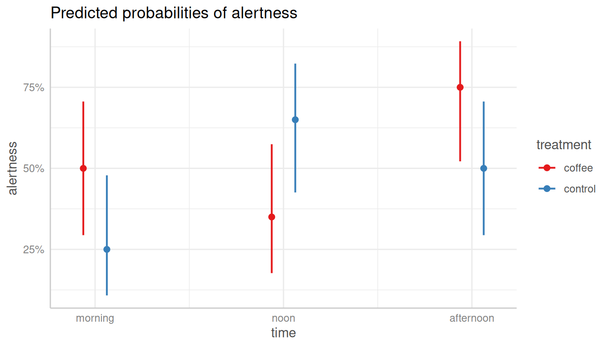

# Case Study: Simple Workflow Using Logistic Regression

This vignette demonstrates a typical workflow using the `ggeffects`
package, with a logistic regression model as an example. We will explore
various aspects of the model, such as model coefficients, predicted
probabilities, and pairwise comparisons. Let’s get started!

## Preparing the data and fitting a model

First, we load the `ggeffects` package and the `coffee_data` data set,
which is included in the package. The data set contains information on
the effect of coffee consumption on alertness over time. The outcome
variable is binary (alertness), and the predictor variables are coffee
consumption (treatment) and time.

``` r

library(ggeffects)
library(parameters) # for model summary
library(datawizard) # for recodings

data(coffee_data, package = "ggeffects")

# dichotomize outcome variable
coffee_data$alertness <- categorize(coffee_data$alertness, lowest = 0)
# rename variable
coffee_data$treatment <- coffee_data$coffee

# model
model <- glm(alertness ~ treatment * time, data = coffee_data, family = binomial())
```

## Exploring the model - model coefficients

Let’s start by examining the model coefficients. We can use the
[`model_parameters()`](https://easystats.github.io/parameters/reference/model_parameters.html)
function to extract the coefficients from the model. By setting
`exponentiate = TRUE`, we can obtain the odds ratios for the
coefficients.

``` r

# coefficients
model_parameters(model, exponentiate = TRUE)
#> Parameter                              | Odds Ratio |   SE |        95% CI |         z |      p
#> -----------------------------------------------------------------------------------------------
#> (Intercept)                            |       1.00 | 0.45 | [0.41,  2.44] | -1.54e-15 | > .999
#> treatment [control]                    |       0.33 | 0.23 | [0.08,  1.23] |     -1.61 | 0.108 
#> time [noon]                            |       0.54 | 0.35 | [0.15,  1.90] |     -0.96 | 0.339 
#> time [afternoon]                       |       3.00 | 2.05 | [0.81, 12.24] |      1.61 | 0.108 
#> treatment [control] × time [noon]      |      10.35 | 9.85 | [1.66, 70.73] |      2.45 | 0.014 
#> treatment [control] × time [afternoon] |       1.00 | 0.97 | [0.15,  6.74] | -6.10e-16 | > .999
#> 
#> Uncertainty intervals (profile-likelihood) and p-values (two-tailed) computed using a Wald z-distribution approximation.
```

The model coefficients are difficult to interpret directly, in
particular sinc we have an interaction effect. Instead, we should use
the
[`predict_response()`](https://strengejacke.github.io/ggeffects/reference/predict_response.md)
function to calculate predicted probabilities for the model. These refer
to the adjusted probabilities of the outcome (higher alertness)
depending on the predictor variables (treatment and time).

## Predicted probabilities - understanding the model

Thus, since we are interested in the interaction effect of coffee
consumption (treatment) on alertness depending on different times of the
day, we simply specify these two variables as *focal terms* in the
[`predict_response()`](https://strengejacke.github.io/ggeffects/reference/predict_response.md)
function.

``` r

# predicted probabilities
predictions <- predict_response(model, c("time", "treatment"))
plot(predictions)
#> Ignoring unknown labels:
#> • linetype : "treatment"
#> • shape : "treatment"
```



As we can see, the predicted probabilities of alertness are higher for
participants who consumed coffee compared to those who did not, but only
in the morning and in the afternoon. Furthermore, we see differences
between the *coffee* and the *control* group at each time point - but
are these differences statistically significant?

## Pairwise comparisons - testing the differences

To check this, we finally use the
[`test_predictions()`](https://strengejacke.github.io/ggeffects/reference/test_predictions.md)
function to perform pairwise comparisons of the predicted probabilities.
We simply pass our results from
[`predict_response()`](https://strengejacke.github.io/ggeffects/reference/predict_response.md)
to the function.

``` r

# pairwise comparisons - quite long table
test_predictions(predictions)
#> # Pairwise comparisons
#> 
#> time                |       treatment | Contrast |       95% CI |      p
#> ------------------------------------------------------------------------
#> afternoon-afternoon |  coffee-control |     0.25 | -0.04,  0.54 | 0.091 
#> afternoon-morning   |  coffee-control |     0.50 |  0.23,  0.77 | < .001
#> afternoon-noon      |  coffee-control |     0.10 | -0.18,  0.38 | 0.488 
#> morning-afternoon   |   coffee-coffee |    -0.25 | -0.54,  0.04 | 0.091 
#> morning-afternoon   |  coffee-control |     0.00 | -0.31,  0.31 | > .999
#> morning-afternoon   | control-control |    -0.25 | -0.54,  0.04 | 0.091 
#> morning-morning     |  coffee-control |     0.25 | -0.04,  0.54 | 0.091 
#> morning-noon        |   coffee-coffee |     0.15 | -0.15,  0.45 | 0.332 
#> morning-noon        |  coffee-control |    -0.15 | -0.45,  0.15 | 0.332 
#> morning-noon        | control-control |    -0.40 | -0.68, -0.12 | 0.005 
#> noon-afternoon      |   coffee-coffee |    -0.40 | -0.68, -0.12 | 0.005 
#> noon-afternoon      |  coffee-control |    -0.15 | -0.45,  0.15 | 0.332 
#> noon-afternoon      | control-control |     0.15 | -0.15,  0.45 | 0.332 
#> noon-morning        |  coffee-control |     0.10 | -0.18,  0.38 | 0.488 
#> noon-noon           |  coffee-control |    -0.30 | -0.60,  0.00 | 0.047
#> 
#> Contrasts are presented as probabilities (in %-points).
```

In the above output, we see all possible pairwise comparisons of the
predicted probabilities. The table is quite long, but we can also group
the comparisons, e.g. by the variable *time*.

``` r

# group comparisons by "time"
test_predictions(predictions, by = "time")
#> # Pairwise comparisons
#> 
#> treatment      |      time | Contrast |       95% CI |     p
#> ------------------------------------------------------------
#> coffee-control |   morning |     0.25 | -0.04,  0.54 | 0.091
#> coffee-control |      noon |    -0.30 | -0.60,  0.00 | 0.047
#> coffee-control | afternoon |     0.25 | -0.04,  0.54 | 0.091
#> 
#> Contrasts are presented as probabilities (in %-points).
```

The output shows that the differences between the *coffee* and the
*control* group are statistically significant only in the noon time.
