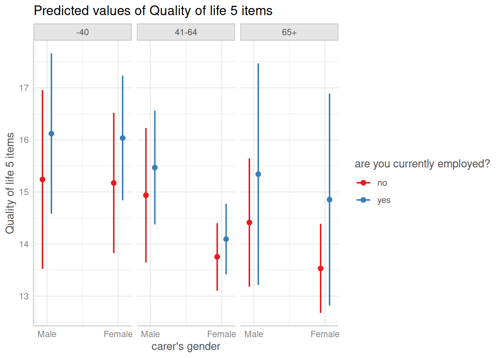

# Case Study: Intersectionality Analysis Using The MAIHDA Framework

This vignette demonstrate how to use *ggeffects* in the context of an
intersectional multilevel analysis of individual heterogeneity, using
the MAIHDA framework. The general approach of the MAIHDA framework
(sometimes also *I-MAIHDA*) is described in *Axelsson Fisk et al. 2018*
and *Evans et al. 2024*.

Intersectionality analysis is a new approach in social epidemiology,
which attempts to move away from looking at relevant social indicators
in isolation.

> “The advantage of incorporating an intersectional framework in social
> epidemiology is that it goes beyond the unidimensional study of
> socioeconomic and demographic categorizations by considering the
> effect of belonging to specific strata simultaneously defined by
> multiple social, economic and demographic dimensions.”

The steps we are showing here are:

1.  Defining the intersectional strata.

2.  Fitting a multilevel model to see whether intersectional strata
    contribute to between-stratum variance (which can be considered as
    “inequalities”, whether social or health related).

3.  Fitting partially adjusted multilevel models and calculating
    proportional change in the between-stratum variance (PCVs) to
    quantify to what degree the different intersectional dimensions
    contribute to the between-stratum variance (inequalities).

4.  Calculate adjusted predictions (estimated marginal means) of the
    outcome by intersectional strata, to get a clearer picture of the
    variation between intersectional dimensions, as well as testing
    specific strata for significant differences.

#  Summary of most important points:

- The MAIHDA framework is a new gold standard for quantitative
  intersectional analysis of inequity. This approach involves multilevel
  modelling, where the combination of inequality dimensions
  (characteristics of the social strata) is included as random effect
  (level-2 unit).

The analysis includes following steps:

1.  Fitting a null-model, partially and fully adjusted models. Partially
    adjusted models each include one of the different inequality
    dimenstions as fixed effect (level-1).
2.  Calculate the ICC (also called *VPC* ) of the null-model to estimate
    the general variation between inequality dimensions.
3.  Calculate the PCV for each partially adjusted model in comparison to
    the null-model, to quantify to what degree the different dimensions
    contribute to the inequality.
4.  Visualize the results using adjusted predictions.

### 1. Prepating the data and defining intersectional strata

First, we load the required packages and prepare a sample data set. We
use the `efc` data from the **ggeffects** package, which contains data
of family carers who care for their elderly relatives. Our outcome of
interest is *quality of life* of family carers (score ranging from 0 to
25 points), the different dimensions of the intersectionality groups are
*gender* (male/female), *employment status* (currently employed yes/no)
and *age* (three groups: until 40, 41 to 64 and 65 or older). We assume
that there might be health-related inequalities, i.e. the quality of
life differs depending on the characteristics that define our
intersectional strata.

[`library`](https://rdrr.io/r/base/library.html)`(`[`ggeffects`](https://strengejacke.github.io/ggeffects/)`)`` ``# predictions and significance testing`` `[`library`](https://rdrr.io/r/base/library.html)`(`[`insight`](https://easystats.github.io/insight/)`)`` ``# extracting random effects variances`` `[`library`](https://rdrr.io/r/base/library.html)`(`[`datawizard`](https://easystats.github.io/datawizard/)`)`` ``# data wrangling and preparation`` `[`library`](https://rdrr.io/r/base/library.html)`(`[`parameters`](https://easystats.github.io/parameters/)`)`` ``# model summaries`` `[`library`](https://rdrr.io/r/base/library.html)`(`[`performance`](https://easystats.github.io/performance/)`)`` ``# model fit indices, ICC`` `[`library`](https://rdrr.io/r/base/library.html)`(`[`glmmTMB`](https://github.com/glmmTMB/glmmTMB)`)`` ``# multilevel modelling`` `` ``# sample data set`` `[`data`](https://rdrr.io/r/utils/data.html)`(``efc``, package ``=`` ``"ggeffects"``)`` `` ``efc`` ``<-`` ``efc`` ``|>`` `` ``# numeric to factors, set labels as levels`` `` `[`to_factor`](https://easystats.github.io/datawizard/reference/to_factor.html)`(``select ``=`` `[`c`](https://rdrr.io/r/base/c.html)`(``"c161sex"``, ``"c172code"``, ``"c175empl"``)``)`` ``|>`` `` ``# recode age into three groups`` `` `[`recode_values`](https://easystats.github.io/datawizard/reference/recode_values.html)`(`` `` select ``=`` ``"c160age"``,`` `` recode ``=`` `[`list`](https://rdrr.io/r/base/list.html)`(``` `1`  ```=`` ``"min:40"``` , `2`  ```=`` ``41``:``64``` , `3`  ```=`` ``"65:max"``)`` `` ``)`` ``|>`` `` ``# rename variables`` `` `[`data_rename`](https://easystats.github.io/datawizard/reference/data_rename.html)`(`` `` select ``=`` `[`c`](https://rdrr.io/r/base/c.html)`(``"c161sex"``, ``"c160age"``, ``"quol_5"``, ``"c175empl"``)``,`` `` replacement ``=`` `[`c`](https://rdrr.io/r/base/c.html)`(``"gender"``, ``"age"``, ``"qol"``, ``"employed"``)`` `` ``)`` ``|>`` `` ``# age into factor, set levels, and change labels for education`` `` `[`data_modify`](https://easystats.github.io/datawizard/reference/data_modify.html)`(``age ``=`` `[`factor`](https://rdrr.io/r/base/factor.html)`(``age``, labels ``=`` `[`c`](https://rdrr.io/r/base/c.html)`(``"-40"``, ``"41-64"``, ``"65+"``)``)``)`

To include the intersectional strata variables `gender`, `employed` and
`age` in our mixed model, we will define them as interacting random
effects (excluding main effects of interactions):
`(1 | gender:employed:age)` (see also below). The idea is to have truly
unique combinations in our model, similar as if we would create a factor
variable with all combinations manually:

`efc``$``strata`` ``<-`` `[`ifelse`](https://rdrr.io/r/base/ifelse.html)`(`` `` `[`is.na`](https://rdrr.io/r/base/NA.html)`(``efc``$``employed``)`` ``|`` `[`is.na`](https://rdrr.io/r/base/NA.html)`(``efc``$``gender``)`` ``|`` `[`is.na`](https://rdrr.io/r/base/NA.html)`(``efc``$``age``)``,`` `` ``NA_character_``,`` `` `[`paste0`](https://rdrr.io/r/base/paste.html)`(``efc``$``gender``, ``", "``, ``efc``$``employed``, ``", "``, ``efc``$``age``)`` ``)`` ``efc``$``strata`` ``<-`` `[`factor`](https://rdrr.io/r/base/factor.html)`(``efc``$``strata``)`` `[`data_tabulate`](https://easystats.github.io/datawizard/reference/data_tabulate.html)`(``efc``$``strata``)`` ``#> efc$strata <categorical>`` ``#> # total N=908 valid N=900`` ``#> `` ``#> Value | N | Raw % | Valid % | Cumulative %`` ``#> -------------------+-----+-------+---------+-------------`` ``#> Female, no, -40 | 37 | 4.07 | 4.11 | 4.11`` ``#> Female, no, 41-64 | 238 | 26.21 | 26.44 | 30.56`` ``#> Female, no, 65+ | 135 | 14.87 | 15.00 | 45.56`` ``#> Female, yes, -40 | 63 | 6.94 | 7.00 | 52.56`` ``#> Female, yes, 41-64 | 210 | 23.13 | 23.33 | 75.89`` ``#> Female, yes, 65+ | 3 | 0.33 | 0.33 | 76.22`` ``#> Male, no, -40 | 15 | 1.65 | 1.67 | 77.89`` ``#> Male, no, 41-64 | 42 | 4.63 | 4.67 | 82.56`` ``#> Male, no, 65+ | 50 | 5.51 | 5.56 | 88.11`` ``#> Male, yes, -40 | 34 | 3.74 | 3.78 | 91.89`` ``#> Male, yes, 41-64 | 70 | 7.71 | 7.78 | 99.67`` ``#> Male, yes, 65+ | 3 | 0.33 | 0.33 | 100.00`` ``#> <NA> | 8 | 0.88 | <NA> | <NA>`

We now have the choice and could either use the `strata` variable as
group factor for our random effects, or `gender:employed:age`. For
plotting predictions (see section 4), we get clearer plots when we
include the three factors `gender`, `employed` and `age` instead of the
integrated `strata` factor.

### 2. Fitting the simple intersectional model

Intersectionality analysis aims at recognizing effects of belonging to
specific strata simultaneously. In the context of the MAIHDA framework,
the interest lies in analysing the variation between strata regarding
the outcome of interest. Thus, the indicators that define the
intersectional dimensions are used as interacting *random effects*
(group factors) in a multilevel model (random-intercept model).

We start by fitting a linear mixed effects model, which includes no
fixed effects, but only our different intersectional dimensions:
`gender`, `employed` and `age`.

`# Quality of Life score ranges from 0 to 25`` ``m_null`` ``<-`` `[`glmmTMB`](https://rdrr.io/pkg/glmmTMB/man/glmmTMB.html)`(``qol`` ``~`` ``1`` ``+`` ``(``1`` ``|`` ``gender``:``employed``:``age``)``, data ``=`` ``efc``)`` `` ``# the above model is identical to:`` ``# m_null <- glmmTMB(qol ~ 1 + (1 | strata), data = efc)`

The purpose of this model is to quantify the “discriminatory accuracy”,
which is achieved by calculating the ICC (see
[`performance::icc()`](https://easystats.github.io/performance/reference/icc.html))
of this model. The higher the ICC, the greater the degree of similarity
*within the strata* (regarding quality of life) and the greater the
difference in quality of life *between the intersectional strata*. I.e.,
the higher the ICC, the better the model is at discriminating
individuals with higher or lower quality of life score, as opposed to
models with lower ICC.

We now look at the model parameters and the ICC of our simple
intersectional model.

[`model_parameters`](https://easystats.github.io/parameters/reference/model_parameters.html)`(``m_null``)`` ``#> # Fixed Effects`` ``#> `` ``#> Parameter | Coefficient | SE | 95% CI | z | p`` ``#> ------------------------------------------------------------------`` ``#> (Intercept) | 14.91 | 0.40 | [14.13, 15.70] | 37.41 | < .001`` ``#> `` ``#> # Random Effects`` ``#> `` ``#> Parameter | Coefficient | 95% CI`` ``#> ----------------------------------------------------------------`` ``#> SD (Intercept: gender:employed:age) | 1.03 | [0.56, 1.89]`` ``#> SD (Residual) | 5.23 | [4.99, 5.48]`` `` `[`icc`](https://easystats.github.io/performance/reference/icc.html)`(``m_null``)`` ``#> # Intraclass Correlation Coefficient`` ``#> `` ``#> Adjusted ICC: 0.038`` ``#> Unadjusted ICC: 0.038`

The ICC with a value of about 4% is rather low. Usually, this indiates
that our dimensions used to define the intersectional strata do not
suggest larger social inequalities regarding quality of life. But we
ignore this fact for now, as the purpose of demonstrating the analysis
approach is rarely affected.

### 3. Partially-adjusted intersectional model and PCV

In the next step we want to find out, which intersectional dimension
contributes most to possible inequalities, i.e. which of our group
factors `gender`, `employed` and `age` explains most of the
between-stratum variance of the random effects. This is achieved by
fitting partially-adjusted intersectional models.

> “The purpose of the partially adjusted model was to quantify to what
> degree the different dimensions used to construct the intersectional
> strata contributed to the between stratum variance seen in the
> previous model.”

For each of the intersectional dimensions, a multilevel model including
this dimension as fixed effect is fitted. We can then both look at the
ICCs of the partially-adjusted models, as well as at the proportional
change in the between-stratum variance, the so-called *PCV*
coefficients.

First, we fit three models each with one dimension as predictor.

`m_gender`` ``<-`` `[`glmmTMB`](https://rdrr.io/pkg/glmmTMB/man/glmmTMB.html)`(``qol`` ``~`` ``gender`` ``+`` ``(``1`` ``|`` ``gender``:``employed``:``age``)``, data ``=`` ``efc``)`` ``m_employment`` ``<-`` `[`glmmTMB`](https://rdrr.io/pkg/glmmTMB/man/glmmTMB.html)`(``qol`` ``~`` ``employed`` ``+`` ``(``1`` ``|`` ``gender``:``employed``:``age``)``, data ``=`` ``efc``)`` ``m_age`` ``<-`` `[`glmmTMB`](https://rdrr.io/pkg/glmmTMB/man/glmmTMB.html)`(``qol`` ``~`` ``age`` ``+`` ``(``1`` ``|`` ``gender``:``employed``:``age``)``, data ``=`` ``efc``)`

The regression coefficients already give an impression how strong the
association between each single dimension and the outcome is, taking
between-stratum variance into accout. The larger (in absolute values)
the coefficients, the higher the degree that dimension contributed to
the between-stratum variance.

[`compare_parameters`](https://easystats.github.io/parameters/reference/compare_parameters.html)`(``m_gender``, ``m_employment``, ``m_age``)`` ``#> Parameter | m_gender | m_employment | m_age`` ``#> ------------------------------------------------------------------------------------`` ``#> (Intercept) | 15.55 (14.51, 16.60) | 14.23 (13.35, 15.12) | 16.25 (15.33, 17.17)`` ``#> gender [Female] | -1.18 (-2.54, 0.17) | | `` ``#> employed [yes] | | 1.38 ( 0.07, 2.68) | `` ``#> age [41-64] | | | -1.99 (-3.14, -0.84)`` ``#> age [65+] | | | -2.55 (-3.88, -1.23)`` ``#> ------------------------------------------------------------------------------------`` ``#> Observations | 895 | 895 | 895`

Looking at the summary tables above, it seems like `gender` is the
dimension that explains least of the between-stratum variance,
i.e. gender seems to be the characteristic that contributes least to
potential social inequalities. `age`, in turn, seems to be the most
important characteristic regarding inequalities.

Since the fixed effects now take away some of the proportion of the
variance explained by the grouping factors (random effects), we expect
the ICC for the above models to be lower.

[`icc`](https://easystats.github.io/performance/reference/icc.html)`(``m_gender``)``$``ICC_adjusted`` ``#> [1] 0.02583979`` `[`icc`](https://easystats.github.io/performance/reference/icc.html)`(``m_employment``)``$``ICC_adjusted`` ``#> [1] 0.02341412`` `[`icc`](https://easystats.github.io/performance/reference/icc.html)`(``m_age``)``$``ICC_adjusted`` ``#> [1] 0.00461901`

Indeed, the ICC correlates with the fixed effects coefficients, i.e. the
larger the coefficient (in absolute values), the lower the ICC.

Next, we want to quantify the degree the different dimensions contribute
to the variance between groups more accurately. To do so, we calculate
the *proportional change in between-stratum variance*, or *PCV*. This
coefficient explains how much of the total proportion of explained
variance by the strata can be explained by a single dimension that
define those strata. The PCV ranges from 0 to 1, and the closer to 1,
the more this particular dimension explains social inequalities.

`# extract random effect variances from all models`` ``v_null`` ``<-`` `[`get_variance`](https://easystats.github.io/insight/reference/get_variance.html)`(``m_null``)`` ``v_gender`` ``<-`` `[`get_variance`](https://easystats.github.io/insight/reference/get_variance.html)`(``m_gender``)`` ``v_employment`` ``<-`` `[`get_variance`](https://easystats.github.io/insight/reference/get_variance.html)`(``m_employment``)`` ``v_age`` ``<-`` `[`get_variance`](https://easystats.github.io/insight/reference/get_variance.html)`(``m_age``)`` `` ``# PCV (proportional change in between-stratum variance)`` ``# from null-model to gender-model`` ``(``v_null``$``var.random`` ``-`` ``v_gender``$``var.random``)`` ``/`` ``v_null``$``var.random`` ``#> [1] 0.3202535`` `` ``# PCV from null-model to employment-model`` ``(``v_null``$``var.random`` ``-`` ``v_employment``$``var.random``)`` ``/`` ``v_null``$``var.random`` ``#> [1] 0.3859538`` `` ``# PCV from null-model to age-model`` ``(``v_null``$``var.random`` ``-`` ``v_age``$``var.random``)`` ``/`` ``v_null``$``var.random`` ``#> [1] 0.8809532`

Again, we see that the PCV is in line with the models’ ICC’s and
regression coefficients. We see the highest proportional change for
`age`, meaning that - although gender and education can contribute to
inequalities - age is the most relevant predictor.

### 4. Predict between-stratum variance and test for significant differences

Finally, we may want to have a clearer picture of how the different
strata vary, which combination of characteristics defines the highest or
maybe lowest risk group. To do so, we calculate predictions of the
random effects (*unit-level* predictions) by either setting
`margin = "empirical"` or setting `type = "random"` (for more defaults
how *ggeffects* handles mixed models, see [this
vignette](https://strengejacke.github.io/ggeffects/articles/introduction_randomeffects.md).).

The following code shows the predicted average quality of life scores
for the different groups.

`predictions`` ``<-`` `[`predict_response`](https://strengejacke.github.io/ggeffects/reference/predict_response.md)`(`` `` ``m_null``,`` `` `[`c`](https://rdrr.io/r/base/c.html)`(``"gender"``, ``"employed"``, ``"age"``)``,`` `` type ``=`` ``"random"`` ``)`` `[`plot`](https://strengejacke.github.io/ggeffects/reference/plot.md)`(``predictions``)`



According to these results, employed male family carers, who are not
older than 40 years, show on average the highest quality of life. On the
other hand, unemployed female carers aged 65 or older have the lowest
quality of life.

We can now calculate pairwise comparisons that show which differences
between groups are statistically significant. Since all combinations of
pairwise comparisons would return 66 rows in total, we just show the
first ten rows for demonstrating purpose.

`# just show first 10 rows of output...`` `[`test_predictions`](https://strengejacke.github.io/ggeffects/reference/test_predictions.md)`(``predictions``)``[``1``:``10``, ``]`` ``#> # Pairwise comparisons`` ``#> `` ``#> gender | employed | age | Contrast | 95% CI | p`` ``#> -----------------------------------------------------------------------`` ``#> Female-Female | no-no | -40-41-64 | 1.42 | -0.08, 2.91 | 0.063`` ``#> Female-Female | no-no | -40-65+ | 1.64 | 0.04, 3.23 | 0.044`` ``#> Female-Female | no-no | 41-64-65+ | 0.22 | -0.85, 1.29 | 0.686`` ``#> Female-Female | no-yes | -40--40 | -0.86 | -2.67, 0.94 | 0.348`` ``#> Female-Female | no-yes | -40-41-64 | 1.08 | -0.43, 2.59 | 0.162`` ``#> Female-Female | no-yes | -40-65+ | 0.32 | -2.12, 2.76 | 0.798`` ``#> Female-Female | no-yes | 41-64-41-64 | -0.34 | -1.28, 0.60 | 0.476`` ``#> Female-Female | no-yes | 41-64-65+ | -1.10 | -3.23, 1.04 | 0.313`` ``#> Female-Female | no-yes | 65+-65+ | -1.32 | -3.53, 0.89 | 0.241`` ``#> Female-Female | yes-no | -40-41-64 | 2.28 | 0.92, 3.64 | 0.001`

If we only want to modulate one factor and compare those groups within
the levels of the other groups, we can use the `by` argument. This
reduces the output and only compares the focal term(s) within the levels
of the remaining predictors.

`# Compare levels of gender and employment status for age groups`` `[`test_predictions`](https://strengejacke.github.io/ggeffects/reference/test_predictions.md)`(``predictions``, by ``=`` ``"age"``)`` ``#> # Pairwise comparisons`` ``#> `` ``#> gender | employed | age | Contrast | 95% CI | p`` ``#> ------------------------------------------------------------------`` ``#> Female-Female | no-yes | -40 | -0.86 | -2.67, 0.94 | 0.348`` ``#> Female-Male | no-yes | -40 | -0.95 | -2.99, 1.10 | 0.364`` ``#> Male-Female | no-no | -40 | 0.07 | -2.11, 2.25 | 0.951`` ``#> Male-Female | no-yes | -40 | -0.79 | -2.89, 1.30 | 0.457`` ``#> Male-Female | yes-yes | -40 | 0.08 | -1.86, 2.03 | 0.932`` ``#> Male-Male | no-yes | -40 | -0.88 | -3.18, 1.43 | 0.455`` ``#> Female-Female | no-yes | 41-64 | -0.34 | -1.28, 0.60 | 0.476`` ``#> Female-Male | no-yes | 41-64 | -1.71 | -2.98, -0.44 | 0.008`` ``#> Male-Female | no-no | 41-64 | 1.18 | -0.26, 2.63 | 0.109`` ``#> Male-Female | no-yes | 41-64 | 0.84 | -0.62, 2.30 | 0.258`` ``#> Male-Female | yes-yes | 41-64 | 1.37 | 0.09, 2.66 | 0.036`` ``#> Male-Male | no-yes | 41-64 | -0.53 | -2.22, 1.16 | 0.538`` ``#> Female-Female | no-yes | 65+ | -1.32 | -3.53, 0.89 | 0.241`` ``#> Female-Male | no-yes | 65+ | -1.81 | -4.10, 0.48 | 0.122`` ``#> Male-Female | no-no | 65+ | 0.88 | -0.62, 2.38 | 0.250`` ``#> Male-Female | no-yes | 65+ | -0.44 | -2.82, 1.94 | 0.717`` ``#> Male-Female | yes-yes | 65+ | 0.49 | -2.45, 3.43 | 0.745`` ``#> Male-Male | no-yes | 65+ | -0.93 | -3.39, 1.53 | 0.459`

E.g., if we look at the plot and want to know whether female persons
aged 65+ differ depending on their employment status, we can use the
following code:

`# Compare levels employment status by gender and age groups`` `[`test_predictions`](https://strengejacke.github.io/ggeffects/reference/test_predictions.md)`(``predictions``, by ``=`` `[`c`](https://rdrr.io/r/base/c.html)`(``"gender"``, ``"age"``)``)`` ``#> # Pairwise comparisons`` ``#> `` ``#> employed | gender | age | Contrast | 95% CI | p`` ``#> ----------------------------------------------------------`` ``#> no-yes | Male | -40 | -0.88 | -3.18, 1.43 | 0.455`` ``#> no-yes | Male | 41-64 | -0.53 | -2.22, 1.16 | 0.538`` ``#> no-yes | Male | 65+ | -0.93 | -3.39, 1.53 | 0.459`` ``#> no-yes | Female | -40 | -0.86 | -2.67, 0.94 | 0.348`` ``#> no-yes | Female | 41-64 | -0.34 | -1.28, 0.60 | 0.476`` ``#> no-yes | Female | 65+ | -1.32 | -3.53, 0.89 | 0.241`

### 5. Conclusion

Intersectional multilevel analysis of individual heterogeneity, using
the MAIHDA framework, is a new approach in social epidemiology, which
helps to understand the interaction of social indicators with regard to
social inequalities.

This approach requires the application of multilevel models, where ICC
and PCV are relevant coefficients. The *ggeffects* package allows to go
beyond quantifying to what degree different intersectional dimensions
contribute to inequalities by predicting the average outcome by group,
thereby explicitly showing the differences between those groups
(strata).

Furthermore, with *ggeffects* it is possible to compare differences
between groups and test whether these differences are statistically
significant or not, i.e. whether we find “evidence” for social
inequalities in our data for certain groups (at risk).

## References

1.  Axelsson Fisk S, Mulinari S, Wemrell M, Leckie G, Perez Vicente R,
    Merlo J. Chronic Obstructive Pulmonary Disease in Sweden: An
    intersectional multilevel analysis of individual heterogeneity and
    discriminatory accuracy. SSM - Population Health (2018) 4:334-346.
    doi: 10.1016/j.ssmph.2018.03.005

2.  Evans CR, Leckie G, Subramanian SV, Bell A, Merlo J. A tutorial for
    conducting intersectional multilevel analysis of individual
    heterogeneity and discriminatory accuracy (MAIHDA). SSM - Population
    Health (2024) 26; doi: 10.1016/j.ssmph.2024.101664
