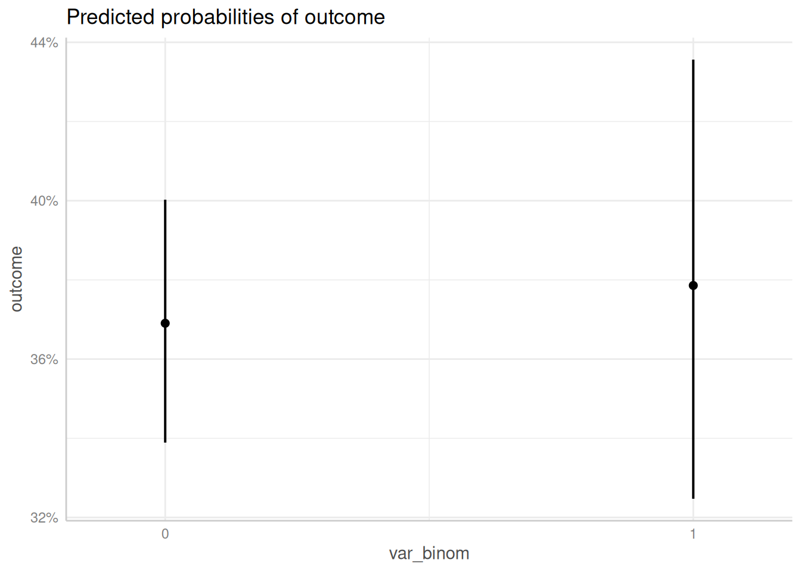
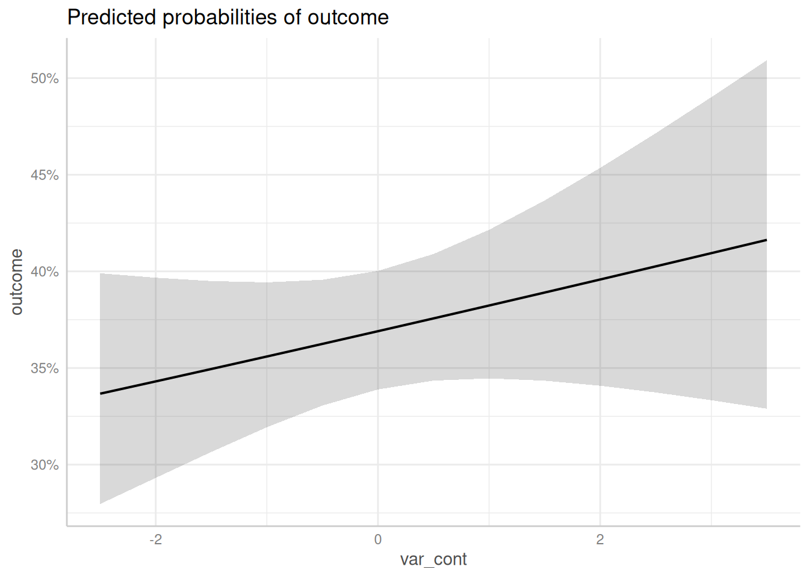
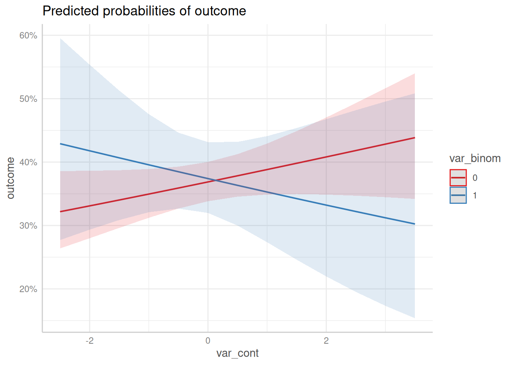
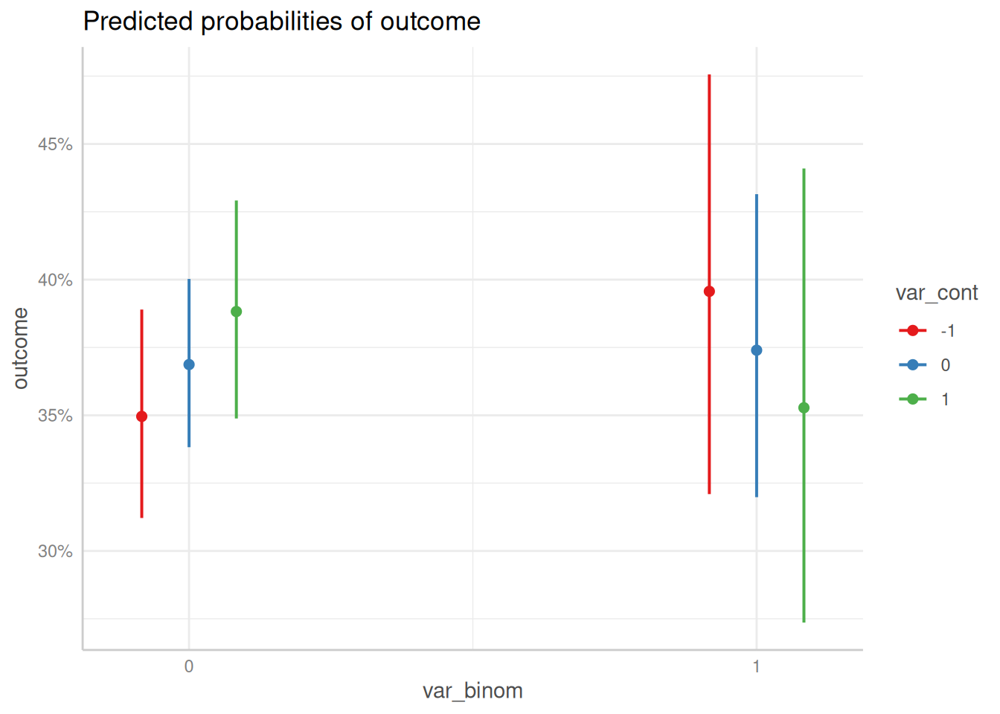
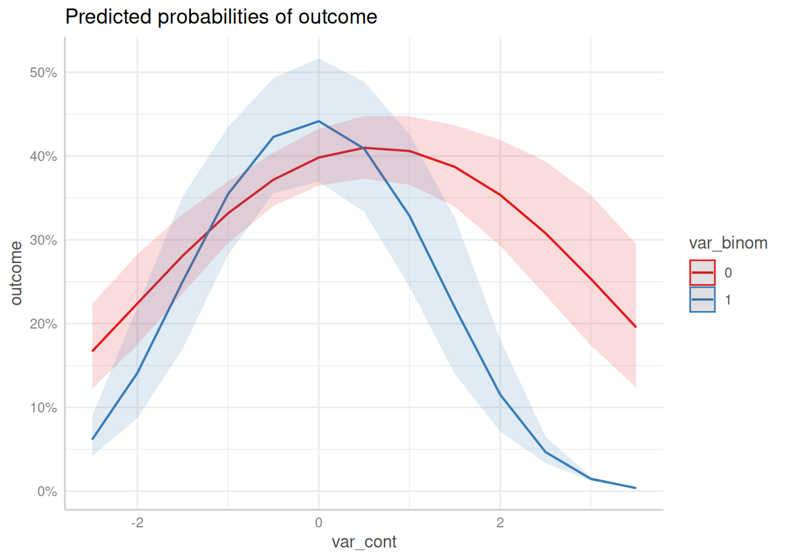
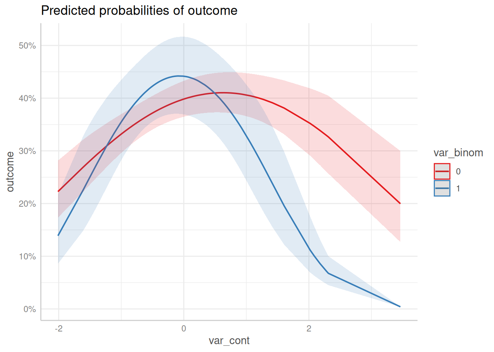
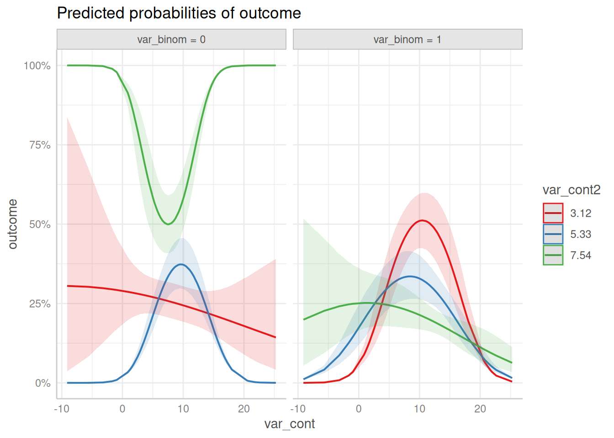

# Case Study: Logistic Mixed Effects Model With Interaction Term

This vignette demonstrate how to use *ggeffects* to compute and plot
adjusted predictions of a logistic regression model. To cover some
frequently asked questions by users, we’ll fit a mixed model, including
an interaction term and a quadratic resp. spline term. A general
introduction into the package usage can be found in the vignette
[adjusted predictions of regression
model](https://strengejacke.github.io/ggeffects/articles/ggeffects.md).

One crucial distinction is between *conditional* and *marginal*
predictions (or effects). Conditional predictions are specific to a
particular level of the random effect (e.g., the predicted outcome for a
specific individual in a study). Marginal predictions, on the other
hand, average over the random effects, providing an overall estimate of
the effect in the population. The marginal effect is often the quantity
of interest when we want to generalize to the population.

For further reading, we recommend [this new vignette on mixed
models](https://easystats.github.io/modelbased/articles/mixed_models.html),
and strongly advise using the **modelbased** package for more
flexibility.

First, we load the required packages and create a sample data set with a
binomial and continuous variable as predictor as well as a group factor.
To avoid convergence warnings, the continuous variable is standardized.

[`library`](https://rdrr.io/r/base/library.html)`(`[`ggeffects`](https://strengejacke.github.io/ggeffects/)`)`` `[`library`](https://rdrr.io/r/base/library.html)`(`[`lme4`](https://github.com/lme4/lme4/)`)`` `[`library`](https://rdrr.io/r/base/library.html)`(``splines``)`` `` `[`set.seed`](https://rdrr.io/r/base/Random.html)`(``123``)`` `` ``dat`` ``<-`` `[`data.frame`](https://rdrr.io/r/base/data.frame.html)`(`` `` outcome ``=`` `[`rbinom`](https://rdrr.io/r/stats/Binomial.html)`(``n ``=`` ``100``, size ``=`` ``1``, prob ``=`` ``0.35``)``,`` `` var_binom ``=`` `[`as.factor`](https://rdrr.io/r/base/factor.html)`(`[`rbinom`](https://rdrr.io/r/stats/Binomial.html)`(``n ``=`` ``100``, size ``=`` ``1``, prob ``=`` ``0.2``)``)``,`` `` var_cont ``=`` `[`rnorm`](https://rdrr.io/r/stats/Normal.html)`(``n ``=`` ``100``, mean ``=`` ``10``, sd ``=`` ``7``)``,`` `` group ``=`` `[`sample`](https://rdrr.io/r/base/sample.html)`(``letters``[``1``:``4``]``, size ``=`` ``100``, replace ``=`` ``TRUE``)`` ``)`` `` ``dat``$``var_cont`` ``<-`` ``datawizard``::`[`standardize`](https://easystats.github.io/datawizard/reference/standardize.html)`(``dat``$``var_cont``)`

## Simple Logistic Mixed Effects Model

We start by fitting a simple mixed effects model.

`m1`` ``<-`` `[`glmer`](https://rdrr.io/pkg/lme4/man/glmer.html)`(`` `` ``outcome`` ``~`` ``var_binom`` ``+`` ``var_cont`` ``+`` ``(``1`` ``|`` ``group``)``,`` `` data ``=`` ``dat``,`` `` family ``=`` `[`binomial`](https://rdrr.io/r/stats/family.html)`(``link ``=`` ``"logit"``)`` ``)`

For a discrete variable, adjusted predictions for all levels are
calculated by default. For continuous variables, a pretty range of
values is generated. See more details about value ranges in the vignette
[adjusted predictions at specific
values](https://strengejacke.github.io/ggeffects/articles/introduction_effectsatvalues.md).

For logistic regression models, since *ggeffects* returns adjusted
predictions on the response scale, the predicted values are predicted
*probabilities*. Furthermore, for mixed models, the predicted values are
typically at the *population* level, not group-specific.

[`predict_response`](https://strengejacke.github.io/ggeffects/reference/predict_response.md)`(``m1``, ``"var_binom"``)`` ``` #> You are calculating adjusted predictions on the population-level (i.e. `type = "fixed"`) for a *generalized* linear mixed model. ``` ``` #> This may produce biased estimates due to Jensen's inequality. Consider setting `bias_correction = TRUE` to correct for this bias. ``` ``` #> See also the documentation of the `bias_correction` argument. ``` ``#> # Predicted probabilities of outcome`` ``#> `` ``#> var_binom | Predicted | 95% CI`` ``#> ----------------------------------`` ``#> 0 | 0.37 | 0.34, 0.40`` ``#> 1 | 0.38 | 0.32, 0.44`` ``#> `` ``#> Adjusted for:`` ``#> * var_cont = -0.00`` ``#> * group = 0 (population-level)`` `` `[`predict_response`](https://strengejacke.github.io/ggeffects/reference/predict_response.md)`(``m1``, ``"var_cont"``)`` ``` #> Data were 'prettified'. Consider using `terms="var_cont [all]"` to get smooth plots. ``` ``#> # Predicted probabilities of outcome`` ``#> `` ``#> var_cont | Predicted | 95% CI`` ``#> ---------------------------------`` ``#> -2.50 | 0.34 | 0.28, 0.40`` ``#> -2.00 | 0.34 | 0.29, 0.40`` ``#> -1.00 | 0.36 | 0.32, 0.39`` ``#> 0.00 | 0.37 | 0.34, 0.40`` ``#> 0.50 | 0.38 | 0.34, 0.41`` ``#> 1.00 | 0.38 | 0.34, 0.42`` ``#> 2.00 | 0.40 | 0.34, 0.45`` ``#> 3.50 | 0.42 | 0.33, 0.51`` ``#> `` ``#> Adjusted for:`` ``#> * var_binom = 0`` ``#> * group = 0 (population-level)`` ``#> `` ``` #> Not all rows are shown in the output. Use `print(..., n = Inf)` to show all rows. ``

To plot adjusted predictions, simply plot the returned results or use
the pipe.

`# save adjusted predictions in an object and plot`` ``me`` ``<-`` `[`predict_response`](https://strengejacke.github.io/ggeffects/reference/predict_response.md)`(``m1``, ``"var_binom"``)`` `[`plot`](https://strengejacke.github.io/ggeffects/reference/plot.md)`(``me``)`



`# plot using the pipe`` `[`predict_response`](https://strengejacke.github.io/ggeffects/reference/predict_response.md)`(``m1``, ``"var_cont"``)`` ``|>`` `[`plot`](https://strengejacke.github.io/ggeffects/reference/plot.md)`(``)`



## Logistic Mixed Effects Model with Interaction Term

Next, we fit a model with an interaction between the binomial and
continuous variable.

`m2`` ``<-`` `[`glmer`](https://rdrr.io/pkg/lme4/man/glmer.html)`(`` `` ``outcome`` ``~`` ``var_binom`` ``*`` ``var_cont`` ``+`` ``(``1`` ``|`` ``group``)``,`` `` data ``=`` ``dat``,`` `` family ``=`` `[`binomial`](https://rdrr.io/r/stats/family.html)`(``link ``=`` ``"logit"``)`` ``)`

To compute or plot adjusted predictions of interaction terms, simply
specify these terms, i.e. the names of the variables, as character
vector in the `terms`-argument. Since we have an interaction between
`var_binom` and `var_cont`, the argument would be
`terms = c("var_binom", "var_cont")`. However, the *first* variable in
the `terms`-argument is used as predictor along the x-axis. Adjusted
predictions are then plotted for specific values or at specific levels
from the *second* variable.

If the second variable is a factor, adjusted predictions for each level
are plotted. If the second variable is continuous, representative values
are chosen (typically, mean +/- one SD, see [adjusted predictions at
specific
values](https://strengejacke.github.io/ggeffects/articles/introduction_effectsatvalues.md)).

[`predict_response`](https://strengejacke.github.io/ggeffects/reference/predict_response.md)`(``m2``, `[`c`](https://rdrr.io/r/base/c.html)`(``"var_cont"``, ``"var_binom"``)``)`` ``|>`` `[`plot`](https://strengejacke.github.io/ggeffects/reference/plot.md)`(``)`` ``` #> Data were 'prettified'. Consider using `terms="var_cont [all]"` to get smooth plots. ``



[`predict_response`](https://strengejacke.github.io/ggeffects/reference/predict_response.md)`(``m2``, `[`c`](https://rdrr.io/r/base/c.html)`(``"var_binom"``, ``"var_cont"``)``)`` ``|>`` `[`plot`](https://strengejacke.github.io/ggeffects/reference/plot.md)`(``)`` ``#> Ignoring unknown labels:`` ``#> ``•`` ``linetype`` : ``"var_cont"`` ``#> ``•`` ``shape`` : ``"var_cont"`



## Logistic Mixed Effects Model with quadratic Interaction Term

Now we fit a model with interaction term, where the continuous variable
is modelled as quadratic term.

`m3`` ``<-`` `[`glmer`](https://rdrr.io/pkg/lme4/man/glmer.html)`(`` `` ``outcome`` ``~`` ``var_binom`` ``*`` `[`poly`](https://rdrr.io/r/stats/poly.html)`(``var_cont``, degree ``=`` ``2``, raw ``=`` ``TRUE``)`` ``+`` ``(``1`` ``|`` ``group``)``,`` `` data ``=`` ``dat``,`` `` family ``=`` `[`binomial`](https://rdrr.io/r/stats/family.html)`(``link ``=`` ``"logit"``)`` ``)`

Again, *ggeffect* automatically plots all high-order terms when these
are specified in the `terms`-argument. Hence, the function call is
identical to the previous examples with interaction terms, which had no
polynomial term included.

[`predict_response`](https://strengejacke.github.io/ggeffects/reference/predict_response.md)`(``m3``, `[`c`](https://rdrr.io/r/base/c.html)`(``"var_cont"``, ``"var_binom"``)``)`` ``|>`` `[`plot`](https://strengejacke.github.io/ggeffects/reference/plot.md)`(``)`` ``` #> Model contains splines or polynomial terms. Consider using `terms="var_cont [all]"` to get smooth plots. See also package-vignette 'Adjusted Predictions at Specific Values'. ``



As you can see, *ggeffects* also returned a message indicated that the
plot may not look very smooth due to the involvement of polynomial or
spline terms:

> Model contains splines or polynomial terms. Consider using
> `terms="var_cont [all]"` to get smooth plots. See also
> package-vignette ‘Adjusted predictions at Specific Values’.

This is because for mixed models, computing adjusted predictions with
spline or polynomial terms may lead to memory allocation problems. If
you are sure that this will not happen, add the `[all]`-tag to the
`terms`-argument, as described in the message:

[`predict_response`](https://strengejacke.github.io/ggeffects/reference/predict_response.md)`(``m3``, `[`c`](https://rdrr.io/r/base/c.html)`(``"var_cont [all]"``, ``"var_binom"``)``)`` ``|>`` `[`plot`](https://strengejacke.github.io/ggeffects/reference/plot.md)`(``)`



The above plot produces much smoother curves.

## Logistic Mixed Effects Model with Three-Way Interaction

The last model does not produce very nice plots, but for the sake of
demonstration, we fit a model with three interaction terms, including
polynomial and spline terms.

[`set.seed`](https://rdrr.io/r/base/Random.html)`(``321``)`` ``dat`` ``<-`` `[`data.frame`](https://rdrr.io/r/base/data.frame.html)`(`` `` outcome ``=`` `[`rbinom`](https://rdrr.io/r/stats/Binomial.html)`(``n ``=`` ``100``, size ``=`` ``1``, prob ``=`` ``0.35``)``,`` `` var_binom ``=`` `[`rbinom`](https://rdrr.io/r/stats/Binomial.html)`(``n ``=`` ``100``, size ``=`` ``1``, prob ``=`` ``0.5``)``,`` `` var_cont ``=`` `[`rnorm`](https://rdrr.io/r/stats/Normal.html)`(``n ``=`` ``100``, mean ``=`` ``10``, sd ``=`` ``7``)``,`` `` var_cont2 ``=`` `[`rnorm`](https://rdrr.io/r/stats/Normal.html)`(``n ``=`` ``100``, mean ``=`` ``5``, sd ``=`` ``2``)``,`` `` group ``=`` `[`sample`](https://rdrr.io/r/base/sample.html)`(``letters``[``1``:``4``]``, size ``=`` ``100``, replace ``=`` ``TRUE``)`` ``)`` `` `` ``m4`` ``<-`` `[`glmer`](https://rdrr.io/pkg/lme4/man/glmer.html)`(`` `` ``outcome`` ``~`` ``var_binom`` ``*`` `[`poly`](https://rdrr.io/r/stats/poly.html)`(``var_cont``, degree ``=`` ``2``)`` ``*`` `[`ns`](https://rdrr.io/r/splines/ns.html)`(``var_cont2``, df ``=`` ``3``)`` ``+`` ``(``1`` ``|`` ``group``)``,`` `` data ``=`` ``dat``,`` `` family ``=`` `[`binomial`](https://rdrr.io/r/stats/family.html)`(``link ``=`` ``"logit"``)`` ``)`

Since we have adjusted predictions for *var_cont* at the levels of
*var_cont2* and *var_binom*, we not only have groups, but also facets to
plot all three “dimensions”. Three-way interactions are plotted simply
by speficying all terms in question in the `terms`-argument.

[`predict_response`](https://strengejacke.github.io/ggeffects/reference/predict_response.md)`(``m4``, `[`c`](https://rdrr.io/r/base/c.html)`(``"var_cont [all]"``, ``"var_cont2"``, ``"var_binom"``)``)`` ``|>`` `[`plot`](https://strengejacke.github.io/ggeffects/reference/plot.md)`(``)`


