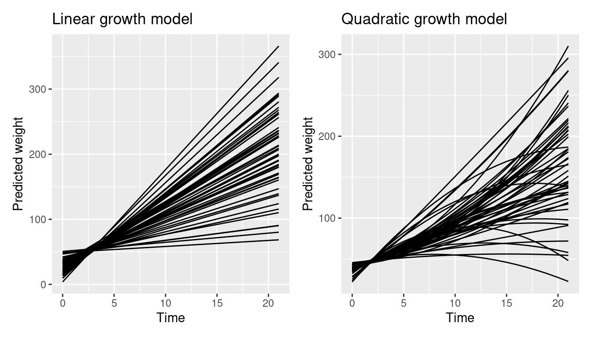
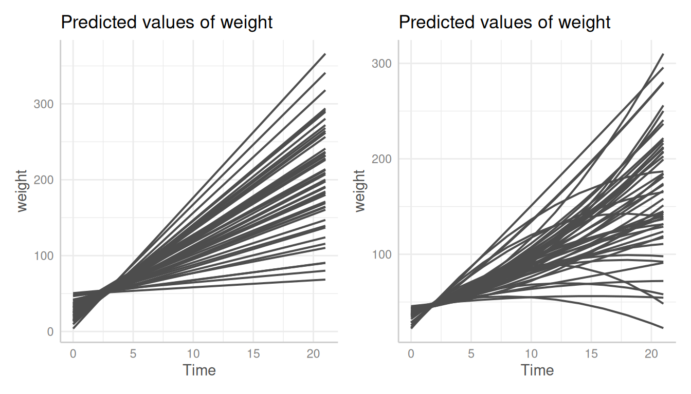
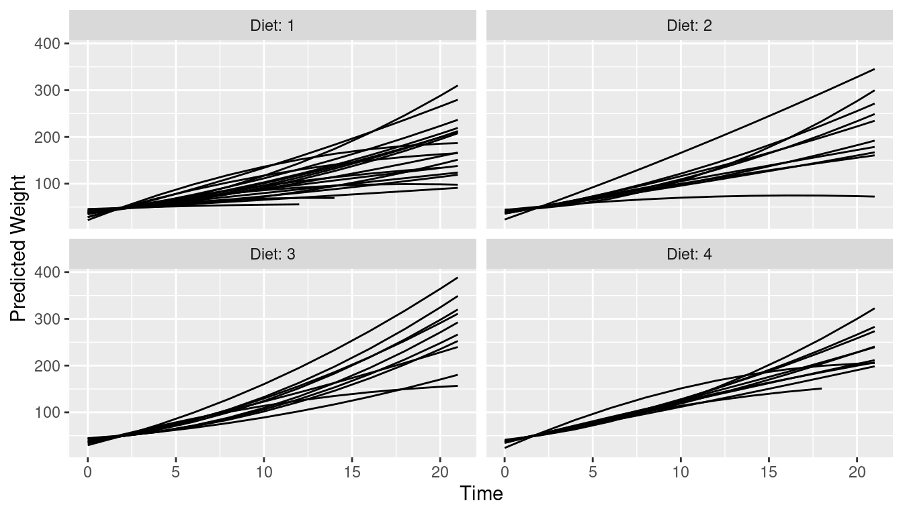
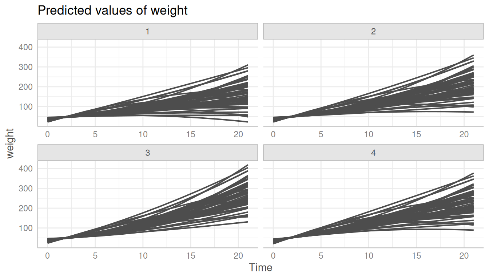
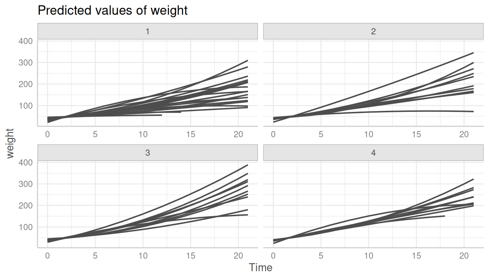
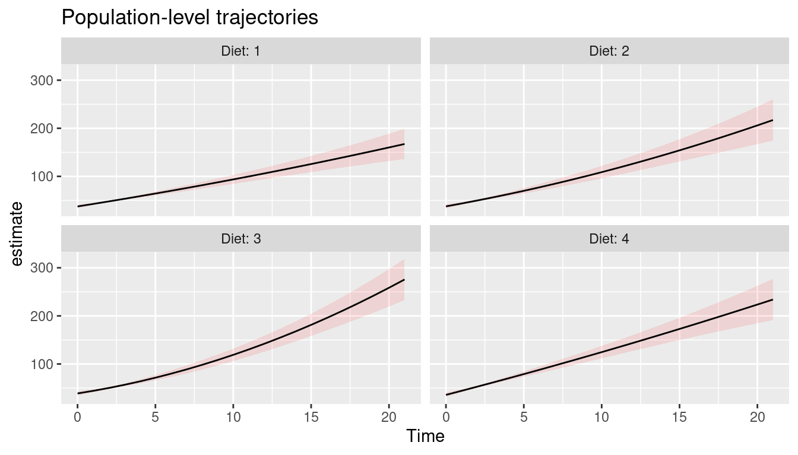
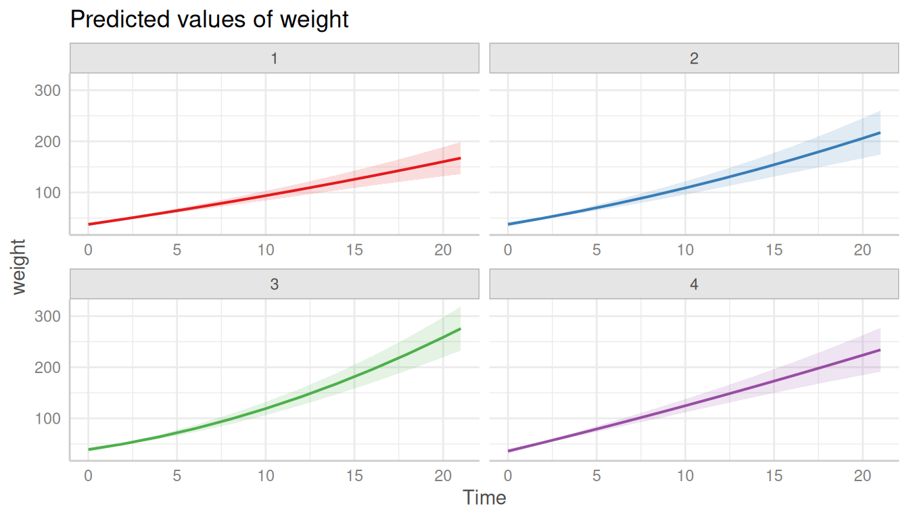

# Case Study: Predictions for Mixed Models: Comparison of ggeffects and marginaleffects

This vignette compares the *ggeffects* package with the
*marginaleffects* package, which is another package that can be used to
create predictions for mixed models. It shows how to reproduce the plots
shown in the [mixed models case study for population- and unit-level
predictions](https://marginaleffects.com/vignettes/lme4.html)

It is probably a good idea to read the [introduction to predictions for
mixed
models](https://strengejacke.github.io/ggeffects/articles/introduction_randomeffects.html)
first, to get familiar with the basics of the package regarding adjusted
predictions for mixed models.

## Population-level and unit-level predictions: comparison between *marginaleffects* and *ggeffects*

First, we fit the two example models.

[`library`](https://rdrr.io/r/base/library.html)`(`[`lme4`](https://github.com/lme4/lme4/)`)`` ``# modelling`` `[`library`](https://rdrr.io/r/base/library.html)`(`[`ggeffects`](https://strengejacke.github.io/ggeffects/)`)`` ``# predictions`` `[`library`](https://rdrr.io/r/base/library.html)`(`[`marginaleffects`](https://marginaleffects.com/)`)`` ``# predictions`` `[`library`](https://rdrr.io/r/base/library.html)`(`[`ggplot2`](https://ggplot2.tidyverse.org)`)`` ``# plotting`` `[`library`](https://rdrr.io/r/base/library.html)`(`[`patchwork`](https://patchwork.data-imaginist.com)`)`` ``# plot layout`` `` `[`data`](https://rdrr.io/r/utils/data.html)`(``ChickWeight``)`` `` ``model1`` ``<-`` `[`lmer`](https://rdrr.io/pkg/lme4/man/lmer.html)`(`` `` ``weight`` ``~`` ``1`` ``+`` ``Time`` ``+`` ``(``1`` ``+`` ``Time`` ``|`` ``Chick``)``,`` `` data ``=`` ``ChickWeight`` ``)`` `` ``model2`` ``<-`` `[`lmer`](https://rdrr.io/pkg/lme4/man/lmer.html)`(`` `` ``weight`` ``~`` ``1`` ``+`` ``Time`` ``+`` `[`I`](https://rdrr.io/r/base/AsIs.html)`(``Time``^``2``)`` ``+`` ``Diet`` ``+`` ``Time``:``Diet`` ``+`` `[`I`](https://rdrr.io/r/base/AsIs.html)`(``Time``^``2``)``:``Diet`` ``+`` `` ``(``1`` ``+`` ``Time`` ``+`` `[`I`](https://rdrr.io/r/base/AsIs.html)`(``Time``^``2``)`` ``|`` ``Chick``)``,`` `` data ``=`` ``ChickWeight`` ``)`

### Unit-level predictions

The first two plots show unit-level predictions created with the
*marginaleffects* package. As can be seen, predictions for each level of
the random effects are included.

`pred1`` ``<-`` `[`predictions`](https://rdrr.io/pkg/marginaleffects/man/predictions.html)`(``model1``,`` `` newdata ``=`` `[`datagrid`](https://rdrr.io/pkg/marginaleffects/man/datagrid.html)`(`` `` Chick ``=`` ``ChickWeight``$``Chick``,`` `` Time ``=`` ``0``:``21`` `` ``)`` ``)`` `` ``p1`` ``<-`` `[`ggplot`](https://ggplot2.tidyverse.org/reference/ggplot.html)`(``pred1``, `[`aes`](https://ggplot2.tidyverse.org/reference/aes.html)`(``Time``, ``estimate``, level ``=`` ``Chick``)``)`` ``+`` `` `[`geom_line`](https://ggplot2.tidyverse.org/reference/geom_path.html)`(``)`` ``+`` `` `[`labs`](https://ggplot2.tidyverse.org/reference/labs.html)`(``y ``=`` ``"Predicted weight"``, x ``=`` ``"Time"``, title ``=`` ``"Linear growth model"``)`` `` ``pred2`` ``<-`` `[`predictions`](https://rdrr.io/pkg/marginaleffects/man/predictions.html)`(``model2``,`` `` newdata ``=`` `[`datagrid`](https://rdrr.io/pkg/marginaleffects/man/datagrid.html)`(`` `` Chick ``=`` ``ChickWeight``$``Chick``,`` `` Time ``=`` ``0``:``21`` `` ``)`` ``)`` `` ``p2`` ``<-`` `[`ggplot`](https://ggplot2.tidyverse.org/reference/ggplot.html)`(``pred2``, `[`aes`](https://ggplot2.tidyverse.org/reference/aes.html)`(``Time``, ``estimate``, level ``=`` ``Chick``)``)`` ``+`` `` `[`geom_line`](https://ggplot2.tidyverse.org/reference/geom_path.html)`(``)`` ``+`` `` `[`labs`](https://ggplot2.tidyverse.org/reference/labs.html)`(``y ``=`` ``"Predicted weight"``, x ``=`` ``"Time"``, title ``=`` ``"Quadratic growth model"``)`` `` ``p1`` ``+`` ``p2`



*ggeffects* handles unit-level predictions slightly different (see [this
vignette](https://strengejacke.github.io/ggeffects/articles/introduction_randomeffects.html)) -
each unit-level is considered as own “group”, thus the plot would
normally use colors and a color legend to distinguish between the
unit-levels. In this example, the default color palette is too small to
plot all unit-levels.

`pr`` ``<-`` `[`predict_response`](https://strengejacke.github.io/ggeffects/reference/predict_response.md)`(``model1``, terms ``=`` `[`c`](https://rdrr.io/r/base/c.html)`(``"Time"``, ``"Chick"``)``, type ``=`` ``"random"``)`` `[`plot`](https://strengejacke.github.io/ggeffects/reference/plot.md)`(``pr``)`` ``` #> Error in `palette()`: ``` ``#> Insufficient values in manual scale. 50 needed but only 9 provided.`

To reproduce the plots from the *marginaleffects* package, we need to
modify our plot. We simply provide a vector with a sufficient amount of
color values and hide the legend.

`pr`` ``<-`` `[`predict_response`](https://strengejacke.github.io/ggeffects/reference/predict_response.md)`(``model1``, terms ``=`` `[`c`](https://rdrr.io/r/base/c.html)`(``"Time"``, ``"Chick"``)``, type ``=`` ``"random"``)`` ``p3`` ``<-`` `[`plot`](https://strengejacke.github.io/ggeffects/reference/plot.md)`(``pr``, colors ``=`` `[`rep`](https://rdrr.io/r/base/rep.html)`(``"grey30"``, ``50``)``, show_ci ``=`` ``FALSE``, show_legend ``=`` ``FALSE``)`` `` ``pr`` ``<-`` `[`predict_response`](https://strengejacke.github.io/ggeffects/reference/predict_response.md)`(``model2``, terms ``=`` `[`c`](https://rdrr.io/r/base/c.html)`(``"Time"``, ``"Chick"``)``, type ``=`` ``"random"``)`` ``p4`` ``<-`` `[`plot`](https://strengejacke.github.io/ggeffects/reference/plot.md)`(``pr``, colors ``=`` `[`rep`](https://rdrr.io/r/base/rep.html)`(``"grey30"``, ``50``)``, show_ci ``=`` ``FALSE``, show_legend ``=`` ``FALSE``)`` `` ``p3`` ``+`` ``p4`



### Unit-level predictions stratified by `Diet`

This is the next plot shown in the *marginaleffects* case study.
Unit-level predictions are stratified by `Diet`.

`pred`` ``<-`` `[`predictions`](https://rdrr.io/pkg/marginaleffects/man/predictions.html)`(``model2``)`` `` `[`ggplot`](https://ggplot2.tidyverse.org/reference/ggplot.html)`(``pred``, `[`aes`](https://ggplot2.tidyverse.org/reference/aes.html)`(``Time``, ``estimate``, level ``=`` ``Chick``)``)`` ``+`` `` `[`geom_line`](https://ggplot2.tidyverse.org/reference/geom_path.html)`(``)`` ``+`` `` `[`ylab`](https://ggplot2.tidyverse.org/reference/labs.html)`(``"Predicted Weight"``)`` ``+`` `` `[`facet_wrap`](https://ggplot2.tidyverse.org/reference/facet_wrap.html)`(``~``Diet``, labeller ``=`` ``label_both``)`



*ggeffects* by default creates a (theoretical) reference grid for all
possible combinations in the data. That’s why the following plot looks
different than the one above. We see predictions for *all* unit-levels
in each panel of `Diet`.

`pr`` ``<-`` `[`predict_response`](https://strengejacke.github.io/ggeffects/reference/predict_response.md)`(``model2``, terms ``=`` `[`c`](https://rdrr.io/r/base/c.html)`(``"Time"``, ``"Chick"``, ``"Diet"``)``, type ``=`` ``"random"``)`` `[`plot`](https://strengejacke.github.io/ggeffects/reference/plot.md)`(``pr``, colors ``=`` `[`rep`](https://rdrr.io/r/base/rep.html)`(``"grey30"``, ``50``)``, show_ci ``=`` ``FALSE``, show_legend ``=`` ``FALSE``)`



To limit the plot to the unit-levels that are actually present in the
data, we need to set `limit_range = TRUE`.

`pr`` ``<-`` `[`predict_response`](https://strengejacke.github.io/ggeffects/reference/predict_response.md)`(``model2``, terms ``=`` `[`c`](https://rdrr.io/r/base/c.html)`(``"Time"``, ``"Chick"``, ``"Diet"``)``, type ``=`` ``"random"``)`` `[`plot`](https://strengejacke.github.io/ggeffects/reference/plot.md)`(`` `` ``pr``,`` `` colors ``=`` `[`rep`](https://rdrr.io/r/base/rep.html)`(``"grey30"``, ``50``)``,`` `` show_ci ``=`` ``FALSE``,`` `` show_legend ``=`` ``FALSE``,`` `` limit_range ``=`` ``TRUE`` ``)`



### Population-level predictions

The last example shows population-level predictions.

`pred`` ``<-`` `[`predictions`](https://rdrr.io/pkg/marginaleffects/man/predictions.html)`(`` `` ``model2``,`` `` newdata ``=`` `[`datagrid`](https://rdrr.io/pkg/marginaleffects/man/datagrid.html)`(`` `` Chick ``=`` ``NA``,`` `` Diet ``=`` ``1``:``4``,`` `` Time ``=`` ``0``:``21`` `` ``)``,`` `` re.form ``=`` ``NA`` ``)`` `` `[`ggplot`](https://ggplot2.tidyverse.org/reference/ggplot.html)`(``pred``, `[`aes`](https://ggplot2.tidyverse.org/reference/aes.html)`(``x ``=`` ``Time``, y ``=`` ``estimate``, ymin ``=`` ``conf.low``, ymax ``=`` ``conf.high``)``)`` ``+`` `` `[`geom_ribbon`](https://ggplot2.tidyverse.org/reference/geom_ribbon.html)`(``alpha ``=`` ``0.1``, fill ``=`` ``"red"``)`` ``+`` `` `[`geom_line`](https://ggplot2.tidyverse.org/reference/geom_path.html)`(``)`` ``+`` `` `[`facet_wrap`](https://ggplot2.tidyverse.org/reference/facet_wrap.html)`(``~``Diet``, labeller ``=`` ``label_both``)`` ``+`` `` `[`labs`](https://ggplot2.tidyverse.org/reference/labs.html)`(``title ``=`` ``"Population-level trajectories"``)`



This plot is rather simple to reproduce with *ggeffects*. We don’t need
to specify the `type` argument, since `type = "fixed"` is the default
and returns population-level predictions.

`pr`` ``<-`` `[`predict_response`](https://strengejacke.github.io/ggeffects/reference/predict_response.md)`(``model2``, terms ``=`` `[`c`](https://rdrr.io/r/base/c.html)`(``"Time"``, ``"Diet"``)``)`` `[`plot`](https://strengejacke.github.io/ggeffects/reference/plot.md)`(``pr``, grid ``=`` ``TRUE``)`


