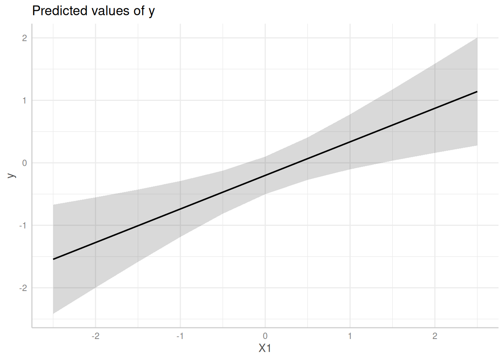
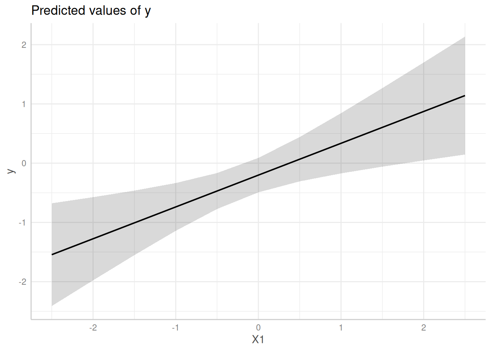
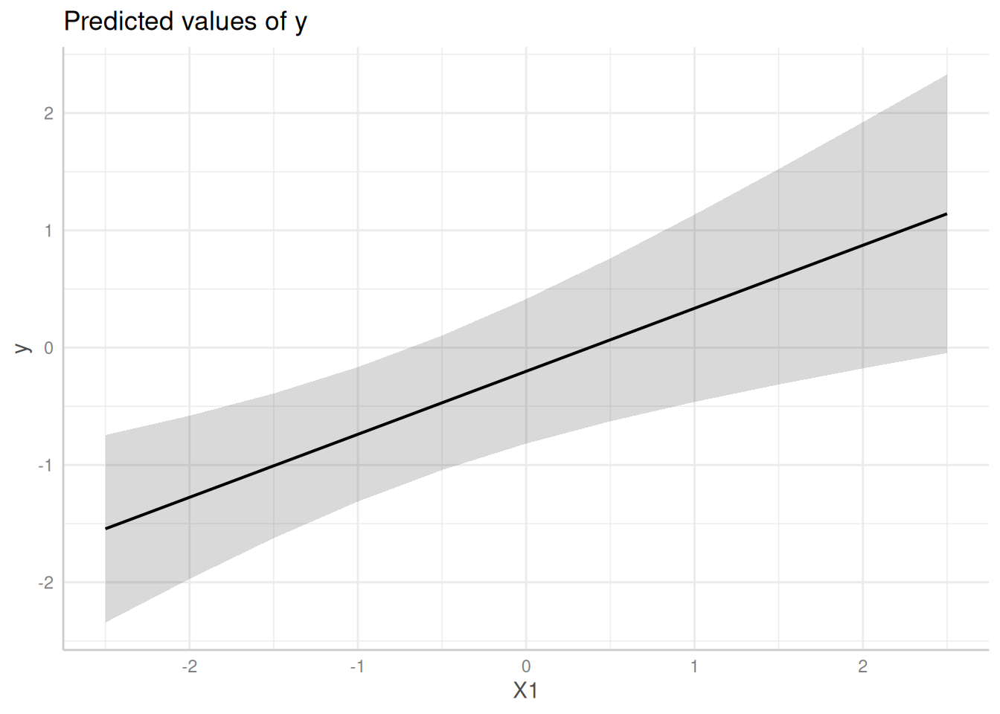

# Case Study: (Cluster) Robust Standard Errors

This vignette demonstrate how to compute confidence intervals based on
(cluster) robust variance-covariance matrices for standard errors.

First, we load the required packages and create a sample data set with a
binomial and continuous variable as predictor as well as a group factor.

``` r

library(ggeffects)
set.seed(123)

# example taken from "?clubSandwich::vcovCR"
m <- 8
cluster <- factor(rep(LETTERS[1:m], 3 + rpois(m, 5)))
n <- length(cluster)
X <- matrix(rnorm(3 * n), n, 3)
nu <- rnorm(m)[cluster]
e <- rnorm(n)
y <- X %*% c(0.4, 0.3, -0.3) + nu + e
dat <- data.frame(y, X, cluster, row = 1:n)

# fit linear model
model <- lm(y ~ X1 + X2 + X3, data = dat)
```

## Predictions with normal standard errors

In this example, we use the normal standard errors, as returned by
[`predict()`](https://rdrr.io/r/stats/predict.html), to compute
confidence intervals.

``` r

predict_response(model, "X1")
#> # Predicted values of y
#> 
#>    X1 | Predicted |       95% CI
#> --------------------------------
#> -2.50 |     -1.54 | -2.42, -0.67
#> -2.00 |     -1.28 | -2.00, -0.55
#> -1.00 |     -0.74 | -1.19, -0.29
#> -0.50 |     -0.47 | -0.81, -0.13
#>  0.00 |     -0.20 | -0.50,  0.10
#>  0.50 |      0.07 | -0.27,  0.41
#>  1.00 |      0.34 | -0.10,  0.78
#>  2.50 |      1.14 |  0.28,  2.01
#> 
#> Adjusted for:
#> * X2 = -0.08
#> * X3 =  0.09
#> 
#> Not all rows are shown in the output. Use `print(..., n = Inf)` to show
#>   all rows.
```

``` r

me <- predict_response(model, "X1")
plot(me)
```



## Predictions with HC-estimated standard errors

Now, we use
[`sandwich::vcovHC()`](https://sandwich.R-Forge.R-project.org/reference/vcovHC.html)
to estimate heteroskedasticity-consistent standard errors. To do so,
first the *name* of a related *function* must be supplied or the *type*
of the HC-estimation as string.

E.g., to use the default
[`sandwich::vcovHC()`](https://sandwich.R-Forge.R-project.org/reference/vcovHC.html)
function, set `vcov = "HC"`, in which case the default type in
[`sandwich::vcovHC()`](https://sandwich.R-Forge.R-project.org/reference/vcovHC.html)
is called. Setting `vcov = "HC1"` is a convenient shortcut for
`vcov = "HC", vcov_args = list(type = "HC1")`, which would call
`sandwich::vcovHC(type = "HC1")`.

``` r

# short: predict_response(model, "X1", vcov = "HC0")
# This is equivalent to the following:
predict_response(model, "X1", vcov = "HC", vcov_args = list(type = "HC0"))
#> # Predicted values of y
#> 
#>    X1 | Predicted |       95% CI
#> --------------------------------
#> -2.50 |     -1.54 | -2.41, -0.68
#> -2.00 |     -1.28 | -1.98, -0.57
#> -1.00 |     -0.74 | -1.14, -0.34
#> -0.50 |     -0.47 | -0.77, -0.17
#>  0.00 |     -0.20 | -0.49,  0.09
#>  0.50 |      0.07 | -0.31,  0.44
#>  1.00 |      0.34 | -0.17,  0.84
#>  2.50 |      1.14 |  0.15,  2.14
#> 
#> Adjusted for:
#> * X2 = -0.08
#> * X3 =  0.09
#> 
#> Not all rows are shown in the output. Use `print(..., n = Inf)` to show
#>   all rows.
```

``` r

me <- predict_response(model, "X1", vcov = "HC", vcov_args = list(type = "HC0"))
plot(me)
```



## Passing a function to `vcov`

Instead of character strings, the `vcov` argument also accepts a
function that returns a variance-covariance matrix. Further arguments
that need to be passed to that functions should be provided as list to
the `vcov_args` argument. Thus, we can rewrite the above code-chunk in
the following way:

``` r

predict_response(
  model,
  "X1",
  vcov = sandwich::vcovHC,
  vcov_args = list(type = "HC0")
)
#> # Predicted values of y
#> 
#>    X1 | Predicted |       95% CI
#> --------------------------------
#> -2.50 |     -1.54 | -2.41, -0.68
#> -2.00 |     -1.28 | -1.98, -0.57
#> -1.00 |     -0.74 | -1.14, -0.34
#> -0.50 |     -0.47 | -0.77, -0.17
#>  0.00 |     -0.20 | -0.49,  0.09
#>  0.50 |      0.07 | -0.31,  0.44
#>  1.00 |      0.34 | -0.17,  0.84
#>  2.50 |      1.14 |  0.15,  2.14
#> 
#> Adjusted for:
#> * X2 = -0.08
#> * X3 =  0.09
#> 
#> Not all rows are shown in the output. Use `print(..., n = Inf)` to show
#>   all rows.
```

## Predictions with cluster-robust standard errors

The last example shows how to define cluster-robust standard errors.
These are based on
[`clubSandwich::vcovCR()`](http://jepusto.github.io/clubSandwich/reference/vcovCR.md).
Thus, `vcov = "CR"` is always required when estimating cluster robust
standard errors.
[`clubSandwich::vcovCR()`](http://jepusto.github.io/clubSandwich/reference/vcovCR.md)
has also different estimation types, which must be specified in
`vcov_args`. Furthermore,
[`clubSandwich::vcovCR()`](http://jepusto.github.io/clubSandwich/reference/vcovCR.md)
*requires* the `cluster`-argument, which must also be specified in
`vcov_args`:

``` r

# short:
# predict_response(model, "X1", vcov = "CR0",
#                  vcov_args = list(cluster = dat$cluster)).
# This is equivalent to the following:
predict_response(
  model,
  "X1",
  vcov = "CR",
  vcov_args = list(type = "CR0", cluster = dat$cluster)
)
#> # Predicted values of y
#> 
#>    X1 | Predicted |       95% CI
#> --------------------------------
#> -2.50 |     -1.54 | -2.34, -0.75
#> -2.00 |     -1.28 | -1.97, -0.58
#> -1.00 |     -0.74 | -1.31, -0.17
#> -0.50 |     -0.47 | -1.04,  0.10
#>  0.00 |     -0.20 | -0.82,  0.41
#>  0.50 |      0.07 | -0.63,  0.76
#>  1.00 |      0.34 | -0.46,  1.13
#>  2.50 |      1.14 | -0.05,  2.33
#> 
#> Adjusted for:
#> * X2 = -0.08
#> * X3 =  0.09
#> 
#> Not all rows are shown in the output. Use `print(..., n = Inf)` to show
#>   all rows.
```

``` r

me <- predict_response(
  model,
  "X1",
  vcov = "CR",
  vcov_args = list(type = "CR0", cluster = dat$cluster)
)
plot(me)
```


