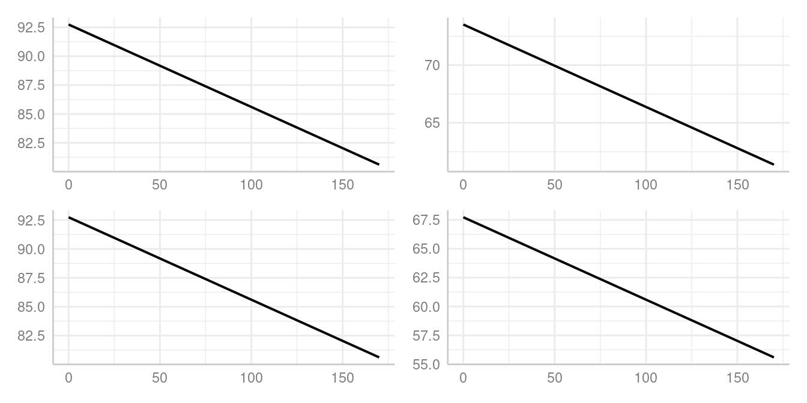

# Technical Details: Difference Between Marginalization Methods: The \`margin\` Argument

[`predict_response()`](https://strengejacke.github.io/ggeffects/reference/predict_response.md)
computes marginal means or predicted values for all possible levels or
values from specified model’s predictors (*focal terms*). These effects
are “marginalized” (or “averaged”) over the values or levels of
remaining predictors (the **non-focal** terms). The `margin` argument
specifies the method of marginalization. The following methods are
available:

- `"mean_reference"`: non-focal predictors are set to their mean
  (numeric variables), reference level (factors), or “most common” value
  (mode) in case of character vectors. Technically, a data grid is
  constructed, roughly comparable to
  [`expand.grid()`](https://rdrr.io/r/base/expand.grid.html) on all
  unique combinations of `model.frame(model)[, terms]`. This data grid
  (see
  [`data_grid()`](https://strengejacke.github.io/ggeffects/reference/new_data.md))
  is used for the `newdata` argument of
  [`predict()`](https://rdrr.io/r/stats/predict.html). All remaining
  covariates not specified in `terms` are held constant: Numeric values
  are set to the mean, integer values are set to their median, factors
  are set to their reference level and character vectors to their mode
  (most common element).

- `"mean_mode"`: non-focal predictors are set to their mean (numeric
  variables) or mode (factors, or “most common” value in case of
  character vectors).

- `"marginalmeans"`: non-focal predictors are set to their mean (numeric
  variables) or marginalized over the levels or “values” for factors and
  character vectors. Marginalizing over the factor levels of non-focal
  terms computes a kind of “weighted average” for the values at which
  these terms are hold constant.

- `"empirical"` (or `"counterfactual"`): non-focal predictors are
  marginalized over the observations in your sample, for *counterfactual
  predictions*. Technically, predicted values for each observation in
  the data are calculated multiple times (the data is duplicated once
  for all unique values of the focal terms), each time fixing one unique
  value or level of the focal terms and then takes the average of these
  predicted values (aggregated/grouped by the focal terms).

That means:

- For models without categorical predictors, results are usually
  identical, no matter which `margin` option is selected (except some
  *slight* differences in the associated confidence intervals, which
  are, however, negligible).

- When all categorical predictors are specified in `terms` and further
  (non-focal) terms are only numeric, results are usually identical, as
  well.

In the [general
introduction](https://strengejacke.github.io/ggeffects/articles/ggeffects.md),
the `margin` argument is discussed more in detail, providing hints on
when to use which method. Here, we will provide a more technical
explanation of the differences between the methods.

``` r

library(ggeffects)
data(efc, package = "ggeffects")
fit <- lm(barthtot ~ c12hour + neg_c_7, data = efc)

# we add margin = "mean_reference" to show that it is the default
predict_response(fit, "c12hour [0,50,100,150]", margin = "mean_reference")
#> # Predicted values of Total score BARTHEL INDEX
#> 
#> c12hour | Predicted |       95% CI
#> ----------------------------------
#>       0 |     75.07 | 72.96, 77.19
#>      50 |     62.78 | 61.16, 64.40
#>     100 |     50.48 | 48.00, 52.97
#>     150 |     38.19 | 34.30, 42.08
#> 
#> Adjusted for:
#> * neg_c_7 = 11.83

predict_response(fit, "c12hour [0,50,100,150]", margin = "marginalmeans")
#> # Predicted values of Total score BARTHEL INDEX
#> 
#> c12hour | Predicted |       95% CI
#> ----------------------------------
#>       0 |     75.07 | 72.96, 77.19
#>      50 |     62.78 | 61.16, 64.40
#>     100 |     50.48 | 48.00, 52.97
#>     150 |     38.19 | 34.30, 42.08
#> 
#> Adjusted for:
#> * neg_c_7 = 11.83
```

As can be seen, the continuous predictor `neg_c_7` is held constant at
its mean value, 11.83. For categorical predictors,
`margin = "mean_reference"` (the default, and thus not specified in the
above example) and `margin = "marginalmeans"` behave differently. While
`"mean_reference"` uses the reference level of each categorical
predictor to hold it constant, `"marginalmeans"` averages over the
proportions of the categories of factors.

``` r

library(datawizard)
data(efc, package = "ggeffects")
efc$e42dep <- to_factor(efc$e42dep)
# we add categorical predictors to our model
fit <- lm(barthtot ~ c12hour + neg_c_7 + e42dep, data = efc)

predict_response(fit, "c12hour [0,50,100,150]", margin = "mean_reference")
#> # Predicted values of Total score BARTHEL INDEX
#> 
#> c12hour | Predicted |       95% CI
#> ----------------------------------
#>       0 |     92.74 | 88.48, 97.01
#>      50 |     89.18 | 84.82, 93.54
#>     100 |     85.61 | 80.79, 90.42
#>     150 |     82.04 | 76.49, 87.59
#> 
#> Adjusted for:
#> * neg_c_7 =       11.83
#> *  e42dep = independent

predict_response(fit, "c12hour [0,50,100,150]", margin = "marginalmeans")
#> # Predicted values of Total score BARTHEL INDEX
#> 
#> c12hour | Predicted |       95% CI
#> ----------------------------------
#>       0 |     73.51 | 71.85, 75.18
#>      50 |     69.95 | 68.51, 71.38
#>     100 |     66.38 | 64.19, 68.56
#>     150 |     62.81 | 59.51, 66.10
#> 
#> Adjusted for:
#> * neg_c_7 = 11.83
```

In this case, one would obtain the same results for `"mean_reference"`
and `"marginalmeans"` again, if `condition` is used to define specific
levels at which variables, in our case the factor `e42dep`, should be
held constant.

``` r

predict_response(fit, "c12hour [0,50,100,150]", margin = "mean_reference")
#> # Predicted values of Total score BARTHEL INDEX
#> 
#> c12hour | Predicted |       95% CI
#> ----------------------------------
#>       0 |     92.74 | 88.48, 97.01
#>      50 |     89.18 | 84.82, 93.54
#>     100 |     85.61 | 80.79, 90.42
#>     150 |     82.04 | 76.49, 87.59
#> 
#> Adjusted for:
#> * neg_c_7 =       11.83
#> *  e42dep = independent

predict_response(
  fit,
  "c12hour [0,50,100,150]",
  margin = "marginalmeans",
  condition = c(e42dep = "independent")
)
#> # Predicted values of Total score BARTHEL INDEX
#> 
#> c12hour | Predicted |       95% CI
#> ----------------------------------
#>       0 |     92.74 | 88.48, 97.01
#>      50 |     89.18 | 84.82, 93.54
#>     100 |     85.61 | 80.79, 90.42
#>     150 |     82.04 | 76.49, 87.59
#> 
#> Adjusted for:
#> * neg_c_7 = 11.83
```

Another option is to use `predict_response(margin = "empirical")` to
compute “counterfactual” adjusted predictions. This function is a
wrapper for the
[`avg_predictions()`](https://marginaleffects.com/man/r/predictions.html)-method
from the **marginaleffects**-package. The major difference to
`margin = "marginalmeans"` is that estimated marginal means, as computed
by `"marginalmeans"`, are a special case of predictions, made on a
perfectly balanced grid of categorical predictors, with numeric
predictors held at their means, and marginalized with respect to some
focal variables.

`predict_response(margin = "empirical")`, in turn, calculates predicted
values for each observation in the data multiple times, each time fixing
the unique values or levels of the focal terms to one specific value and
then takes the average of these predicted values (aggregated/grouped by
the focal terms) - or in other words: the whole dataset is duplicated
once for every unique value of the focal terms, makes predictions for
each observation of the new dataset and take the average of all
predictions (grouped by focal terms). This is also called
“counterfactual” predictions.

``` r

predict_response(fit, "c12hour", margin = "empirical")
#> # Average predicted values of Total score BARTHEL INDEX
#> 
#> c12hour | Predicted |       95% CI
#> ----------------------------------
#>       0 |     67.73 | 66.15, 69.31
#>      20 |     66.30 | 65.03, 67.57
#>      45 |     64.52 | 63.38, 65.66
#>      65 |     63.09 | 61.81, 64.37
#>      85 |     61.66 | 60.07, 63.25
#>     105 |     60.23 | 58.24, 62.23
#>     125 |     58.81 | 56.37, 61.25
#>     170 |     55.59 | 52.08, 59.11
```

To explain how `margin = "empirical"` works, let’s look at following
example, where we compute the average predicted values and the estimated
marginal means manually. The confidence intervals for the manually
calculated means differ from those of
[`predict_response()`](https://strengejacke.github.io/ggeffects/reference/predict_response.md),
however, the predicted and manually calculated mean values are
identical.

``` r

data(iris)
set.seed(123)
iris$x <- as.factor(sample(1:4, nrow(iris), replace = TRUE, prob = c(0.1, 0.2, 0.3, 0.4)))
m <- lm(Sepal.Width ~ Species + x, data = iris)

# average predicted values
predict_response(m, "Species", margin = "empirical")
#> # Average predicted values of Sepal.Width
#> 
#> Species    | Predicted |     95% CI
#> -----------------------------------
#> setosa     |      3.43 | 3.34, 3.52
#> versicolor |      2.77 | 2.67, 2.86
#> virginica  |      2.97 | 2.88, 3.07

# replicate the dataset for each level of "Species", i.e. 3 times
d <- do.call(rbind, replicate(3, iris, simplify = FALSE))
# for each data set, we set our focal term to one of the three levels
d$Species <- as.factor(rep(levels(iris$Species), each = 150))
# we calculate predicted values for each "dataset", i.e. we predict our outcome
# for observations, for all levels of "Species"
d$predicted <- predict(m, newdata = d)
# now we compute the average predicted values by levels of "Species", where
# non-focal terms are weighted proportional to their occurence in the data
datawizard::means_by_group(d, "predicted", "Species")
#> # Mean of predicted by Species
#> 
#> Category   | Mean |   N |   SD |       95% CI |      p
#> ------------------------------------------------------
#> setosa     | 3.43 | 150 | 0.06 | [3.42, 3.44] | < .001
#> versicolor | 2.77 | 150 | 0.06 | [2.76, 2.78] | < .001
#> virginica  | 2.97 | 150 | 0.06 | [2.96, 2.98] | < .001
#> Total      | 3.06 | 450 | 0.28 |              |       
#> 
#> Anova: R2=0.951; adj.R2=0.951; F=4320.998; p<.001

# estimated marginal means, in turn, differ from the above, because they are
# averaged across balanced reference grids for all focal terms, thereby non-focal
# are hold constant at an (equally) "weighted average".

# estimated marginal means, from `ggemmeans()`
predict_response(m, "Species", margin = "marginalmeans")
#> # Predicted values of Sepal.Width
#> 
#> Species    | Predicted |     95% CI
#> -----------------------------------
#> setosa     |      3.45 | 3.35, 3.54
#> versicolor |      2.78 | 2.68, 2.89
#> virginica  |      2.99 | 2.89, 3.09

d <- rbind(
  data_grid(m, "Species", condition = c(x = "1")),
  data_grid(m, "Species", condition = c(x = "2")),
  data_grid(m, "Species", condition = c(x = "3")),
  data_grid(m, "Species", condition = c(x = "4"))
)
d$predicted <- predict(m, newdata = d)
# means calculated manually
datawizard::means_by_group(d, "predicted", "Species")
#> # Mean of predicted by Species
#> 
#> Category   | Mean |  N |   SD |       95% CI |      p
#> -----------------------------------------------------
#> setosa     | 3.45 |  4 | 0.07 | [3.36, 3.53] | < .001
#> versicolor | 2.78 |  4 | 0.07 | [2.70, 2.87] | < .001
#> virginica  | 2.99 |  4 | 0.07 | [2.91, 3.07] | 0.019 
#> Total      | 3.07 | 12 | 0.30 |              |       
#> 
#> Anova: R2=0.952; adj.R2=0.941; F=88.566; p<.001
```

**But when should I use which `margin` option?**

When you are interested in the strength of association, it usually
doesn’t matter. as you can see in the plots below. The slope of our
focal term, `c12hour`, is the same for all four plots:

``` r

library(see)
predicted_1 <- predict_response(fit, terms = "c12hour")
predicted_2 <- predict_response(fit, terms = "c12hour", margin = "marginalmeans")
predicted_3 <- predict_response(fit, terms = "c12hour", margin = "marginalmeans", condition = c(e42dep = "independent"))
predicted_4 <- predict_response(fit, terms = "c12hour", margin = "empirical")

p1 <- plot(predicted_1, show_ci = FALSE, show_title = FALSE, show_x_title = FALSE, show_y_title = FALSE)
p2 <- plot(predicted_2, show_ci = FALSE, show_title = FALSE, show_x_title = FALSE, show_y_title = FALSE)
p3 <- plot(predicted_3, show_ci = FALSE, show_title = FALSE, show_x_title = FALSE, show_y_title = FALSE)
p4 <- plot(predicted_4, show_ci = FALSE, show_title = FALSE, show_x_title = FALSE, show_y_title = FALSE)

plots(p1, p2, p3, p4, n_rows = 2)
```



However, the predicted outcome varies. The [general
introduction](https://strengejacke.github.io/ggeffects/articles/ggeffects.md)
discusses the `margin` argument more in detail, but a few hints on when
to use which method are following:

- Predictions based on `"mean_reference"` and `"mean_mode"` represent a
  rather “theoretical” view on your data, which does not necessarily
  exactly reflect the characteristics of your sample. It helps answer
  the question, “What is the predicted value of the response at
  meaningful values or levels of my focal terms for a ‘typical’
  observation in my data?”, where ‘typical’ refers to certain
  characteristics of the remaining predictors.

- `"marginalmeans"` comes closer to the sample, because it takes all
  possible values and levels of your non-focal predictors into account.
  It would answer thr question, “What is the predicted value of the
  response at meaningful values or levels of my focal terms for an
  ‘average’ observation in my data?”. It refers to randomly picking a
  subject of your sample and the result you get on average.

- `"empirical"`is probably the most “realistic” approach, insofar as the
  results can also be transferred to other contexts. It answers the
  question, “What is the predicted value of the response at meaningful
  values or levels of my focal terms for the ‘average’ observation in
  the population?”. It does not only refer to the actual data in your
  sample, but also “what would be if” we had more data, or if we had
  data from a different population. This is where “counterfactual”
  refers to.

**What is the most apparent difference from `margin = "empirical"` to
the other options?**

The most apparent difference from `margin = "empirical"` compared to the
other methods occurs when you have categorical co-variates (*non-focal
terms*) with unequally distributed levels. `margin = "marginalmeans"`
will “average” over the levels of non-focal factors, while
`margin = "empirical"` will average over the observations in your
sample.

Let’s show this with a very simple example:

``` r

data(iris)
set.seed(123)
# create an unequal distributed factor, used as non-focal term
iris$x <- as.factor(sample(1:4, nrow(iris), replace = TRUE, prob = c(0.1, 0.2, 0.3, 0.4)))
m <- lm(Sepal.Width ~ Species + x, data = iris)

# predicted values, conditioned on x = 1
predict_response(m, "Species")
#> # Predicted values of Sepal.Width
#> 
#> Species    | Predicted |     95% CI
#> -----------------------------------
#> setosa     |      3.50 | 3.30, 3.69
#> versicolor |      2.84 | 2.63, 3.04
#> virginica  |      3.04 | 2.85, 3.23
#> 
#> Adjusted for:
#> * x = 1

# predicted values, conditioned on weighted average of x
predict_response(m, "Species", margin = "marginalmeans")
#> # Predicted values of Sepal.Width
#> 
#> Species    | Predicted |     95% CI
#> -----------------------------------
#> setosa     |      3.45 | 3.35, 3.54
#> versicolor |      2.78 | 2.68, 2.89
#> virginica  |      2.99 | 2.89, 3.09

# average predicted values, averaged over the sample and aggregated by "Species"
predict_response(m, "Species", margin = "empirical")
#> # Average predicted values of Sepal.Width
#> 
#> Species    | Predicted |     95% CI
#> -----------------------------------
#> setosa     |      3.43 | 3.34, 3.52
#> versicolor |      2.77 | 2.67, 2.86
#> virginica  |      2.97 | 2.88, 3.07
```

Finally, the weighting for `margin = "marginalmeans"` can be changed
using the `weights` argument (for details, see
[`?emmeans::emmeans`](https://rvlenth.github.io/emmeans/reference/emmeans.html)),
which returns results that are more similar to `margin = "empirical"`.

``` r

# the default is an equally weighted average; "proportional" weights in
# proportion to the  frequencies of factor combinations
predict_response(m, "Species", margin = "marginalmeans", weights = "proportional")
#> # Predicted values of Sepal.Width
#> 
#> Species    | Predicted |     95% CI
#> -----------------------------------
#> setosa     |      3.43 | 3.34, 3.52
#> versicolor |      2.77 | 2.67, 2.86
#> virginica  |      2.97 | 2.88, 3.07
```
