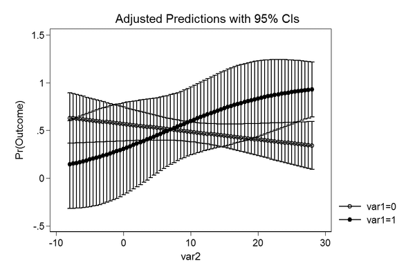
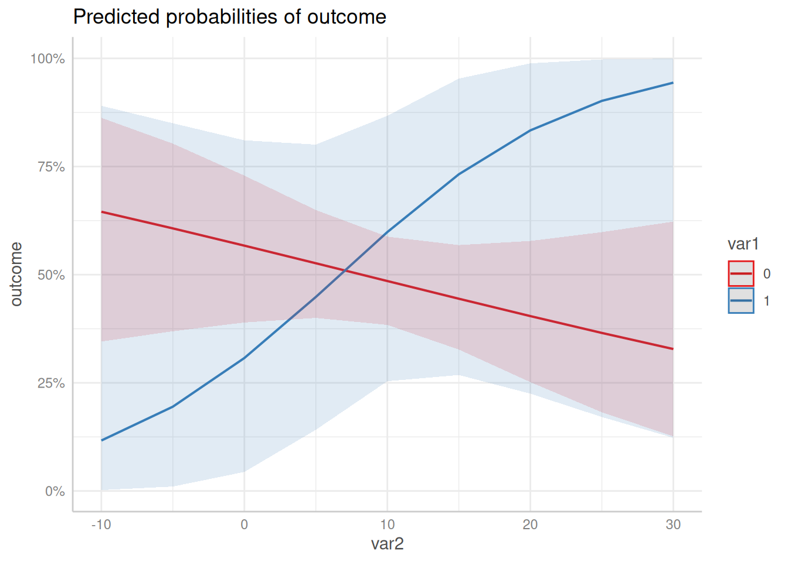

# Technical Details: Different Output between Stata and ggeffects

## Why is the output from Stata different from the output from ggeffect?

Stata’s equivalent to the adjusted predictions produced by *ggeffects*
is the `margins`-command. However, the results are not always identical.
For models from non-gaussian families, point estimates for the adjusted
predictions are identical, but the confidence intervals differ.

Here is an explanation, why there is a difference. First, we fit a
logistic regression model.

``` r

set.seed(5)

data <- data.frame(
  outcome = rbinom(100, 1, 0.5),
  var1 = rbinom(100, 1, 0.1),
  var2 = rnorm(100, 10, 7)
)

m <- glm(
  outcome ~ var1 * var2,
  data = data,
  family = binomial(link = "logit")
)
```

### Example with graphical output

#### The Stata plot

This is the code in Stata to produce an adjusted predictions plot.

``` r
use data.dta, clear
quietly logit outcome c.var1##c.var2
quietly margins, at(var2 = (-8(0.5)28) var1 = (0 1))
marginsplot
```

The resulting image looks like this.



#### The ggeffects plot

When we use *ggeffects*, the plot slighlty differs.

``` r

library(ggeffects)
predict_response(m, c("var2", "var1")) |> plot()
```



As we can see, the confidence intervals in the Stata plot are outside
the plausible range of `[0, 1]`, which means that the predicted
uncertainty from the Stata output has a probability higher than 1 and
lower than 0, while
[`predict_response()`](https://strengejacke.github.io/ggeffects/reference/predict_response.md)
computes confidence intervals *within* the possible range.

### Conclusion

It seems like Stata returns inaccurate confidence intervals. Predictions
and standard errors returned in Stata are on the (transformed) response
scale. Obviously, the confidence intervals are then computed by
`estimate +/- 1.96 * standard error`, which may lead to confidence
intervals that are out of reasonable bounds (e.g. above 1 or below 0 for
predicted probabilities).

The *transformed estimate* (on the response scale) is always between 0
and 1, and the same is true for the *transformed standard errors*.
However, adding or subtracting approx. 2 \* *transformed* SE to the
*transformed* estimate does no longer ensure that the confidence
intervals are within the correct range.

The precise way to do the calculation is to calculate estimates,
standard errors and confidence intervals on the (untransformed) scale of
the linear predictor and then back-transform.
